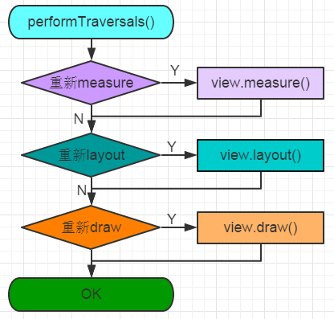
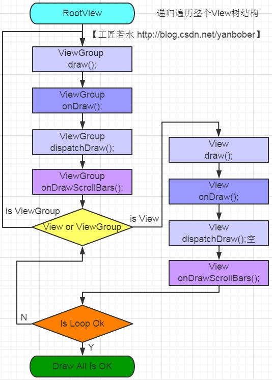

# [View绘制过程](http://blog.csdn.net/yanbober/article/details/46128379)

整个View树的绘图流程是在ViewRootImpl类的performTraversals()方法（这个方法巨长）开始的，该函数做的执行过程主要是根据之前设置的状态，判断是否重新计算视图大小(measure)、是否重新放置视图的位置(layout)、以及是否重绘 (draw)。

## Measure

通过上面可以看出measure过程主要就是从顶层父View向子View递归调用`view.measure`方法（measure中又回调onMeasure方法）的过程。具体measure核心主要有如下几点：

  - `MeasureSpec`（View的内部类）测量规格为int型，值由高2位规格模式`specMode`和低30位具体尺寸`specSize`组成。其中specMode只有三种值：

    - `MeasureSpec.EXACTLY` //确定模式，父View希望子View的大小是确定的，由specSize决定；
    - `MeasureSpec.AT_MOST` //最多模式，父View希望子View的大小最多是specSize指定的值；
    - `MeasureSpec.UNSPECIFIED` //未指定模式，父View完全依据子View的设计值来决定；

  - View的 measure 方法是`final`的，不允许重载，**View子类只能重载onMeasure来完成自己的测量逻辑**。

  - 最顶层DecorView测量时的MeasureSpec是由ViewRootImpl中getRootMeasureSpec方法确定的，**LayoutParams宽高参数均为MATCH_PARENT，specMode是EXACTLY，specSize为物理屏幕大小**。

  - ViewGroup类提供了`measureChild`，`measureChild`和`measureChildWithMargins`方法，简化了父子View的尺寸计算。

  - 只要是ViewGroup的子类就必须要求LayoutParams继承子MarginLayoutParams，否则无法使用layout_margin参数。

  - View的布局大小由父View和子View共同决定。

  - 使用View的`getMeasuredWidth()`和`getMeasuredHeight()`方法来获取View测量的宽高，必须保证这两个方法在`onMeasure`流程之后被调用才能返回有效值。

## Layout

layout方法接收四个参数，这四个参数分别代表相对Parent的左、上、右、下坐标。而且还可以看见左上都为0，右下分别为上面刚刚测量的width和height。

整个layout过程比较容易理解，从上面分析可以看出layout也是从顶层父View向子View的递归调用view.layout方法的过程，即父View根据上一步measure子View所得到的布局大小和布局参数，将子View放在合适的位置上。具体layout核心主要有以下几点：

  - `View.layout`方法可被重载，`ViewGroup.layout`为final的不可重载，`ViewGroup.onLayout`为abstract的，子类必须重载实现自己的位置逻辑。

  - measure操作完成后得到的是对每个View经测量过的`measuredWidth`和`measuredHeight`，layout操作完成之后得到的是对每个View进行位置分配后的mLeft、mTop、mRight、mBottom，这些值都是相对于父View来说的。

  - **凡是layout_XXX的布局属性基本都针对的是包含子View的ViewGroup的，当对一个没有父容器的View设置相关layout_XXX属性是没有任何意义的**。

  - 使用View的getWidth()和getHeight()方法来获取View测量的宽高，必须保证这两个方法在onLayout流程之后被调用才能返回有效值。

## Draw

ViewRootImpl中的代码会创建一个Canvas对象，然后调用View的draw()方法来执行具体的绘制工作。

可以看见，绘制过程就是把View对象绘制到屏幕上，整个draw过程需要注意如下细节：

  - 如果该View是一个`ViewGroup`，则需要递归绘制其所包含的所有子View。

  - View默认不会绘制任何内容，真正的绘制都需要自己在子类中实现。

  - View的绘制是借助`onDraw`方法传入的`Canvas`类来进行的。

  - 区分View动画和ViewGroup布局动画，前者指的是View自身的动画，可以通过`setAnimation`添加，后者是专门针对`ViewGroup`显示内部子视图时设置的动画，可以在xml布局文件中对`ViewGroup`设置`layoutAnimation`属性。

  - 在获取画布剪切区（每个`View`的`draw`中传入的`Canvas`）时会自动处理掉`padding`，子`View`获取`Canvas`不用关注这些逻辑，只用关心如何绘制即可。

  - 默认情况下子`View`的`ViewGroup.drawChild`绘制顺序和子`View`被添加的顺序一致，但是你也可以重载`ViewGroup.getChildDrawingOrder()`方法提供不同顺序。
