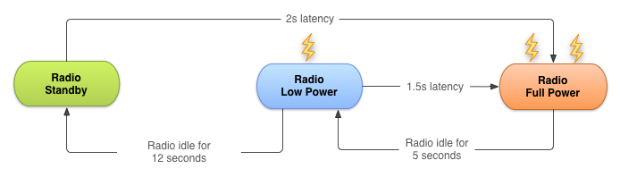
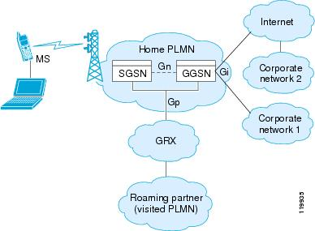

# 推送机制

## 轮询

客户端隔一段时间就去服务器上获取一下信息，看是否有更新的信息出现，这就是轮询。我们可以通过`AlarmManager`来管理时间，当然时间的设置策略也是十分重要的，由于每次轮询都需要建立和释放TCP连接，所以在移动网络情况下耗电量相当大。

>移动网络状态转换

针对不同应用的需求，有的可以每5分钟查询一次或者每10分钟查询一次，但是这种策略的电量和流量消耗十分严重。我们可以使用退避法（暂时这么说），比如第一次我们每隔2分钟查询一次数据，如果没有数据，就将查询间隔加倍。

同时进程的保活也十分重要，这部分的知识参照[进程保活](keep-live。md)。

## 长连接

客户端主动和服务器建立TCP长连接之后，客户端定期向服务器发送心跳包，有消息的时候，服务器直接通过这个已经建立好的TCP连接通知客户端。

长连接就是 **建立连接之后，不主动断开。双方互相发送数据，发完了也不主动断开连接，之后有需要发送的数据就继续通过这个连接发送**。

### 影响TCP连接寿命的因素

#### NAT超时

因为 IPv4 的 IP 量有限，运营商分配给手机终端的 IP 是运营商内网的 IP，手机要连接 Internet，就需要通过运营商的网关做一个网络地址转换（Network Address Translation，NAT）。简单的说运营商的网关需要维护一个外网 IP、端口到内网 IP、端口的对应关系，以确保内网的手机可以跟 Internet 的服务器通讯。

>NAT 功能由图中的 GGSN 模块实现。

大部分移动无线网络运营商都在链路一段时间没有数据通讯时，会淘汰 NAT 表中的对应项，造成链路中断。

#### DHCP租期

目前测试发现安卓系统对DHCP的处理有Bug，DHCP租期到了不会主动续约并且会继续使用过期IP，这个问题会造成TCP长连接偶然的断连。

#### 网络状态变化

手机网络和WIFI网络切换、网络断开和连上等情况有网络状态的变化，也会使长连接变为无效连接，需要监听响应的网络状态变化事件，重新建立Push长连接。

### 心跳包

TCP长连接本质上不需要心跳包来维持，其主要是为了防止上面提到的NAT超时，既然一些`NAT设备`判断是否淘汰`NAT映射`的依据是一定时间没有数据，那么客户端就主动发一个数据，这样就能维持TCP长连接。

当然，如果仅仅是为了防止NAT超时，可以让服务器来发送心跳包给客户端，不过这样做有个弊病就是，万一连接断了，服务器就再也联系不上客户端了。所以心跳包必须由客户端发送，客户端发现连接断了，还可以尝试重连服务器。

#### 时间间隔
发送心跳包势必要先唤醒设备，然后才能发送，如果唤醒设备过于频繁，或者直接导致设备无法休眠，会大量消耗电量，而且移动网络下进行网络通信，比在wifi下耗电得多。所以这个心跳包的时间间隔应该尽量的长，最理想的情况就是根本没有NAT超时，比如刚才我说的两台在同一个wifi下的电脑，完全不需要心跳包。这也就是网上常说的长连接，慢心跳。

现实是残酷的，根据网上的一些说法，中移动2/3G下，NAT超时时间为5分钟，中国电信3G则大于28分钟，理想的情况下，客户端应当以略小于NAT超时时间的间隔来发送心跳包。

#### 心跳包和轮询的区别

  - 轮询是为了获取数据，而心跳是为了保活TCP连接。
  - 轮询得越频繁，获取数据就越及时，心跳的频繁与否和数据是否及时没有直接关系。
  - 轮询比心跳能耗更高，因为一次轮询需要经过TCP三次握手，四次挥手，单次心跳不需要建立和拆除TCP连接。
