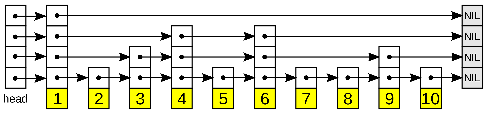

# 跳跃表

跳跃列表是一种数据结构。它允许快速查询一个有序连续元素的数据链表。跳跃列表的平均查找和插入时间复杂度都是 `O(log n)` ，优于普通队列的 `O(n)`。

快速查询是通过维护一个多层次的链表，且每一层链表中的元素是前一层链表元素的子集。一开始时，算法在最稀疏的层次进行搜索，直至需要查找的元素在该层两个相邻的元素中间。这时，算法将跳转到下一个层次，重复刚才的搜索，直到找到需要查找的元素为止。跳过的元素的方法可以是 **随机性选择** 或 **确定性选择**，其中前者更为常见。



在查找目标元素时，从顶层列表、头元素起步。算法沿着每层链表搜索，直至找到一个大于或等于目标的元素，或者到达当前层列表末尾。如果该元素等于目标元素，则表明该元素已被找到；如果该元素大于目标元素或已到达链表末尾，则退回到当前层的上一个元素，然后转入下一层进行搜索。

跳跃列表不像平衡树等数据结构那样提供对最坏情况的性能保证：由于用来建造跳跃列表采用随机选取元素进入更高层的方法，在小概率情况下会生成一个不平衡的跳跃列表（**最坏情况例如最底层仅有一个元素进入了更高层，此时跳跃列表的查找与普通列表一致**）。但是在实际中它通常工作良好，**随机化平衡方案也比平衡二叉查找树等数据结构中使用的确定性平衡方案容易实现**。跳跃列表在并行计算中也很有用：插入可以在跳跃列表不同的部分并行地进行，而不用对数据结构进行全局的重新平衡。

跳跃表插入一个元素：


## 实现

因为跳跃列表中的元素可以在多个列表中，所以每个元素可以有多于一个指针。跳跃列表的插入和删除的实现与普通的链表操作类似，但高层元素必须在进行多个链表中进行插入或删除。

```java
package io.github.hadyang.leetcode.algo;

import lombok.Getter;
import lombok.Setter;

import java.util.Arrays;
import java.util.Random;

/**
 * @author haoyang.shi
 */
public class SkipList<K extends Comparable<K>, V> {

    @Getter
    @Setter
    static final class Node<K extends Comparable<K>, V> {
        private K key;

        private V value;

        private Node<K, V> up, down, pre, next;

        Node(K key, V value) {
            this.key = key;
            this.value = value;
        }


        @Override
        public String toString() {
            return "Node{" +
                    "key=" + key +
                    ", value=" + value +
                    ", hashcode=" + hashCode() +
                    ", up=" + (up == null ? "null" : up.hashCode()) +
                    ", down=" + (down == null ? "null" : down.hashCode()) +
                    ", pre=" + (pre == null ? "null" : pre.hashCode()) +
                    ", next=" + (next == null ? "null" : next.hashCode()) +
                    '}';
        }
    }

    private Node<K, V> head;//k,v都是NULL

    private Integer levels = 0;

    private Integer length = 0;

    private Random random = new Random(System.currentTimeMillis());

    public SkipList() {
        createNewLevel();
    }

    public void put(K key, V value) {
        if (key == null || value == null) {
            return;
        }

        Node<K, V> newNode = new Node<>(key, value);
        insertNode(newNode);
    }

    private void insertNode(Node<K, V> newNode) {
        Node<K, V> curNode = findNode(newNode.getKey());
        if (curNode.getKey() == null) {
            insertNext(curNode, newNode);
        } else if (curNode.getKey().compareTo(newNode.getKey()) == 0) {
            //update
            curNode.setValue(newNode.getValue());
            return;
        } else {
            insertNext(curNode, newNode);
        }

        int currentLevel = 1;
        Node<K, V> oldTop = newNode;
        while (random.nextInt(100) < 50) {
            Node<K, V> newTop = new Node<>(newNode.getKey(), null);

            if (currentLevel >= levels) {
                createNewLevel();
            }

            while (curNode.getPre() != null && curNode.getUp() == null) {
                curNode = curNode.getPre();
            }

            if (curNode.getUp() == null) {
                continue;
            }

            curNode = curNode.getUp();
            Node<K, V> curNodeNext = curNode.getNext();

            curNode.setNext(newTop);
            newTop.setPre(curNode);
            newTop.setDown(oldTop);
            oldTop.setUp(newTop);

            newTop.setNext(curNodeNext);
            oldTop = newTop;

            currentLevel++;
        }
    }

    private void createNewLevel() {
        Node<K, V> newHead = new Node<>(null, null);
        if (this.head == null) {
            this.head = newHead;
            this.levels++;
            return;
        }

        this.head.setUp(newHead);
        newHead.setDown(this.head);
        this.head = newHead;
        this.levels++;
    }

    private void insertNext(Node<K, V> curNode, Node<K, V> newNode) {
        Node<K, V> curNodeNext = curNode.getNext();
        newNode.setNext(curNodeNext);
        if (curNodeNext != null) {
            curNodeNext.setPre(newNode);
        }
        curNode.setNext(newNode);
        newNode.setPre(curNode);

        this.length++;
    }

    public V get(K key) {
        Node<K, V> node = findNode(key);
        if (key.equals(node.getKey())) {
            return node.getValue();
        }

        return null;
    }

    private Node<K, V> findNode(K key) {
        Node<K, V> curNode = this.head;

        for (; ; ) {
            while (curNode.getNext() != null && curNode.getNext().getKey().compareTo(key) <= 0) {
                curNode = curNode.getNext();
            }

            if (curNode.getDown() != null) {
                curNode = curNode.getDown();
            } else {
                break;
            }
        }

        return curNode;
    }

    public void print() {
        Node<K, V> curI = this.head;

        String[][] strings = new String[levels][length + 1];
        for (String[] string : strings) {
            Arrays.fill(string, "0");
        }

        while (curI.getDown() != null) {
            curI = curI.getDown();
        }

        System.out.println("levels:" + levels + "_" + "length:" + length);

        int i = 0;
        while (curI != null) {
            Node<K, V> curJ = curI;

            int j = levels - 1;
            while (curJ != null) {
                strings[j][i] = String.valueOf(curJ.getKey());

                if (curJ.getUp() == null) {
                    break;
                }
                curJ = curJ.getUp();
                j--;
            }

            if (curI.getNext() == null) {
                break;
            }
            curI = curI.getNext();
            i++;
        }

        for (String[] string : strings) {
            System.out.println(Arrays.toString(string));
        }
    }

    public static void main(String[] args) {

        SkipList<Integer, String> skipList = new SkipList<>();

        skipList.put(2, "B");
        skipList.put(1, "A");
        skipList.put(3, "C");

        skipList.print();

        System.out.println(skipList.get(2));

    }

}
```
