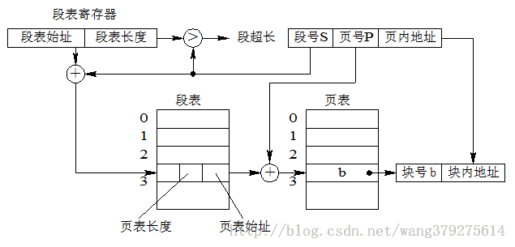

# 内存管理

## 存储器工作原理

应用程序如何在计算机系统上运行的呢？首先，用编程语言编写和编辑应用程序，所编写的程序称为源程序，源程序不能再计算机上直接被运行，需要通过三个阶段的处理：**编译程序处理源程序并生成目标代码，链接程序把他们链接为一个可重定位代码，此时该程序处于逻辑地址空间中；下一步装载程序将可执行代码装入物理地址空间，直到此时程序才能运行**。

### 程序编译

源程序经过编译程序的处理生成目标模块（目标代码）。**一个程序可由独立编写且具有不同功能的多个源程序模块组成，由于模块包含外部引用（即指向其他模块中的数据或指令地址，或包含对库函数的引用），编译程序负责记录引用发生的位置，其处理结果将产生相应的多个目标模块，每个模块都附有供引用使用的内部符号表和外部符号表。符号表中依次给出各个符号名及在本目标模块中的名字地址，在模块链接时进行转换**。

### 程序链接

链接程序(Linker)的作用是根据目标模块之间的调用和依赖关系，将主调模块、被调模块以及所用到的库函数装配和链接成一个完整的可装载执行模块。根据程序链接发生的时间和链接方式，程序链接可分为以下三种方式：

  - **静态链接**：在程序装载到内存和运行前，就已将它所有的目标模块及所需要的库函数进行链接和装配成一个完整的可执行程序且此后不再拆分。

  - **动态链接**：在程序装入内存前并未事先进行程序各目标模块的链接，而是在程序装载时一边装载一边链接，生成一个可执行程序。在装载目标模块时，若发生外部模块调用，将引发响应外部目标模块的搜索、装载和链接。

  - **运行时链接**：在程序执行过程中，若发现被调用模块或库函数尚未链接，先在内存中进行搜索以查看是否装入内存；若已装入，则直接将其链接到调用程序中，否则进行该模块在外存上的搜索，以及装入内存和进行链接，生成一个可执行程序。

运行时链接将链接推迟到程序执行时，可以很好的提高系统资源的利用率和系统效率。

### 程序装载

程序装载就是将可执行程序装入内存，这里有三种方式：

  - **绝对装载**：装载模块中的指令地址始终与其内存中的地址相同，即模块中出现的所有地址均为绝对地址。

  - **可重定位装载**：根据内存当时的使用情况，决定将装载代码模块放入内存的物理位置。模块内使用的都是相对地址。

  - **动态运行时装载**：为提高内存利用率，装入内存的程序可换出到磁盘上，适当时候再换入内存中，对换前后程序在内存中的位置可能不同，即允许进程的内存映像在不同时候处于不同位置，此时模块内使用的地址必定为相对地址。

磁盘中的装载模块所使用的是逻辑地址，其逻辑地址集合称为进程的逻辑地址空间。进程运行时，其装载代码模块将被装入物理地址空间中，此时程序和数据的实际地址不可能同原来的逻辑一致。**可执行程序逻辑地址转换为物理地址的过程被称为 “地址重定位”**。

  - **静态地址重定位**：由装载程序实现装载代码模块的加载和物理地址转换，把它装入分配给进程的内存指定区域，其中所有逻辑地址修改为物理地址。地址转换在进程执行前一次完成，易于实现，但不允许程序在执行过程中移动位置。

  - **动态地址重定位**：由装载程序实现装载代码模块的加载，把它装入分配给进程的内存指定区域，但对链接程序处理过的程序的逻辑地址不做任何改变，程序内存起始地址被置入硬件专用寄存器 —— **重定位寄存器**。程序执行过程中，每当CPU引用内存地址时，有硬件截取此逻辑地址，并在它被发送到内存之前加上重定位寄存器的值，以实现地址转换。

  - **运行时链接地址重定位**：对于静态和动态地址重定位装载方式而言，装载代码模块是由整个程序的所有目标模块及库函数经链接和整合构成的可执行程序，即在程序启动执行前已经完成了程序的链接过程。可见，装载代码的正文结构是静态的，在程序运行期间保持不变。**运行时链接装载方式必然采用运行时链接地址重定位**。

> 重定位寄存器：用于保存程序内存起始地址。

## 连续存储管理

### 固定分区存储管理

固定分区存储管理又称为静态分区模式，基本思想是：内存空间被划分成数目固定不变的分区，各分区大小不等，每个分区装入一个作业，若多个分区中都有作业，则他们可以并发执行。

为说明各分区分配和使用情况，需要设置一张内存分配表，记录内存中划分的分区及其使用情况。内存分配表中指出各分区起始地址和长度，占用标志用来指示此分区是否被使用。

### 可变分区存储管理

可变分区存储管理按照作业大小来划分分区，但划分的时间、大小、位置都是动态的。系统把作业装入内存时，根据其所需要的内存容量查看是否有足够空间，若有则按需分割一个分区分配给此作业；若无则令此作业等待内存资源。

在可变分区模式下，内存中分区数目和大小随作业的执行而不断改变，为了方便内存空间的分配和去配，用于管理的数据结构可由两张表组成：**已分配区表和未分配区表。当装入新作业时，从未分配区表中找出一个足够容纳它的空闲区，将此区分为两个部分，一部分用来装入作业，成为已分配区；另一部分仍是空闲区（若有）。这时，应从已分配区表中找出一个空栏目登记新作业的起始地址、占用长度，同时修改未分配区表中空闲区的长度和起始地址。当作业撤离时，已分配区表中的相应状态改为空闲，而将收回的分区登记到为分配区中，若有相邻空闲区再将其连接后登记**。

### 常用的可变分区分配算法

  - **最先适应分配算法**：该算法顺序查找未分配区表，直到找到第一个能满足长度要求的空闲区为止，分割此分区，一部分分配给作业，另一部分仍为空闲区。

  - **下次适应分配算法**：该算法总是从未分配区的上次扫描结束处顺序查找未分配区表，直到找到第一个能满足长度要求的空闲区为止。

  - **最优适应分配算法**：该算法扫描整个未分配区表，从空闲区中挑选一个能满足用户进程要求的最小分区进行分配。

  - **最坏适应分配算法**：该算法扫描整个未分配区表，总是挑选一个最大的空闲区分割给作业使用，其优点是使剩下的空闲区不至于过小。

  - **快速适应分配算法**：该算法为那些经常用到的长度的空闲区设立单独的空闲区链表。

## 分页存储管理

  - 逻辑空间等分为页；并从0开始编号
  - 内存空间等分为块，与页面大小相同；从0开始编号
  - 分配内存时，以块为单位将进程中的若干个页分别装入到多个可以不相邻接的物理块中。

## 分段存储管理

  - 逻辑空间分为若干个段，每个段定义了一组有完整逻辑意义的信息（如主程序`Main()`）。
  - 内存空间为每个段分配一个连续的分区。

分页和分段的主要区别：

  - **分页**：信息的物理单位。大小一样，由系统决定。地址空间是一维的。
  - **分段**：信息的逻辑单位。大小不一样，由程序员决定。地址空间是二维的。

## 段页式存储管理

用户程序先分段，每个段内部再分页（内部原理同基本的分页、分段相同）

## 内存分配

- `虚拟地址`：用户编程时将代码（或数据）分成若干个段，每条代码或每个数据的地址由`段名称 + 段内相对地址`构成，这样的程序地址称为虚拟地址
- `逻辑地址`：虚拟地址中，段内相对地址部分称为逻辑地址
- `物理地址`：实际物理内存中所看到的存储地址称为物理地址

- `逻辑地址空间`：在实际应用中，将虚拟地址和逻辑地址经常不加区分，通称为逻辑地址。逻辑地址的集合称为逻辑地址空间
- `线性地址空间`：CPU地址总线可以访问的所有地址集合称为线性地址空间
- `物理地址空间`：实际存在的可访问的物理内存地址集合称为物理地址空间

- `MMU(Memery Management Unit内存管理单元)`：实现将用户程序的虚拟地址（逻辑地址） -> 物理地址映射的CPU中的硬件电路
- `基地址`：在进行地址映射时，经常以段或页为单位并以其最小地址（即起始地址）为基值来进行计算
- `偏移量`：在以段或页为单位进行地址映射时，相对于基地址的地址值

**虚拟地址先经过分段机制映射到线性地址，然后线性地址通过分页机制映射到物理地址**。

## 虚拟内存--请求分页虚拟存储管理

请求调页，也称按需调页，即对不在内存中的“页”，当进程执行时要用时才调入，否则有可能到程序结束时也不会调入。

### 页面置换算法

  - **FIFO算法**：先入先出，即淘汰最早调入的页面。

  - **OPT(MIN)算法**：选未来最远将使用的页淘汰，是一种最优的方案，可以证明缺页数最小。可惜，MIN需要知道将来发生的事，只能在理论中存在，实际不可应用。

  - **LRU(Least-Recently-Used)算法**：用过去的历史预测将来，选最近最长时间没有使用的页淘汰(也称最近最少使用)。性能最接近OPT。**与页面使用时间有关**。

  - **LFU(Least Frequently Used)算法**：即最不经常使用页置换算法，要求在页置换时置换引用计数最小的页，因为经常使用的页应该有一个较大的引用次数。**与页面使用次数有关**。

  - **Clock**：给每个页帧关联一个使用位，当该页第一次装入内存或者被重新访问到时，将使用位置为1。每次需要替换时，查找使用位被置为0的第一个帧进行替换。在扫描过程中，如果碰到使用位为1的帧，将使用位置为0，在继续扫描。如果所谓帧的使用位都为0，则替换第一个帧。

**内存抖动现象**：页面的频繁更换，导致整个系统效率急剧下降，这个现象称为内存抖动（或颠簸）。抖动一般是内存分配算法不好，内存太小引或者程序的算法不佳引起的。

**交换区**：用于保存请求分页淘汰出来的页面。
