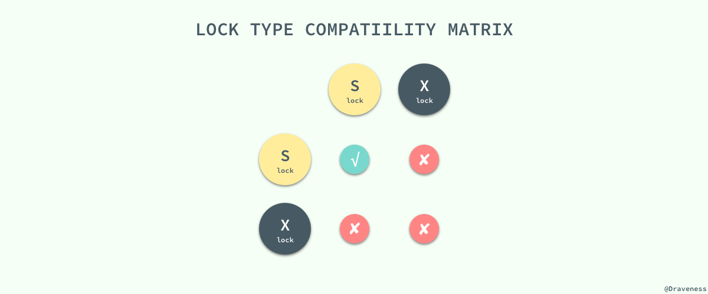
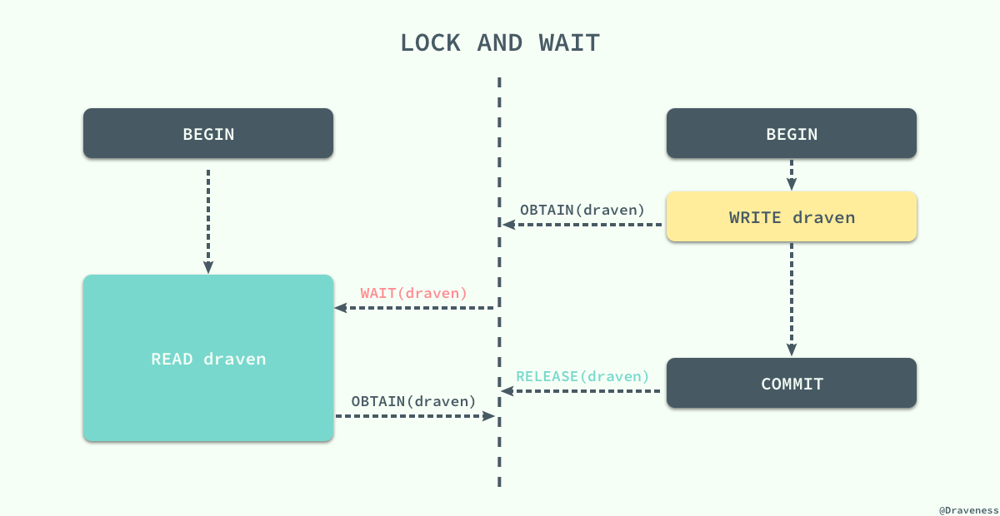
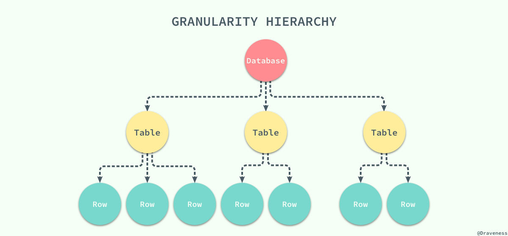
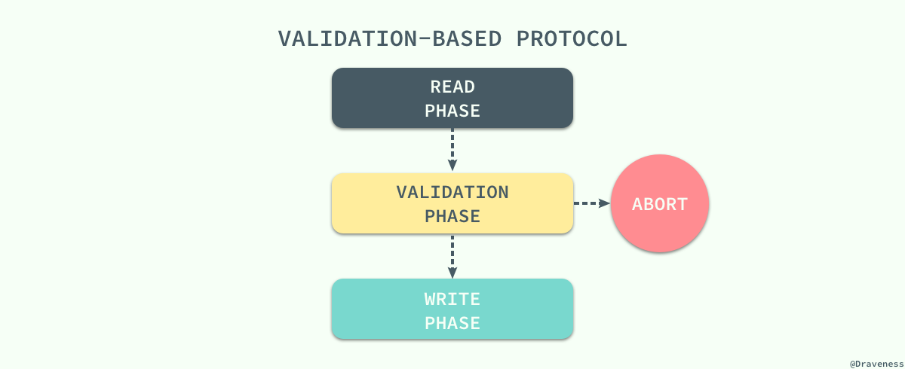

# [并发控制](https://draveness.me/database-concurrency-control)

如果数据库中的所有事务都是串行执行的，那么它非常容易成为整个应用的性能瓶颈，虽然说没法水平扩展的节点在最后都会成为瓶颈，但是串行执行事务的数据库会加速这一过程；而并发（`Concurrency`）使一切事情的发生都有了可能，它能够解决一定的性能问题，但是它会带来更多诡异的错误。

引入了并发事务之后，如果不对事务的执行进行控制就会出现各种各样的问题，你可能没有享受到并发带来的性能提升就已经被各种奇怪的问题折磨的欲仙欲死了。

如何控制并发是数据库领域中非常重要的问题之一，不过到今天为止事务并发的控制已经有了很多成熟的解决方案，而这些方案的原理就是这篇文章想要介绍的内容，最为常见的三种并发控制机制：

  - **悲观并发控制**：悲观并发控制其实是最常见的并发控制机制，也就是锁
  - **乐观并发控制**：即乐观锁，乐观锁其实并不是一种真实存在的锁
  - **多版本并发控制（MVCC）**：与前两者对立的命名不同，`MVCC` 可以与前两者中的任意一种机制结合使用，以提高数据库的读性能

## 悲观并发控制

控制不同的事务对同一份数据的获取是保证数据库的一致性的最根本方法，如果我们能够让事务在同一时间对同一资源有着独占的能力，那么就可以保证操作同一资源的不同事务不会相互影响。

最简单的、应用最广的方法就是使用锁来解决，**当事务需要对资源进行操作时需要先获得资源对应的锁，保证其他事务不会访问该资源后，再对资源进行各种操作**；在悲观并发控制中，数据库程序对于数据被修改持悲观的态度，在数据处理的过程中都会被锁定，以此来解决竞争的问题。

### 读写锁

为了最大化数据库事务的并发能力，数据库中的锁被设计为两种模式，分别是 **共享锁和互斥锁**。当一个事务获得共享锁之后，它只可以进行读操作，所以共享锁也叫 `读锁` ；而当一个事务获得一行数据的互斥锁时，就可以对该行数据进行读和写操作，所以互斥锁也叫 `写锁` 。

> 共享锁和互斥锁除了限制事务能够执行的读写操作之外，它们之间还有『共享』和『互斥』的关系，也就是多个事务可以同时获得某一行数据的共享锁，但是互斥锁与共享锁和其他的互斥锁并不兼容

如果当前事务没有办法获取该行数据对应的锁时就会陷入等待的状态，直到其他事务将当前数据对应的锁释放才可以获得锁并执行相应的操作。

### 两阶段锁协议

两阶段锁协议（`2PL`）是一种能够保证事务可串行化的协议，它将事务的获取锁和释放锁划分成了增长（`Growing`）和缩减（`Shrinking`）两个不同的阶段。

**在增长阶段，一个事务可以获得锁但是不能释放锁；而在缩减阶段事务只可以释放锁，并不能获得新的锁**，如果只看 `2PL` 的定义，那么到这里就已经介绍完了，但是它还有两个变种：

  - `Strict 2PL`：事务持有的 **互斥锁** 必须在提交后再释放；
  - `Rigorous 2PL`：事务持有的 **所有锁** 必须在提交后释放；

虽然 **锁的使用能够为我们解决不同事务之间由于并发执行造成的问题，但是两阶段锁的使用却引入了另一个严重的问题，死锁**；不同的事务等待对方已经锁定的资源就会造成死锁，我们在这里举一个简单的例子：

两个事务在刚开始时分别获取了 `draven` 和 `beacon` 资源上面的锁，然后再请求对方已经获得的锁时就会发生死锁，双方都没有办法等到锁的释放，如果没有死锁的处理机制就会无限等待下去，两个事务都没有办法完成。

#### 预防死锁

有两种方式可以帮助我们预防死锁的出现，**一种是保证事务之间的等待不会出现环**，也就是事务之间的等待图应该是一张有向无环图，没有循环等待的情况或者保证一个事务中想要获得的所有资源都在事务开始时以原子的方式被锁定，所有的资源要么被锁定要么都不被锁定。

但是这种方式有两个问题，在事务一开始时很难判断哪些资源是需要锁定的，同时因为一些很晚才会用到的数据被提前锁定，数据的利用率与事务的并发率也非常的低。一种解决的办法就是按照一定的顺序为所有的数据行加锁，同时与 2PL 协议结合，在加锁阶段保证所有的数据行都是从小到大依次进行加锁的，不过这种方式依然需要事务提前知道将要加锁的数据集。

**另一种预防死锁的方法就是使用抢占加事务回滚的方式预防死锁**，当事务开始执行时会先获得一个时间戳，数据库程序会根据事务的时间戳决定事务应该等待还是回滚。

### 锁的粒度

到目前为止我们都没有对不同粒度的锁进行讨论，一直以来我们都讨论的都是数据行锁，但是在有些时候我们希望将多个节点看做一个数据单元，使用锁直接将这个数据单元、表甚至数据库锁定起来。这个目标的实现需要我们在数据库中定义不同粒度的锁：

当我们拥有了不同粒度的锁之后，如果某个事务想要锁定整个数据库或者整张表时只需要简单的锁住对应的节点就会在当前节点加上显示（`explicit`）锁，在所有的子节点上加隐式（`implicit`）锁；**虽然这种不同粒度的锁能够解决父节点被加锁时，子节点不能被加锁的问题，但是我们没有办法在子节点被加锁时，立刻确定父节点不能被加锁**。

在这时我们就需要引入 **意向锁** 来解决这个问题了，当需要给子节点加锁时，先给所有的父节点加对应的意向锁，**意向锁之间是完全不会互斥的，只是用来帮助父节点快速判断是否可以对该节点进行加锁**：

这里是一张引入了两种意向锁，**意向共享锁** 和 **意向互斥锁** 之后所有的锁之间的兼容关系；到这里，我们通过不同粒度的锁和意向锁加快了数据库的吞吐量。

## 乐观并发控制

除了悲观并发控制机制 - 锁之外，我们其实还有其他的并发控制机制，乐观并发控制（`Optimistic Concurrency Control`）。乐观并发控制也叫乐观锁，但是它并不是真正的锁，很多人都会误以为乐观锁是一种真正的锁，然而它只是一种并发控制的思想。

### 基于时间戳的协议

锁协议按照不同事务对同一数据项请求的时间依次执行，因为后面执行的事务想要获取的数据已将被前面的事务加锁，只能等待锁的释放，所以基于锁的协议执行事务的顺序与获得锁的顺序有关。在这里想要介绍的 **基于时间戳的协议能够在事务执行之前先决定事务的执行顺序**。

**每一个事务都会具有一个全局唯一的时间戳，它即可以使用系统的时钟时间，也可以使用计数器，只要能够保证所有的时间戳都是唯一并且是随时间递增的就可以**。

**基于时间戳的协议能够保证事务并行执行的顺序与事务按照时间戳串行执行的效果完全相同**；每一个数据项都有两个时间戳，读时间戳和写时间戳，分别代表了当前成功执行对应操作的事务的时间戳。

该协议能够保证所有冲突的读写操作都能按照时间戳的大小串行执行，在执行对应的操作时不需要关注其他的事务只需要关心数据项对应时间戳的值就可以了：

无论是读操作还是写操作都会从左到右依次比较读写时间戳的值，**如果小于当前值就会直接被拒绝然后回滚，数据库系统会给回滚的事务添加一个新的时间戳并重新执行这个事务**。

### 基于验证的协议

**乐观并发控制其实本质上就是基于验证的协议**，因为在多数的应用中只读的事务占了绝大多数，事务之间因为写操作造成冲突的可能非常小，也就是说大多数的事务在不需要并发控制机制也能运行的非常好，也可以保证数据库的一致性；而 **并发控制机制其实向整个数据库系统添加了很多的开销，我们其实可以通过别的策略降低这部分开销**。

而验证协议就是我们找到的解决办法，它根据事务的只读或者更新将所有事务的执行分为两到三个阶段：

在读阶段，数据库会执行事务中的 **全部读操作和写操作**，并将所有写后的值存入临时变量中，并不会真正更新数据库中的内容；在这时候会进入下一个阶段，数据库程序会检查当前的改动是否合法，也就是是否有其他事务在 `RAED PHASE` 期间更新了数据，如果通过测试那么直接就进入 `WRITE PHASE` 将所有存在临时变量中的改动全部写入数据库，没有通过测试的事务会直接被终止。

为了保证乐观并发控制能够正常运行，我们需要知道一个事务不同阶段的发生时间，包括事务开始时间、验证阶段的开始时间以及写阶段的结束时间；通过这三个时间戳，我们可以保证任意冲突的事务不会同时写入数据库，一旦由一个事务完成了验证阶段就会立即写入，其他读取了相同数据的事务就会回滚重新执行。

作为乐观的并发控制机制，它会假定所有的事务在最终都会通过验证阶段并且执行成功，而锁机制和基于时间戳排序的协议是悲观的，因为它们会在发生冲突时强制事务进行等待或者回滚，哪怕有不需要锁也能够保证事务之间不会冲突的可能。

## 多版本并发控制 -- MVCC

到目前为止我们介绍的 **并发控制机制其实都是通过延迟或者终止相应的事务来解决事务之间的竞争条件（`Race condition`）来保证事务的可串行化**；虽然前面的两种并发控制机制确实能够从根本上解决并发事务的可串行化的问题，但是在实际环境中数据库的事务大都是只读的，**读请求是写请求的很多倍**，如果写请求和读请求之前没有并发控制机制，那么最坏的情况也是读请求读到了已经写入的数据，这对很多应用完全是可以接受的。

在这种大前提下，数据库系统引入了另一种并发控制机制 - 多版本并发控制（`Multiversion Concurrency Control`），**每一个写操作都会创建一个新版本的数据，读操作会从有限多个版本的数据中挑选一个最合适的结果直接返回**；在这时，读写操作之间的冲突就不再需要被关注，而 **管理和快速挑选数据的版本就成了 MVCC 需要解决的主要问题**。

**MVCC 并不是一个与乐观和悲观并发控制对立的东西，它能够与两者很好的结合以增加事务的并发量**，在目前最流行的 SQL 数据库 MySQL 和 PostgreSQL 中都对 MVCC 进行了实现；但是由于它们分别实现了悲观锁和乐观锁，所以 MVCC 实现的方式也不同。

## MVCC vs 乐观锁

MVCC 可以保证不阻塞地读到一致的数据。但是，MVCC 并没有对实现细节做约束，为此不同的数据库的语义有所不同，比如：

  - `postgres` 对写操作也是乐观并发控制；在表中保存同一行数据记录的多个不同版本，每次写操作，都是创建，而回避更新；在事务提交时，按版本号检查当前事务提交的数据是否存在写冲突，则抛异常告知用户，回滚事务；

  - `innodb` 则只对读无锁，写操作仍是上锁的悲观并发控制，这也意味着，`innodb` 中只能见到因死锁和不变性约束而回滚，而见不到因为写冲突而回滚，不像 postgres 那样对数据修改在表中创建新纪录，而是每行数据只在表中保留一份，在更新数据时上行锁，同时将旧版数据写入 `undo log`。表和 undo log 中行数据都记录着事务ID，在检索时，只读取来自当前已提交的事务的行数据。

可见 MVCC 中的写操作仍可以按悲观并发控制实现，而 `CAS` 的写操作只能是乐观并发控制。还有一个不同在于，MVCC 在语境中倾向于 “对多行数据打快照造平行宇宙”，然而 `CAS` 一般只是保护单行数据而已。比如 mongodb 有 CAS 的支持，但不能说这是 MVCC。

## MySQL 与 MVCC

MySQL 中实现的多版本两阶段锁协议（Multiversion 2PL）将 MVCC 和 2PL 的优点结合了起来，每一个版本的数据行都具有一个唯一的时间戳，当有读事务请求时，数据库程序会直接从多个版本的数据项中具有最大时间戳的返回。

更新操作就稍微有些复杂了，事务会先读取最新版本的数据计算出数据更新后的结果，然后创建一个新版本的数据，新数据的时间戳是目前数据行的最大版本 `＋1`：

数据版本的删除也是根据时间戳来选择的， `MySQL` 会将版本最低的数据定时从数据库中清除以保证不会出现大量的遗留内容。
