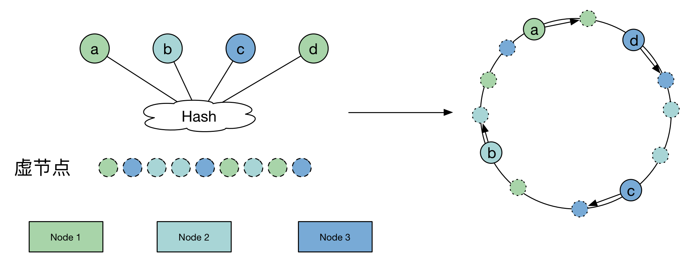
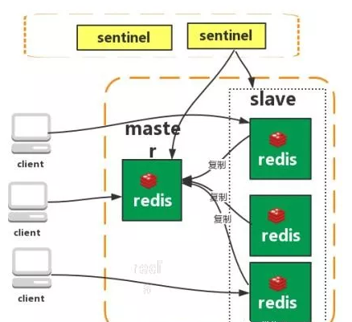
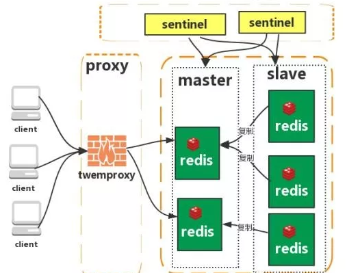
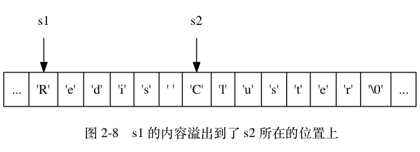

# Redis

## 数据结构

Redis的外围由一个键、值映射的字典构成。与其他非关系型数据库主要不同在于：Redis中值的类型不仅限于 **字符串**，还支持如下抽象数据类型：
  - **List**：字符串列表
  - **Set**：无序不重复的字符串集合
  - **Soret Set**：有序不重复的字符串集合
  - **HashTable**：键、值都为字符串的哈希表

值的类型决定了值本身支持的操作。Redis支持不同无序、有序的列表，无序、有序的集合间的交集、并集等高级服务器端原子操作。

## 持久化：

  - 使用快照，一种半持久耐用模式。不时的将数据集以异步方式从内存以RDB格式写入硬盘。
  - 1.1版本开始使用更安全的 `AOF` 格式替代，一种只能追加的日志类型。将数据集修改操作记录起来。Redis 能够在后台对只可追加的记录作修改来避免无限增长的日志。

比较：
  1. aof文件比rdb更新频率高，优先使用aof还原数据。
  2. aof比rdb更安全也更大
  3. rdb性能比aof好
  4. 如果两个都配了优先加载AOF

## 一致性哈希算法

一致哈希 是一种特殊的哈希算法。在使用一致哈希算法后，哈希表槽位数（大小）的改变平均只需要对 `K/n` 个关键字重新映射，其中 `K` 是关键字的数量，`n` 是槽位数量。然而在传统的哈希表中，添加或删除一个槽位的几乎需要对所有关键字进行重新映射。

>一致哈希也可用于实现健壮缓存来减少大型 Web 应用中系统部分失效带来的负面影响

### 需求

在使用 `n` 台缓存服务器时，一种常用的负载均衡方式是，对资源 `o` 的请求使用 `hash(o)= o mod n` 来映射到某一台缓存服务器。当增加或减少一台缓存服务器时这种方式可能会改变所有资源对应的 `hash` 值，也就是所有的缓存都失效了，这会使得缓存服务器大量集中地向原始内容服务器更新缓存。

因此需要一致哈希算法来避免这样的问题。 一致哈希尽可能使同一个资源映射到同一台缓存服务器。这种方式要求增加一台缓存服务器时，新的服务器尽量分担存储其他所有服务器的缓存资源。减少一台缓存服务器时，其他所有服务器也可以尽量分担存储它的缓存资源。

一致哈希算法的主要思想是将每个缓存服务器与一个或多个哈希值域区间关联起来，其中区间边界通过计算缓存服务器对应的哈希值来决定。如果一个缓存服务器被移除，则它所对应的区间会被并入到邻近的区间，其他的缓存服务器不需要任何改变。

### 实现

一致哈希将每个对象映射到圆环边上的一个点，系统再将可用的节点机器映射到圆环的不同位置。查找某个对象对应的机器时，需要用一致哈希算法计算得到对象对应圆环边上位置，沿着圆环边上查找直到遇到某个节点机器，这台机器即为对象应该保存的位置。

当删除一台节点机器时，这台机器上保存的所有对象都要移动到下一台机器。添加一台机器到圆环边上某个点时，这个点的下一台机器需要将这个节点前对应的对象移动到新机器上。更改对象在节点机器上的分布可以通过调整节点机器的位置来实现。

## [实践](https://yikun.github.io/2016/06/09/%E4%B8%80%E8%87%B4%E6%80%A7%E5%93%88%E5%B8%8C%E7%AE%97%E6%B3%95%E7%9A%84%E7%90%86%E8%A7%A3%E4%B8%8E%E5%AE%9E%E8%B7%B5/)

> 假设有1000w个数据项，100个存储节点，请设计一种算法合理地将他们存储在这些节点上。

看一看普通Hash算法的原理：


```
for item in range(ITEMS):
    k = md5(str(item)).digest()
    h = unpack_from(">I", k)[0]
    # 通过取余的方式进行映射
    n = h % NODES
    node_stat[n] += 1
```

普通的Hash算法均匀地将这些数据项打散到了这些节点上，并且分布最少和最多的存储节点数据项数目小于 `1%`。之所以分布均匀，主要是依赖 Hash 算法（实现使用的MD5算法）能够比较随机的分布。

然而，我们看看存在一个问题，由于 **该算法使用节点数取余的方法，强依赖 `node` 的数目**，因此，当是 `node` 数发生变化的时候，`item` 所对应的 `node` 发生剧烈变化，而发生变化的成本就是我们需要在 `node` 数发生变化的时候，数据需要迁移，这对存储产品来说显然是不能忍的。

#### 一致性哈希

普通 `Hash` 算法的劣势，即当 `node` 数发生变化（增加、移除）后，数据项会被重新“打散”，导致大部分数据项不能落到原来的节点上，从而导致大量数据需要迁移。

那么，一个亟待解决的问题就变成了：当 `node` 数发生变化时，如何保证尽量少引起迁移呢？即当增加或者删除节点时，对于大多数 item ，保证原来分配到的某个 node ，现在仍然应该分配到那个 node ，将数据迁移量的降到最低。


```
for n in range(NODES):
    h = _hash(n)
    ring.append(h)
    ring.sort()
    hash2node[h] = n
for item in range(ITEMS):
    h = _hash(item)
    n = bisect_left(ring, h) % NODES
    node_stat[hash2node[ring[n]]] += 1
```

**虽然一致性Hash算法解决了节点变化导致的数据迁移问题，但是，数据项分布的均匀性很差**。


主要是因为这 100 个节点 Hash 后，在环上分布不均匀，导致了每个节点实际占据环上的区间大小不一造成的。

#### 改进 -- 虚节点

当我们将 node 进行哈希后，这些值并没有均匀地落在环上，因此，最终会导致，这些节点所管辖的范围并不均匀，最终导致了数据分布的不均匀。



```
for n in range(NODES):
    for v in range(VNODES):
        h = _hash(str(n) + str(v))
        # 构造ring
        ring.append(h)
        # 记录hash所对应节点
        hash2node[h] = n
ring.sort()
for item in range(ITEMS):
    h = _hash(str(item))
    # 搜索ring上最近的hash
    n = bisect_left(ring, h) % (NODES*VNODES)
    node_stat[hash2node[ring[n]]] += 1
```

通过增加虚节点的方法，使得每个节点在环上所“管辖”更加均匀。这样就既保证了在节点变化时，尽可能小的影响数据分布的变化，而同时又保证了数据分布的均匀。也就是靠增加“节点数量”加强管辖区间的均匀。

## 集群

### 哨兵



`Redis sentinel` 是一个分布式系统中监控 redis 主从服务器，并在主服务器下线时自动进行故障转移。其中三个特性：

  - `监控（Monitoring）`：`Sentinel`  会不断地检查你的主服务器和从服务器是否运作正常。
  - `提醒（Notification）`： 当被监控的某个 Redis 服务器出现问题时， Sentinel 可以通过 API 向管理员或者其他应用程序发送通知。
  - `自动故障迁移（Automatic failover）`： 当一个主服务器不能正常工作时， Sentinel 会开始一次自动故障迁移操作。

特点：
  1. 保证高可用
  2. 监控各个节点
  3. 自动故障迁移

缺点：主从模式，切换需要时间丢数据

没有解决 master 写的压力

### 集群（proxy 型）



`Twemproxy` 是一个 `Twitter` 开源的一个 `redis` 和 `memcache` 快速/轻量级代理服务器； `Twemproxy` 是一个快速的单线程代理程序，支持` Memcached ASCII` 协议和 `redis` 协议。

特点：

  1. 多种 hash 算法：`MD5、CRC16、CRC32、CRC32a、hsieh、murmur、Jenkins`
  2. 支持失败节点自动删除
  3. 后端 `Sharding` 分片逻辑对业务透明，业务方的读写方式和操作单个 Redis 一致

缺点：

增加了新的 proxy，需要维护其高可用。

`failover` 逻辑需要自己实现，其本身不能支持故障的自动转移可扩展性差，进行扩缩容都需要手动干预

## string

Redis 没有直接使用 C 语言传统的字符串表示（以空字符结尾的字符数组，以下简称 C 字符串）， 而是自己构建了一种名为简单动态字符串（simple dynamic string，SDS）的抽象类型， 并将 SDS 用作 Redis 的默认字符串表示。

在 Redis 里面， C 字符串只会作为字符串字面量（string literal）， 用在一些无须对字符串值进行修改的地方， 比如打印日志。

当 Redis 需要的不仅仅是一个字符串字面量， 而是一个可以被修改的字符串值时， Redis 就会使用 SDS 来表示字符串值： 比如在 Redis 的数据库里面， 包含字符串值的键值对在底层都是由 SDS 实现的。

| C字符串     | SDS     |
| :------------- | :------------- |
|获取字符串长度的复杂度为 O(N) 。	|获取字符串长度的复杂度为 O(1) 。|
|API 是不安全的，可能会造成缓冲区溢出。	|API 是安全的，不会造成缓冲区溢出。|
|修改字符串长度 N 次必然需要执行 N 次内存重分配。	|修改字符串长度 N 次最多需要执行 N 次内存重分配。|
|只能保存文本数据。	|可以保存文本或者二进制数据。|
|可以使用所有 <string.h> 库中的函数。	|可以使用一部分 <string.h> 库中的函数。|

### 缓冲区溢出

因为 C 字符串不记录自身的长度， 所以 `strcat` 假定用户在执行这个函数时， 已经为 `dest` 分配了足够多的内存， 可以容纳 `src` 字符串中的所有内容， 而一旦这个假定不成立时， 就会产生缓冲区溢出。

举个例子， 假设程序里有两个在内存中紧邻着的 C 字符串 `s1` 和 `s2` ， 其中 s1 保存了字符串 `"Redis"` ， 而 s2 则保存了字符串 `"MongoDB"` ， 如图所示。


如果一个程序员决定通过执行：

```
strcat(s1, " Cluster");
```

将 `s1` 的内容修改为 `"Redis Cluster"` ， 但粗心的他却忘了在执行 `strcat` 之前为 `s1` 分配足够的空间， 那么在 `strcat` 函数执行之后， `s1` 的数据将溢出到 `s2` 所在的空间中， 导致 `s2` 保存的内容被意外地修改， 如图所示。



与 `C` 字符串不同， `SDS` 的空间分配策略完全杜绝了发生缓冲区溢出的可能性： **当 SDS API 需要对 SDS 进行修改时， API 会先检查 SDS 的空间是否满足修改所需的要求**， 如果不满足的话， API 会自动将 `SDS` 的空间扩展至执行修改所需的大小， 然后才执行实际的修改操作， 所以使用 `SDS` 既不需要手动修改 `SDS` 的空间大小， 也不会出现前面所说的缓冲区溢出问题。

### 减少修改字符串时带来的内存重分配次数

  - 空间预分配：解决 append 问题
  - 惰性空间释放：解决 strim 问题

### 二进制安全

C 字符串中的字符必须符合某种编码（比如 `ASCII`）， 并且 **除了字符串的末尾之外， 字符串里面不能包含空字符**， 否则最先被程序读入的空字符将被误认为是字符串结尾 —— 这些限制使得 C 字符串只能保存文本数据， 而不能保存像图片、音频、视频、压缩文件这样的二进制数据。

## zset底层实现

跳跃表（skiplist）是一种有序数据结构， 它通过在每个节点中维持多个指向其他节点的指针， 从而达到快速访问节点的目的。

`Redis` 使用跳跃表作为有序集合键的底层实现之一：
  - 如果一个有序集合包含的元素数量比较多，
  - 有序集合中元素的成员（`member`）是比较长的字符串时

Redis 就会使用跳跃表来作为有序集合键的底层实现。

和链表、字典等数据结构被广泛地应用在 Redis 内部不同， **Redis 只在两个地方用到了跳跃表， 一个是实现有序集合键， 另一个是在集群节点中用作内部数据结构**， 除此之外， 跳跃表在 Redis 里面没有其他用途。

## 缓存穿透、缓存击穿、缓存雪崩

### 缓存穿透

访问一个不存在的key，缓存不起作用，请求会穿透到 DB，流量大时 DB 会挂掉。

#### 解决方案

  - 采用布隆过滤器，使用一个足够大的`bitmap`，用于存储可能访问的 `key`，不存在的key直接被过滤；

  - 访问key未在DB查询到值，也将空值写进缓存，但可以设置较短过期时间。

### 缓存雪崩

大量的 key 设置了相同的过期时间，导致在缓存在同一时刻全部失效，造成瞬时DB请求量大、压力骤增，引起雪崩。

#### 解决方案

可以给缓存设置过期时间时加上一个随机值时间，使得每个 key 的过期时间分布开来，不会集中在同一时刻失效。

### 缓存击穿

一个存在的key，在缓存过期的一刻，同时有大量的请求，这些请求都会击穿到DB，造成瞬时DB请求量大、压力骤增。

#### 解决方案

在访问key之前，采用`SETNX`（set if not exists）来设置另一个短期key来锁住当前key的访问，访问结束再删除该短期key。

## Redis分布式锁

  - 加锁：`redis.set(String key, String value, String nxxx, String expx, int time)`
  - 解锁：通过 Lua 脚本执行 `if redis.call('get', KEYS[1]) == ARGV[1] then return redis.call('del', KEYS[1]) else return 0 end`
