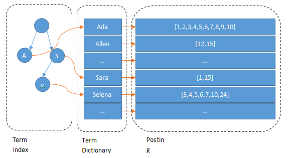
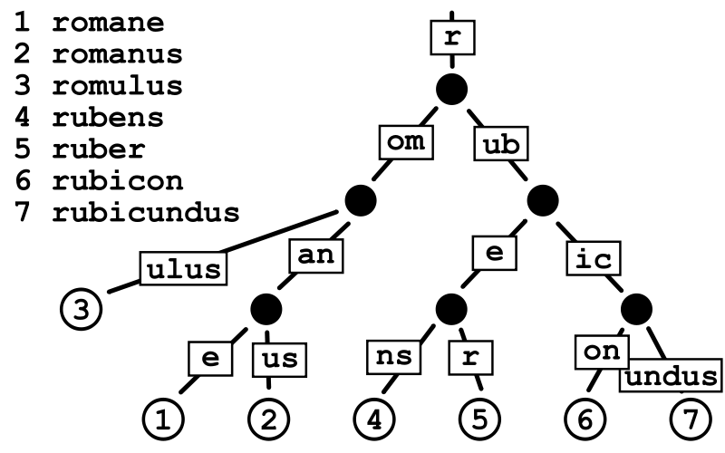

## Bloom filter

### 适用范围

实现数据字典，进行数据的判重，或者集合求交集

### 基本原理

　　对于原理来说很简单，**Bit-Map + K个独立 Hash 函数**。将 Hash 函数对应的值的位数组置`1`，**查找时如果发现所有 Hash 函数对应位都是`1`说明存在**。很明显这个过程并不保证查找的结果是 100% 正确的。同时也不支持删除一个已经插入的关键字，因为该关键字对应的位会牵动到其他的关键字。所以一个简单的改进就是 **Counting Bloom filter**，用一个 Counter 数组代替位数组，就可以支持删除了。


对于元素个数：$n$，错误率（假阳率）：$P$。我们可以计算：
  - Bit-Map 大小：$m\ge -\frac{n\times ln^P}{(ln^2)^2}$
  - Hash 函数个数：$k=log_2^\frac{1}{P}$

> 参数在线计算工具：https://hur.st/bloomfilter

举个例子我们假设 $P=0.01$，$n=4000$，则此时 m 应大概是 $9.5\times n=38000$ bit，$k=7$

注意这里 m 与 n 的单位不同，m是 `bit` 为单位，而n则是以元素个数为单位(准确的说是不同元素的个数)。通常单个元素的长度都是有很多 `bit` 的。所以使用bloom filter内存上通常都是节省的。

### 扩展

　　Bloom filter 将集合中的元素映射到位数组中，用 k 个映射位是否全1表示元素在不在这个集合中。`Counting bloom filter（CBF）`将 **位数组中的每一位扩展为一个 Counter**，从而支持了元素的删除操作。`Spectral Bloom Filter（SBF）`将其与集合元素的出现次数关联。**`SBF`采用 Counter 中的最小值来近似表示元素的出现频率**。

### 问题实例

给你A,B两个文件，各存放50亿条URL，每条URL占用64字节，内存限制是4G，让你找出A,B文件共同的URL。如果是三个乃至n个文件呢？

答：根据这个问题我们来计算下内存的占用，`4G=2^32`大概是40亿*8大概是 340亿，n=50亿，如果按出错率 0.01 算需要的大概是 475 亿个bit。现在可用的是 340 亿，相差并不多，这样可能会使出错率上升些。另外如果这些url ip是一一对应的，就可以转换成ip，则大大简单了。

---

## Hashing

### 适用范围

快速查找，删除的基本数据结构，通常需要总数据量可以放入内存

### 基本原理

　- hash函数选择，针对字符串，整数，排列，具体相应的hash方法。
  - 碰撞处理，一种是open hashing，也称为拉链法；另一种就是closed hashing，也称开地址法。

### 扩展

　　d-left hashing中 的 d 是多个的意思，我们先简化这个问题，看一看 `2-left hashing`。2-left hashing指的是将一个哈希表分成长度相等的两半，分别叫做 `T1` 和 `T2` ，给 `T1` 和 `T2` 分别配备一个哈希函数， `h1` 和 `h2` 。**在存储一个新的key时，同时用两个哈希函数进行计算，得出两个地址 `h1[key]`和 `h2[key]`**。这时需要检查 T1 中的 `h1[key]` 位置和 T2 中的 `h2[key]` 位置，哪一个位置已经存储的（有碰撞的）key比较多，然后 **将新key存储在负载少的位置**。如果两边一样多，比如两个位置都为空或者都存储了一个key，就把新key存储在左边的T1子表中，2-left也由此而来。**在查找一个key时，必须进行两次hash，同时查找两个位置**。 但是这种方法只能使用在静态集合上，一旦集合发生变化，就需要进行重新计算。

### 问题实例：

海量日志数据，提取出某日访问百度次数最多的那个IP。

答：IP的数目还是有限的，最多2^32个，所以可以考虑使用hash将 ip 直接存入内存，然后进行统计。

---

## bit-map

### 适用范围

可进行数据的快速查找，判重，删除，一般来说数据范围是int的10倍以下

### 基本原理

使用bit数组来表示某些元素是否存在，比如8位电话号码。例如bit数组 `001101001001101001` 代表实际数组 `[2,3,5,8]` 。新加入一个元素，只需要将已有的bit数组和新加入的数字做按位或 `or` 计算。bitmap中 `1` 的数量就是集合的基数值。

bitmap 有一个很明显的优势是可以轻松合并多个统计结果，只需要对多个结果求异或就可以。也可以大大减少存储内存，可以做个简单的计算，如果要统计1亿个数据的基数值，大约需要内存： $100000000/8/1024/1024 \approx≈ 12$M
如果用 32bit 的 int 代表每个统计数据，大约需要内存：$32*100000000/8/1024/1024 \approx≈ 381$M

bitmap 对于内存的节约量是显而易见的，但还是不够。统计一个对象的基数值需要`12M`，如果统计 `10000` 个对象，就需要将近 `120G` 了，同样不能广泛用于大数据场景。


### 扩展

bloom filter可以看做是对bit-map的扩展

### 问题实例

- 已知某个文件内包含一些电话号码，每个号码为8位数字，统计不同号码的个数。
答：8位最多99 999 999，大概需要99m个bit，大概10几m字节的内存即可。

- 2.5亿个整数中找出不重复的整数的个数，内存空间不足以容纳这2.5亿个整数。
答：将bit-map扩展一下，用2bit表示一个数即可，0表示未出现，1表示出现一次，2表示出现2次及以上。或者我们不用2bit来进行表示，我们用两个bit-map即可模拟实现这个2bit-map。

---

## HyperLogLog

[基数计数基本概念](http://www.rainybowe.com/blog/2017/07/13/%E7%A5%9E%E5%A5%87%E7%9A%84HyperLogLog%E7%AE%97%E6%B3%95/index.html)

[算法演示](http://content.research.neustar.biz/blog/hll.html)

上面我们计算过用 bitmap 存储 1亿 个统计数据大概需要 `12M` 内存；而在 HLL 中，只需要不到 `1K` 内存就能做到；redis中实现的 `HyperLogLog` ，只需要 `12K` 内存，在标准误差 `0.81%` 的前提下，能够统计 $2^{64}$ 个数据。首先容我感叹一下数学的强大和魅力，那么概率算法是怎样做到如此节省内存的，又是怎样控制误差的呢？

HLL中实际存储的是一个长度为 `m` 的大数组 `S` ，将待统计的数据集合划分成 m 组，每组根据算法记录一个统计值存入数组中。数组的大小 m 由算法实现方自己确定，redis中这个数组的大小是 `16834`，m 越大，基数统计的误差越小，但需要的内存空间也越大。

1. 通过hash函数计算输入值对应的比特串
2. 比特串的低 $t(t=log_2^m)t$ 位对应的数字用来找到数组 `S` 中对应的位置 `i`
3. $t+1$ 位开始找到第一个 `1` 出现的位置 `k`，将 `k` 记入数组 $S_i$ 位置
4. 基于数组 `S` 记录的所有数据的统计值，计算整体的基数值，计算公式可以简单表示为：$\hat{n}=f(S)$

### 原理

举一个我们最熟悉的抛硬币例子，出现正反面的概率都是 `1/2` ，一直抛硬币直到出现正面，记录下投掷次数 `k` ，将这种抛硬币多次直到出现正面的过程记为一次伯努利过程，对于 `n` 次伯努利过程，我们会得到nn个出现正面的投掷次数值 $k_1$, $k_2$ …… $k_n$，其中最大值记为 $k_{max}$，那么可以得到下面结论：

  - n 次伯努利过程的投掷次数都不大于 $k_{max}$
  - n 次伯努利过程，至少有一次投掷次数等于 $k_{max}$
​​
回到基数统计的问题，我们需要统计一组数据中不重复元素的个数，集合中每个元素的经过hash函数后可以表示成 0 和 1 构成的二进制数串，一个二进制串可以类比为一次抛硬币实验，1 是抛到正面，0 是反面。二进制串中从低位开始第一个 1 出现的位置可以理解为抛硬币试验中第一次出现正面的抛掷次数 `k` ，那么基于上面的结论，我们可以通过多次抛硬币实验的最大抛到正面的次数来预估总共进行了多少次实验，同样可以可以通过第一个 1 出现位置的最大值 $k_{max}$ 来预估总共有多少个不同的数字（整体基数）。

这种通过局部信息预估整体数据流特性的方法似乎有些超出我们的基本认知，需要用概率和统计的方法才能推导和验证这种关联关系。HyperLogLog 核心在于观察集合中每个数字对应的比特串，通过统计和记录比特串中最大的出现 1 的位置来估计集合整体的基数，可以大大减少内存耗费。

---

## Simhash

SimHash算法可计算文本间的相似度，实现文本去重。

1. 首先，对原始内容分词，并且计算每个词的权重；
2. 对每个词哈希成一个整数，并且把这个整数对应的二进制序列中的 0 变成 -1，1 还是 1，得到一个 1 和 -1 组成的向量；
3. 把每个词哈希后的向量乘以词的权重，得到一个新的加权向量；
4. 把每个词的加权向量相加，得到一个最终向量，这个向量中每个元素有正有负；
5. 把最终这个向量中元素为正的替换成 1，为负的替换成 0，这个向量变成一个二进制位序列，也就是最终变成了一个整数。

Simhash 为每一个内容生成一个整数指纹，其中的关键是把每个词哈希成一个整数，这一步常常采用 Jenkins 算法。这里简单示意的整数只有 8 个二进制位，实际上可能需要 64 个二进制位的整数，甚至范围更大。

得到每个内容的 Simhash 指纹后，可以两两计算 **汉明距离**，比较二进制位不同个数，其实就是计算两个指纹的异或，异或结果中如果包含 3 个以下的 1，则认为两条内容重复。

---

## 堆

### 适用范围

海量数据前n大，并且n比较小，堆可以放入内存

### 基本原理

最大堆求前n小，最小堆求前n大。适合大数据量，求前n小，n的大小比较小的情况，这样可以扫描一遍即可得到所有的前n元素，效率很高。

### 扩展

双堆，一个最大堆与一个最小堆结合，可以用来维护中位数。

### 问题实例：

- 100w个数中找最大的前100个数。
答：用一个100个元素大小的最小堆即可。

---

## 双层桶划分

### 适用范围

第k大，中位数，不重复或重复的数字

### 基本原理

因为元素范围很大，不能利用直接寻址表，所以通过多次划分，逐步确定范围，然后最后在一个可以接受的范围内进行。可以通过多次缩小，双层只是一个例子。

> 其实本质上就是【分而治之】的思想，重在分的技巧上！

### 扩展

当有时候需要用一个小范围的数据来构造一个大数据，也是可以利用这种思想，相比之下不同的，只是其中的逆过程。

### 问题实例

- 2.5亿个整数中找出不重复的整数的个数，内存空间不足以容纳这2.5亿个整数。
答：有点像鸽巢原理，整数个数为 2^32 ,也就是，我们可以将这 `2^32` 个数，划分为 `2^8` 个区域(比如用单个文件代表一个区域)，然后将数据分离到不同的区域，然后不同的区域在利用 bitmap 就可以直接解决了。也就是说只要有足够的磁盘空间，就可以很方便的解决。

- 5亿个 int 找它们的中位数。
答一：这个例子比上面那个更明显。首先我们将 int 划分为 2^16个 区域，然后读取数据统计落到各个区域里的数的个数，之后我们根据统计结果就可以判断中位数落到那个区域，同时知道这个区域中的第几大数刚好是中位数。然后第二次扫描我们只统计落在这个区域中的那些数就可以了。
答二：实际上，如果不是 int 是 int64，我们可以经过3次这样的划分即可降低到可以接受的程度。即可以先将 int64 分成 2^24 个区域，然后确定区域的第几大数，在将该区域分成 2^20 个子区域，然后确定是子区域的第几大数，然后子区域里的数的个数只有 2^20 ，就可以直接利用 direct addr table 进行统计了。

---

## 数据库索引

### 适用范围

大数据量的增删改查

### 基本原理

利用数据的设计实现方法，对海量数据的增删改查进行处理。

---

## 倒排索引(Inverted index)



### 适用范围

搜索引擎，关键字查询

### 基本原理

用来存储在全文搜索下某个单词在一个文档或者一组文档中的存储位置的映射。

以英文为例，下面是要被索引的文本：

```
T0 = "it is what it is"
T1 = "what is it"
T2 = "it is a banana"
```

我们就能得到下面的反向文件索引：

```
"a": {2} "banana": {2} "is": {0, 1, 2} "it": {0, 1, 2} "what": {0, 1}
```

检索的条件"what","is"和"it"将对应集合的交集。

正向索引开发出来用来存储每个文档的单词的列表。正向索引的查询往往满足每个文档有序频繁的全文查询和每个单词在校验文档中的验证这样的查询。在正向索引中，文档占据了中心的位置，每个文档指向了一个它所包含的索引项的序列。也就是说文档指向了它包含的那些单词，而反向索引则是单词指向了包含它的文档，很容易看到这个反向的关系。

### 扩展


### 问题实例

文档检索系统，查询那些文件包含了某单词，比如常见的学术论文的关键字搜索。

---

## 外排序

https://blog.csdn.net/lsf921016/article/details/64885699
http://data.biancheng.net/view/78.html

### 适用范围

大数据的排序，去重。场景具有很明显的特点，词的大小为16个字节，但是内存只有 1m 做 hash 有些不够，所以可以用来排序。内存可以当输入缓冲区使用。

### 基本原理

一般来说外排序分为两个步骤：预处理和合并排序。
  - 根据可用内存的大小，将外存上含有 n 个纪录的文件分成若干长度为t的子文件（或段）；
  - 利用内部排序的方法，对每个子文件的t个纪录进行内部排序。
  - 这些经过排序的子文件（段）通常称为顺串(run)，顺串生成后即将其写入外存。这样在外存上就得到了m个顺串（m=[n/t]）。
  - 对这些顺串进行归并，使顺串的长度逐渐增大，直到所有的待排序的记录成为一个顺串为止。

### 扩展

外排序的归并方法，置换选择败者树原理，最优归并树

### 问题实例

  - 有一个1G大小的一个文件，里面每一行是一个词，词的大小不超过16个字节，内存限制大小是1M。返回频数最高的100个词。

---

## Trie树

### 适用范围

数据量大，重复多，但是数据种类小可以放入内存

- 字符串的快速检索
- 字符串排序
- 最长公共前缀
- 自动匹配前缀显示后缀

### 基本原理

Trie树的创建要考虑的是父节点如何保存孩子节点，主要有链表和数组两种方式

- 链表：空间占用少，查找效率低
- 数组：空间占用多，查找效率高
- Hash：

### 扩展

#### 压缩Trie Patricia Tree



基数树（也叫基数特里树或压缩前缀树）是一种数据结构，是一种更节省空间的Trie（前缀树），其中作为唯一子节点的每个节点都与其父节点合并，**边既可以表示为元素序列又可以表示为单个元素**。

基数树的查找方式也与常规树不同（常规的树查找一开始就对整个键进行比较，直到不相同为止），基数树查找时节点时，对于节点上的键都按块进行逐块比较，其中该节点中块的长度是基数r； 当 $r$ 为2时，基数树为二进制的（即该节点的键的长度为1比特位），能最大程度地减小树的深度来最小化稀疏性（最大限度地合并键中没有分叉的节点）。 当 $r≥4$ 且为2的整数次幂时，基数树是 $r$ 元基数树，能以潜在的稀疏性为代价降低基数树的深度。

#### 后缀Trie

压缩的后缀字典树

- 查找某个字符串s1是否在另外一个字符串s2中
- 指定字符串s1在字符串s2中重复的次数
- 两个字符串S1，S2的最长公共部分
- 最长回文串

#### 双数组字典树 Double-Array Trie

https://github.com/komiya-atsushi/darts-java

双数组Trie (Double-Array Trie)结构由日本人JUN-ICHI AOE于1989年提出的，是 **Trie结构的压缩形式**，仅用两个线性数组来表示Trie树，该结构有效结合了数字搜索树(Digital Search Tree)检索时间高效的特点和链式表示的Trie空间结构紧凑的特点。双数组Trie的本质是一个确定有限状态自动机（DFA），每个节点代表自动机的一个状态，根据变量不同，进行状态转移，当到达结束状态或无法转移时，完成一次查询操作。**在双数组所有键中包含的字符之间的联系都是通过简单的数学加法运算表示，不仅提高了检索速度，而且省去了链式结构中使用的大量指针，节省了存储空间**。

>DAT的生成如上说的只能对 **排序** 好的单词进行构建

双数组Trie树归根结底还是属于Trie树，所以免不了有一颗树的构造过程。不过这棵树并没有保存下来，而是边构造树边维护双数组以表示整棵树。

```
//i 为状态值 c为当前字符 parent(i) 为i的前置状态
base[i]=base[parent(i)+c]
check[i]=base[parent(i)]

base[i]<0 即为结束
```

### 问题实例

  - 有10个文件，每个文件1G，每个文件的每一行都存放的是用户的query，每个文件的query都可能重复。要你按照query的频度排序。
  - 1000万字符串，其中有些是相同的(重复),需要把重复的全部去掉，保留没有重复的字符串。请问怎么设计和实现？
  - 寻找热门查询：查询串的重复度比较高，虽然总数是1千万，但如果除去重复后，不超过3百万个，每个不超过255字节。

---

## map-reduce

### 适用范围

数据量大，但是数据种类小可以放入内存

### 基本原理及要点

将数据交给不同的机器去处理，数据划分，结果归约。

### 问题实例

  - The canonical example application of MapReduce is a process to count the appearances ofeach different word in a set of documents:
  - 海量数据分布在100台电脑中，想个办法高效统计出这批数据的TOP10。
  - 一共有N个机器，每个机器上有N个数。每个机器最多存O(N)个数并对它们操作。如何找到N^2个数的中数(median)？

## 经典问题分析

　　上千万or亿数据（有重复），统计其中出现次数最多的前N个数据,分两种情况：可一次读入内存，不可一次读入。

　　可用思路：trie树+堆，数据库索引，划分子集分别统计，hash，分布式计算，近似统计，外排序

　　所谓的是否能一次读入内存，实际上应该指去除重复后的数据量。如果去重后数据可以放入内存，我们可以为数据建立字典，比如通过 map，hashmap，trie，然后直接进行统计即可。当然在更新每条数据的出现次数的时候，我们可以利用一个堆来维护出现次数最多的前N个数据，当然这样导致维护次数增加，不如完全统计后在求前N大效率高。

　　如果数据无法放入内存。一方面我们可以考虑上面的字典方法能否被改进以适应这种情形，可以做的改变就是将字典存放到硬盘上，而不是内存，这可以参考数据库的存储方法。

　　当然还有更好的方法，就是可以采用分布式计算，基本上就是map-reduce过程，首先可以根据数据值或者把数据hash(md5)后的值，将数据按照范围划分到不同的机子，最好可以让数据划分后可以一次读入内存，这样不同的机子负责处理各种的数值范围，实际上就是map。得到结果后，各个机子只需拿出各自的出现次数最多的前N个数据，然后汇总，选出所有的数据中出现次数最多的前N个数据，这实际上就是reduce过程。

　　实际上可能想直接将数据均分到不同的机子上进行处理，这样是无法得到正确的解的。因为一个数据可能被均分到不同的机子上，而另一个则可能完全聚集到一个机子上，同时还可能存在具有相同数目的数据。比如我们要找出现次数最多的前100个，我们将1000万的数据分布到10台机器上，找到每台出现次数最多的前 100个，归并之后这样不能保证找到真正的第100个，因为比如出现次数最多的第100个可能有1万个，但是它被分到了10台机子，这样在每台上只有1千个，假设这些机子排名在1000个之前的那些都是单独分布在一台机子上的，比如有1001个，这样本来具有1万个的这个就会被淘汰，即使我们让每台机子选出出现次数最多的1000个再归并，仍然会出错，因为可能存在大量个数为1001个的发生聚集。因此不能将数据随便均分到不同机子上，而是要根据hash 后的值将它们映射到不同的机子上处理，让不同的机器处理一个数值范围。

　 而外排序的方法会消耗大量的IO，效率不会很高。而上面的分布式方法，也可以用于单机版本，也就是将总的数据根据值的范围，划分成多个不同的子文件，然后逐个处理。处理完毕之后再对这些单词的及其出现频率进行一个归并。实际上就可以利用一个外排序的归并过程。

　 另外还可以考虑近似计算，也就是我们可以通过结合自然语言属性，只将那些真正实际中出现最多的那些词作为一个字典，使得这个规模可以放入内存。

## 参考链接

- [360 搜索的百亿级网页搜索引擎架构实现](https://www.infoq.cn/article/pF3_wx3rQ43VYMpLdAPC)
