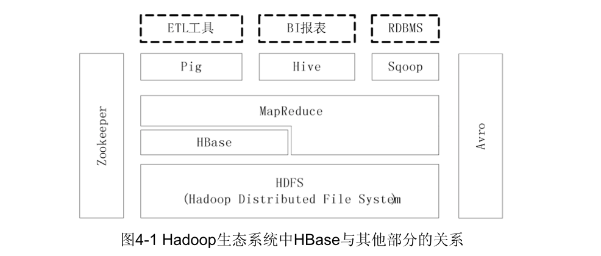
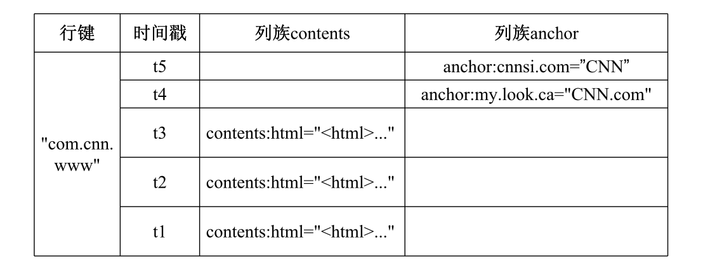
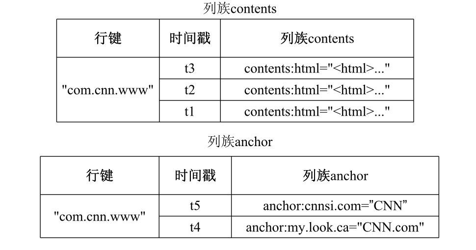

## HBase 概述

HBase 是一个**高可靠**、**高性能**、**面向列**、**可伸缩** 的分布式数据库，是谷歌 BigTable 的开源实现，**主要用来存储非结构化和半结构化的松散数据**。HBase 的目标是处理非常庞大的表，可以通过水平扩展的方式，利用廉价计算机集群处理超过10亿行数据和百万列元素组成的数据表。

||BigTable|HBase|
|:--|:--|:--|
|文件存储系统|GFS|HDFS|
|数据处理|MapReduce|Hadoop MapReduce|
|协同服务管理|Chubby|Zookeeper|

Hadoop 已经有 HDFS 为什么还需要 HBase？这里就需要说到 HDFS 的特性：
1. HDFS 本身是高延迟的数据处理机制，无法提供大规模数据的实时查询；
2. HDFS 是面向批量访问模式，不是随机访问模式

HDFS 与传统的关系型数据库的对比：
1. 数据类型：HBase 中所有的数据都是未经解释的字符串（byte 数组）
2. 数据操作：HBase 操作不存在复杂的表与表之间的关系，只有简单的插入、查询、删除、清空
3. 存储模式：HBase 基于列存储，每个列族都由几个文件保存，不同列族的文件分离
4. 数据索引：HBase 只有一个索引——行键
5. 数据维护：HBase 中的更新操作均不会覆盖旧数据，而是生成一个新的版本
6. 可伸缩性：HBase 可以实现灵活的水平扩展

## HBase 数据模型

HBase 是一个稀疏、多维度、排序的映射表。HBase 中可以存储若干个列族，一个列族可包含任意个列，同一个列族里面的数据存储在一起。列族支持动态扩展，可以轻松的增加一个列族或者列，无需预先定义列。

- 表：HBase 采用表来组织数据，表由行和列组成，列划分为若干个列族
- 行：每个 HBase 表都由若干行组成，每个行由行键（raw key）来标示
- 列族：HBase 表被分组成许多 “列族”（Column Family） 的集合，它是基本的访问控制单元
- 列限定符：列族里的数据通过列限定符来定位
- 单元格：在 HBase 表中，通过行、列族和列限定符能确定一个 “单元格”（Cell） ，单元格中的数据没有数据类型，被视为 byte[]
- 时间戳：每个单元格都保存着同一份数据的多个版本，这些版本采用时间戳进行索引

HBase 中可通过行键、列族、列限定符和时间戳，唯一确定一个数据，因此可以被视为一个思维坐标，即：`[行键，列族，列限定符，时间戳]`。

在 HBase 的逻辑上，数据分布如下所示：

但在物理上的结构有所不同：

## HBase 实现原理

HBase 包含三个主要的功能组件：
- 客户端：
- Master 主服务器：管理和维护 HBase 表的分区信息，维护 Region 服务器列表，分配 Region ，负载均衡
- Region 服务器：负责存储和维护分配给自己的 Region ，处理客户端的读写请求

### 数据写入过程

### 数据读取过程

## HBase 运行机制

## HBase 应用方案

## 参考链接

- [HBase － 数据写入流程解析](http://hbasefly.com/2016/03/23/hbase_writer/)
- [HBase原理－数据读取流程解析](http://hbasefly.com/2016/12/21/hbase-getorscan/)