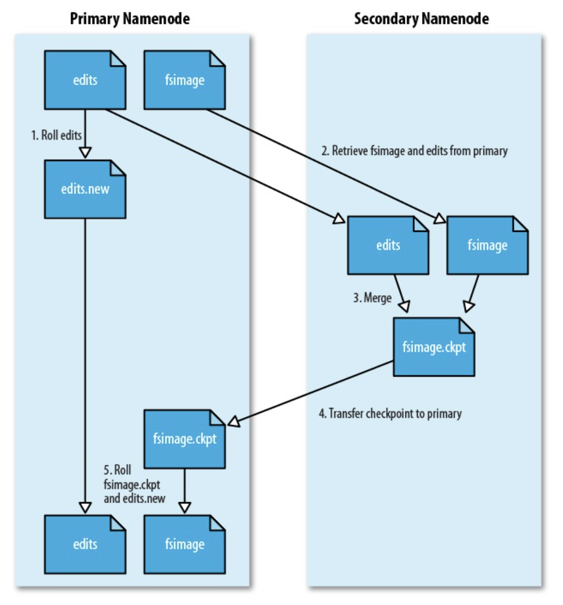

## HDFS 相关概念

HDFS要实现有以下优势：
- 兼容廉价硬件设备
- 流数据读写
- 大数据集
- 简单的文件模型
- 强大的跨平台兼容性

HDFS 在满足上述优势的同时，也不可避免的有一些自身的局限性，主要包括以下几个方面：
- 不适合低延时的数据访问
- 无法高效的存储大量小文件
- 不支持多用户写入及任意修改文件

### 块

HDFS 同计算机系统一样，有一个存储块的概念，默认大小为 64M，一个文件被分成多个块存储。块的大小远远大于计算机文件系统，可以减小寻址开销。其优势有：

- 支持大规模文件存储：以块为单位进行存储，一个大文件可被分割为多个块，并分发到不同节点，因此单个节点的存储容量不会限制存储文件的上限
- 简化系统设计：首先简化了存储管理，因为文件块大小固定，这样很容易计算节点可存储文件块的数量；其次，方便了元数据管理，元数据不与文件块存储，可由其他系统负责管理元数据。
- 适合数据备份：每个文件块都可冗余存储到多个节点，大大提高了系统的容错性和可用性。

### 名称节点（NameNode）和数据节点（DataNode）

|NameNode|DataNode|
|:--|:--|
|存储元数据|存储文件内容|
|元数据存储在内存|文件内容存储在磁盘|
|保存文件、block、 DataNode 之间的映射关系|维护block、本地文件系统的映射关系|

#### 名称节点（NameNode）数据结构

在 HDFS 中，名称节点复杂管理分布式文件系统的命名空间（NameSpace），保存两大核心数据结构：**FSImage** 和 **EditLog**。名称节点中还记录了每个文件中各个块所在的数据节点的位置信息。

**FSImage 文件用于维护文件系统树以及文件树中所有文件和文件夹的元数据**。FSImage 文件中包含文件系统所有目录和文件 `inode` 的序列化形式，每个 `inode` 是一个文件或目录的元数据表示，包含：文件复制等级、修改和访问时间、访问权限、块大小以及组成文件的块。

FSImage 中并没有记录块存储在哪个数据节点。而是由名称节点把这些映射保存在内存中，当数据节点加入 HDFS 集群时，数据节点会报告自己所包含的数据块给名称节点，并定期执行告知，以确保名称节点的映射关系是正确的。

**EditLog 记录了所有针对文件的创建、删除、重命名等操作**。

NameNode 将对文件系统的改动追加保存到本地文件系统上的一个日志文件（EditLog）。当一个 NameNode 启动时，它首先从一个映像文件（FSImage）中读取 HDFS 的状态，接着应用日志文件中的 EditLog 操作。然后它将新的HDFS状态写入（FSImage）中，并使用一个空的 EditLog 文件开始正常操作。因为NameNode只有在启动阶段才合并 FSImage 和 EditLog ，所以久而久之日志文件可能会变得非常庞大，特别是对大型的集群。日志文件太大的另一个副作用是下一次 NameNode 启动会花很长时间。

Secondary NameNode 定期合并 FSImage 和 EditLog 日志，将 EditLog 日志文件大小控制在一个限度下。

#### 名称节点的启动

1. 名称节点启动后，会将 FSImage 文件中的内容加载到内存，之后再执行 EditLog 文件中的各项操作，使得内存中的元数据与实际数据一致。
2. 一旦内存中管理文件系统元数据的映射，则会创建一个新的 FSImage 文件和一个空白的 EditLog 文件。
3. 名称节点启动后， HDFS 中的更新操作会重新写入 EditLog，因为 FSImage 文件一般很大，所以不直接向 FSImage 文件中写入数据，但是 EditLog 每次启动后都是空白的。每次执行完写操作，且在向客户端发送成功消息之前，EditLog 文件都需要同步更新。

#### 数据节点

数据节点是 HDFS 的工作节点，负责数据的存储和读取，会根据客户端或者名称节点的调度来进行数据的存储和检索，并定期向名称节点发送自己所存储的块信息。每个数据节点中的数据都会被保存在各自节点的本地 Linux 文件系统中。

## HDFS 体系结构

HDFS 采取主从模型，一个 HDFS 集群包含一个 NameNode 和若干个 DataNode 。名称节点作为中心服务器，负责管理文件系统的命名空间及客户端对文件的访问。

### 命名空间

HDFS 的命名空间包含块映射、以及相关属性，存储在 FSImage 中。在 HDFS 1.0 体系结构中，整个 HDFS 集群中只有一个命名空间，并且只有唯一一个名称节点，该节点对这个命名空间进行管理。在 HDFS 2.0 中提出了 **联邦 （Federation）** 的概念。

#### Federation

Federation 的设计就是为了解决 HDFS 1.0 中的单一 NameNode 的问题，采用 Federation 的最主要原因是设计实现简单。

> block pool 存储在 DataNode 上，并通过 BPOfferService 提供服务

Federation 的核心思想是将一个大的 `namespace` 划分多个子 `namespace` ，并且每个 `namespace` 分别由单独的 NameNode 负责，这些 NameNode 之间互相独立，不会影响，不需要做任何协调工作（其实跟拆集群有一些相似），**集群的所有 DataNode 会被多个 NameNode 共享**。

其中，每个子 `namespace` 和 DataNode 之间会由数据块管理层作为中介建立映射关系，数据块管理层由若干 **数据块池（Pool）** 构成，每个数据块只会唯一属于某个固定的数据块池，而一个子 `namespace` 可以对应多个数据块池。每个 DataNode 需要向集群中所有的 NameNode 注册，且周期性地向所有 NameNode 发送心跳和块报告，并执行来自所有 NameNode 的命令。

- 一个 block pool 由属于同一个 namespace 的数据块组成，每个 DataNode 可能会存储集群中所有 block pool 的数据块；
- 每个 block pool 内部自治，也就是说各自管理各自的 block，不会与其他 block pool 交流，如果一个 NameNode 挂掉了，不会影响其他 NameNode;
- **某个 NameNode 上的 namespace 和它对应的 block pool 一起被称为 namespace volume，它是管理的基本单位**。当一个 NameNode/namespace 被删除后，其所有 DataNode 上对应的 block pool 也会被删除，当集群升级时，每个 namespace volume 可以作为一个基本单元进行升级。

### HA

在 Hadoop 1.0 时代，Hadoop 的两大核心组件 HDFS NameNode 和 JobTracker 都存在着单点问题，这其中以 NameNode 的单点问题尤为严重。因为 NameNode 保存了整个 HDFS 的元数据信息，一旦 NameNode 挂掉，整个 HDFS 就无法访问，同时 Hadoop 生态系统中依赖于 HDFS 的各个组件，并且重新启动 NameNode 和进行数据恢复的过程也会比较耗时。这些问题在给 Hadoop 的使用者带来困扰的同时，也极大地限制了 Hadoop 的使用场景，使得 Hadoop 在很长的时间内仅能用作离线存储和离线计算，无法应用到对可用性和数据一致性要求很高的在线应用场景中。

所幸的是，在 Hadoop2.0 中，HDFS NameNode 和 YARN ResourceManger 的单点问题都得到了解决，经过多个版本的迭代和发展，目前已经能用于生产环境。

NameNode 的高可用架构主要分为下面几个部分：

- **Active NameNode 和 Standby NameNode**：两台 NameNode 形成互备，一台处于 Active 状态，为主 NameNode，另外一台处于 Standby 状态，为备 NameNode，只有主 NameNode 才能对外提供读写服务。
- **主备切换控制器 ZKFailoverController**：ZKFailoverController 作为独立的进程运行，对 NameNode 的主备切换进行总体控制。ZKFailoverController 能及时检测到 NameNode 的健康状况，在主 NameNode 故障时借助 Zookeeper 实现自动的主备选举和切换，当然 NameNode 目前也支持不依赖于 Zookeeper 的手动主备切换。
- **Zookeeper 集群**：为主备切换控制器提供主备选举支持。
- **共享存储系统**：共享存储系统是实现 NameNode 的高可用最为关键的部分，共享存储系统保存了 NameNode 在运行过程中所产生的 HDFS 的元数据。**主 NameNode 和 备份 NameNode 通过共享存储系统实现元数据同步**。在进行主备切换的时候，新的主 NameNode 在确认元数据完全同步之后才能继续对外提供服务。
- **DataNode 节点**：除了通过共享存储系统共享 HDFS 的元数据信息之外，主 NameNode 和备 NameNode 还需要共享 HDFS 的数据块和 DataNode 之间的映射关系。**DataNode 会同时向主 NameNode 和备 NameNode 上报数据块的位置信息**。

NameNode 主备切换主要由 ZKFailoverController、HealthMonitor 和 ActiveStandbyElector 这 3 个组件来协同实现：

#### HDFS 脑裂问题

在实际中，NameNode 可能会出现这种情况，**NameNode 在垃圾回收（GC）时，可能会在长时间内整个系统无响应，因此，也就无法向 ZK 写入心跳信息，这样的话可能会导致临时节点掉线，备 NameNode 会切换到 Active 状态**。这种情况，可能会导致整个集群会有同时有两个 NameNode，这就是脑裂问题。

脑裂问题的解决方案是隔离（Fencing），主要是在以下三处采用隔离措施：
- 第三方共享存储：任一时刻，只有一个 NN 可以写入
- DataNode：需要保证只有一个 NN 发出与管理数据副本有关的删除命令
- Client：需要保证同一时刻只有一个 NN 能够对 Client 的请求发出正确的响应

#### 共享存储

上述 HA 方案还有一个明显缺点，那就是第三方存储节点有可能失效，目前社区已经把由 Clouderea 公司实现的基于 QJM 的方案作为默认的共享存储实现。`QJM（Quorum Journal Manager）`本质上是利用 `Paxos` 协议来实现的，QJM 在 `2F+1` 个 JournalNode 上存储 NameNode 的 EditLog ，每次写入操作都通过 `Paxos` 保证写入的一致性，它最多可以允许有 `F` 个 JournalNode 节点同时故障。

Active NameNode 首先把 EditLog 提交到 JournalNode 集群，然后 Standby NameNode 再从 JournalNode 集群定时同步 EditLog 。还有一点需要注意的是，在 2.0 中不再有 SNN 这个角色了，NameNode 在启动后，会先加载 `FSImage` 文件和共享目录上的 EditLog Segment 文件，之后 NameNode 会启动 EditLogTailer 线程和 StandbyCheckpointer 线程，正式进入 Standby 模式，其中：

- EditLogTailer 线程的作用是定时从 JournalNode 集群上同步 EditLog
- StandbyCheckpointer 线程的作用其实是为了替代 Hadoop 1.x 版本之中的 Secondary NameNode 的功能，StandbyCheckpointer 线程会在 Standby NameNode 节点上定期进行 Checkpoint，将 Checkpoint 之后的 FSImage 文件上传到 Active NameNode 节点

### 通信协议

- 客户端与 NameNode 通过 TCP 连接，并使用客户端协议进行通信
- NameNode 和 DataNode 之间使用数据节点协议通信
- 客户端与 DataNode 之间通过 RPC 进行交互

### 局限性

- 命名空间的限制（Hadoop 2.0 已解决）
- 性能瓶颈：受限于单节点吞吐量
- 隔离问题：单个 NameSpace 无法对不同应用程序进行隔离（Hadoop 2.0 已解决）
- 可用性：单个 NameNode 故障无法快速切换（Hadoop 2.0 已解决）

## HDFS 存储原理

### 冗余数据保存

HDFS 采用多副本方式对数据进行冗余存储，通常一个数据库的多个副本会被分布到不同的数据节点。这样多副本具有以下几个优点：
1. 加速数据传输
2. 容易检查数据错误
3. 保证数据可靠性

### 数据存取策略

HDFS 使用的是传统的分级文件体系，因此，用户可以像使用普通文件系统一样，创建、删除目录和文件，在目录之间移动、重命名文件，但不支持修改。

#### 存储类型

- DISK：普通磁盘
- SSD：SSD盘
- RAM_DISK：内存盘
- ARCHIVE：归档/压缩，不是实际的磁盘类型，而是数据被压缩存储。

#### 存储策略

存储策略允许不同的文件存储在不同的存储类型上。目前有以下策略：

- **Hot**：存储和计算都热。    如果是热快，那么复制的目标也是DISK（普通的磁盘）。
- **Cold**：用于有限计算的存储。 数据不再使用，或者需要归档的数据被移动到冷存储。如果数据块是冷的，则复制使用ARCHIVE.
- **Warm**：半冷半热。warm块的复制内容，部分放置在DISK，其它的在ARCHIVE.
- **All_SSD**：所有数据存储在SSD.
- **One_SSD**：一个复制在SSD，其它的在DISK.
- **Lazy_Persist**：只针对只有一个复制的数据块，它们被放在RAM_DISK,之后会被写入DISK。

当创建文件/目录的时候，并未为它们设定了存储策略。 但可以通过`hdfs storagepolicies` 命令来管理。文件/路径的存储策略按照如下规则解析：

- 如果有设定特定的策略，那么就是那个策略
- 如果没有设定，就返回上级目录的存储策略。如果是没有策略的根目录，那么返回默认的存储策略（Hot)。

#### 存储时 DataNode 选择

默认情况下，Hadoop 机架感知是没有启用的，需要在NameNode机器的`hadoop-site.xml` 里配置一个选项。

当没有配置机架信息时，所有的机器 Hadoop 都默认在同一个默认的机架下，名为 `/default-rack`，这种情况下，任何一台 DataNode 机器，不管物理上是否属于同一个机架，都会被认为是在同一个机架下，此时，就很容易出现之前提到的增添机架间网络负载的情况。在没有机架信息的情况下， NameNode 默认将所有的 `slaves` 机器全部默认为在 `/default-rack` 下，此时写 `block` 时，三个 DataNode 机器的选择完全是随机的。

当配置了机架感知信息以后，hadoop在选择三个datanode时，就会进行相应的判断。

#### 数据读取策略

- HDFS 提供 API 可以确定一个数据节点所属机架ID，客户端也可以调用 API 获取自己的机架ID
- 从名称节点获取数据块不同副本的存放位置列表，列表中包含副本所在的数据节点
- 客户端调用 API 获取数据节点所属的机架ID，如果与客户端机架ID 相同则优先选择，否则就随机读取

### 数据错误与恢复

#### NameNode 出错

HDFS 有备份机制，定时将 FSImage 和 EditLog 备份到 SecondaryNameNode 。当 NameNode 出错，就可以根据 SecondaryNameNode 中的数据进行恢复。

#### DataNode 出错

当 DataNode 发生网络问题或机器故障时，这些 DataNode 会被标记为 “宕机”，节点上的数据均被标记为 “不可读”， NameNode 不会再对它发送任何数据请求。这时，由于部分 DataNode 不可用，会导致一些数据块的副本数量小于冗余因子。在这种情况下，NameNode 会启动冗余复制，为数据块生成新的副本。

#### 数据出错

当文件被创建时，客户端都会对每个文件块进行信息摘要，并将其存储在同路径的隐藏文件里。客户端在读取数据时，会首先获取信息摘要，并对数据块进行 MD5 和 SHA1 校验。如果数据错误，则会向 NameNode 报告错误，NameNode 定时检查并重新复制该数据块。

## HDFS 数据读写过程

### 写数据过程

具体过程如下：
1. Client 调用 `DistributedFileSystem` 对象的 `create` 方法，创建一个文件输出流（FSDataOutputStream）对象；
2. 通过 `DistributedFileSystem` 对象与集群的 NameNode 进行一次 RPC 远程调用，在 HDFS 的 Namespace 中创建一个文件条目（Entry），此时该条目没有任何的 Block，NameNode 会返回该数据每个块需要拷贝的 DataNode 地址信息；
3. 通过 `FSDataOutputStream` 对象，开始向 DataNode 写入数据，数据首先被写入 `FSDataOutputStream` 对象内部的数据队列中，数据队列由 `DataStreamer` 使用，它通过选择合适的 DataNode 列表来存储副本，从而要求 NameNode 分配新的 block；
4. `DataStreamer` 将数据包以流式传输的方式传输到分配的第一个 DataNode 中，该数据流将数据包存储到第一个 DataNode 中并将其转发到第二个 DataNode 中，接着第二个 DataNode 节点会将数据包转发到第三个 DataNode 节点；
5. DataNode 确认数据传输完成，最后由第一个 DataNode 通知 client 数据写入成功；
6. 完成向文件写入数据，Client 在文件输出流（`FSDataOutputStream`）对象上调用 close 方法，完成文件写入；
7. 调用 `DistributedFileSystem` 对象的 `complete` 方法，通知 NameNode 文件写入成功，NameNode 会将相关结果记录到 `editlog` 中。

> 注意：client运行 write 操作后，写完的 block 才是可见的，正在写的 block 对 client 是不可见的，仅仅有调用 sync 方法。client才确保该文件的写操作已经全部完毕。当 client 调用 close 方法时，会默认调用 sync 方法。是否须要手动调用取决你依据程序须要在数据健壮性和吞吐率之间的权衡。

#### 读数据过程

1. Client 通过 `DistributedFileSystem` 对象与集群的 NameNode 进行一次 RPC 远程调用，获取文件 `block` 位置信息；
2. NameNode 返回存储的每个块的 DataNode 列表；
3. Client 将连接到列表中最近的 DataNode；
4. Client 开始从 DataNode 并行读取数据；
5. 一旦 Client 获得了所有必须的 `block`，它就会将这些 `block` 组合起来形成一个文件。

## 参考

- [HDFS机架感知功能原理 - rack awareness](https://www.jianshu.com/p/372d25352d3a)
- [HDFS数据存储与读写过程](https://zhuanlan.zhihu.com/p/49951304)
- [HDFS 架构学习总结](https://matt33.com/2018/07/15/hdfs-architecture-learn/)
- [Hadoop NameNode 高可用 (High Availability) 实现解析](https://www.ibm.com/developerworks/cn/opensource/os-cn-hadoop-name-node/)