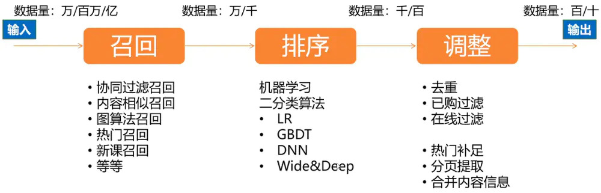
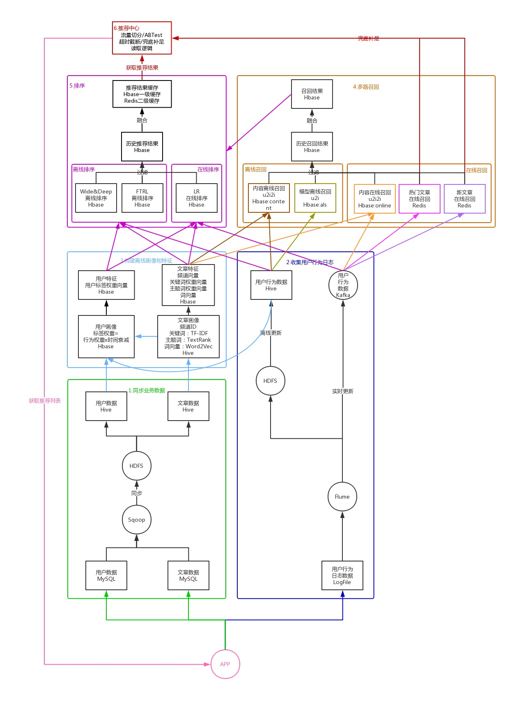

# 推荐系统

根据用户的历史信息和行为，向用户推荐他感兴趣的内容

## 解决的问题

1. 信息过载
2. 挖掘长尾
3. 提升用户体验

## 概念

1. CTR: Click-Through-Rate 点击通过率
2. 召回：
3. 精排：
3. 冷启动：
4. 基于行为的协同过滤：
5. 基于内容的相似性推荐：

## 三个环节

在召回阶段，首先筛选出和用户直接相关或间接相关的物品，将原始数据从万、百万、亿级别缩小到万、千级别；在排序阶段，通常使用二分类算法来预测用户对物品的喜好程度（或者是点击率），然后将物品按照喜好程序从大到小依次排列，筛选出用户最有可能喜欢的物品，这里又将召回数据从万、千级别缩小到千、百级别；最后在调整阶段，需要过滤掉重复推荐的、已经购买或阅读的、已经下线的物品，当召回和排序结果不足时，需要使用热门物品进行补充，最后合并物品基础信息，将包含完整信息的物品推荐列表返回给客户端。

1. 召回：
2. 排序：
3. 调整：

## 数据去重

https://www.narsi.me/2018/03/14/bloom-filter/

去重一般涉及到两方面内容：

1、内容源去重，这个在新闻等信息流推荐中很常用，很多相近的文章讲的都是同一件事情；

2、给用户推荐的内容去重，即不给用户推荐重复的内容；

2就是题主关注的点。

内容去重常采用BloomFilter算法

我现在是这么做的，适用于用户量不大的情况，当前DAU为100W1、spark streaming接收前端pingback日志，提取<用户ID，查看的item列表>数据；2、使用redis cluster的map结构，以用户ID为key，以item列表的json为value，更新；3、下次查询的时候，取出这个item列表，过滤掉；其中spark streaming的处理时间为10秒钟一个窗口；另外，每天会清空这个用户3天前的观看历史，也就是3天前的item会仍然再次推送；我们是类似电商，所以没买过的会过一段时间再推；

## 参考

- [文章推荐系统 | 一、推荐流程设计](https://www.jianshu.com/p/0688c78d0366)
- [CTR展现打散去重的设计](https://yuerblog.cc/2018/07/09/ctr-display-design/)
- [个性化推荐系统从0到1](https://cloud.tencent.com/developer/article/1004920)
