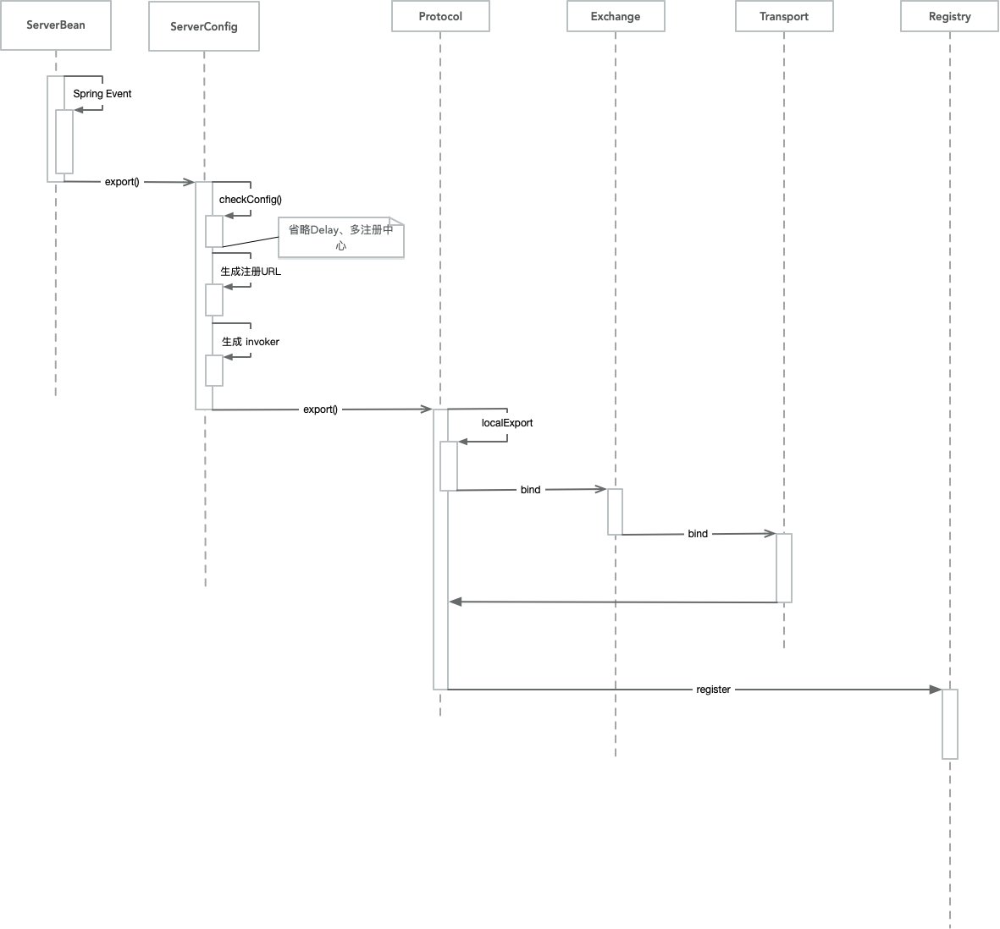
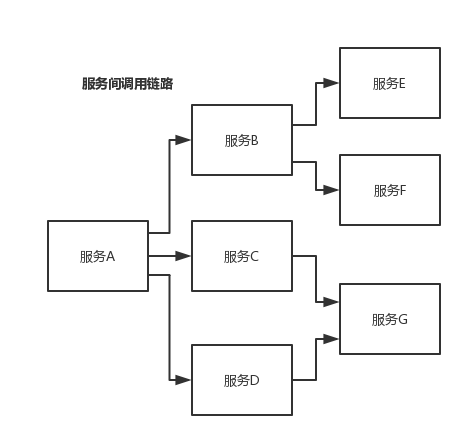

# [Dubbo](https://zhuanlan.zhihu.com/p/45846108)

## 领域模型
在 Dubbo 的核心领域模型中：

  - `Protocol` 是服务域，它是 Invoker 暴露和引用的主功能入口，它负责 Invoker 的生命周期管理。
  - `Invoker` 是实体域，它是 Dubbo 的核心模型，其它模型都向它靠扰，或转换成它，它代表一个可执行体，可向它发起 invoke 调用，它有可能是一个本地的实现，也可能是一个远程的实现，也可能一个集群实现。
  - `Invocation` 是会话域，它持有调用过程中的变量，比如方法名，参数等。

## 基本设计原则

  - 采用 `Microkernel + Plugin` 模式，Microkernel 只负责组装 Plugin，Dubbo 自身的功能也是通过扩展点实现的，也就是 Dubbo 的所有功能点都可被用户自定义扩展所替换。
  - 采用 URL 作为配置信息的统一格式，所有扩展点都通过传递 URL 携带配置信息。

## Dubbo 服务暴露过程

[官方文档--服务导出](https://dubbo.incubator.apache.org/zh-cn/docs/source_code_guide/export-service.html)



## Dubbo 结构

  - 第一层：service 层，接口层，给服务提供者和消费者来实现的
  - 第二层：config 层，配置层，主要是对 dubbo 进行各种配置的
  - 第三层：proxy 层，服务代理层，无论是 consumer 还是 provider，dubbo 都会给你生成代理，代理之间进行网络通信
  - 第四层：registry 层，服务注册层，负责服务的注册与发现
  - 第五层：cluster 层，集群层，封装多个服务提供者的路由以及负载均衡，将多个实例组合成一个服务
  - 第六层：monitor 层，监控层，对 rpc 接口的调用次数和调用时间进行监控
  - 第七层：protocal 层，远程调用层，封装 rpc 调用
  - 第八层：exchange 层，信息交换层，封装请求响应模式，同步转异步
  - 第九层：transport 层，网络传输层，抽象 mina 和 netty 为统一接口
  - 第十层：serialize 层，数据序列化层

## 工作流程
  - 第一步：provider 向注册中心去注册
  - 第二步：consumer 从注册中心订阅服务，注册中心会通知 consumer 注册好的服务
  - 第三步：consumer 调用 provider
  - 第四步：consumer 和 provider 都异步通知监控中心


## 注册中心挂了可以继续通信吗？

可以，因为刚开始初始化的时候，消费者会将提供者的地址等信息拉取到 **本地缓存**，所以注册中心挂了可以继续通信。


## Dubbo 支持哪些序列化协议？说一下 Hessian 的数据结构？PB 知道吗？为什么 PB 的效率是最高的？

### Dubbo 支持不同的通信协议

  - **dubbo 协议**：默认就是走 dubbo 协议，**单一长连接**，进行的是 NIO 异步通信，基于 hessian 作为序列化协议。使用的场景是：传输数据量小（每次请求在 100kb 以内），但是并发量很高。
  - **rmi 协议**：走 Java 二进制序列化，**多个短连接**，适合消费者和提供者数量差不多的情况，适用于文件的传输，一般较少用。
  - **hessian 协议**：走 hessian 序列化协议，**多个短连接**，适用于提供者数量比消费者数量还多的情况，适用于文件的传输，一般较少用。
  - **http 协议**：走 json 序列化
  - **webservice**：走 SOAP 文本序列化

### Dubbo 支持的序列化协议

`dubbo` 支持 `hession` 、 Java 二进制序列化、`json`、`SOAP` 文本序列化多种序列化协议。但是 **`hessian` 是其默认的序列化协议**。

### 为什么 PB 的效率是最高的？

其实 PB 之所以性能如此好，主要得益于两个：
  - 它使用 `proto` 编译器，自动进行序列化和反序列化，速度非常快，应该比 XML 和 JSON 快上了 `20~100` 倍；
  - 它的数据压缩效果好，就是说它序列化后的数据量体积小。因为体积小，传输起来带宽和速度上会有优化。

## dubbo 负载均衡策略和集群容错策略都有哪些？动态代理策略呢？

### dubbo 负载均衡策略

#### random loadbalance

默认情况下，dubbo 是 `random load balance` ，即 **随机** 调用实现负载均衡，可以对 `provider` 不同实例 **设置不同的权重**，会按照权重来负载均衡，权重越大分配流量越高，一般就用这个默认的就可以了。

#### roundrobin loadbalance

这个的话默认就是均匀地将流量打到各个机器上去，但是如果各个机器的性能不一样，容易导致性能差的机器负载过高。所以此时需要调整权重，让性能差的机器承载权重小一些，流量少一些。

#### leastactive loadbalance

这个就是自动感知一下，如果某个机器性能越差，那么接收的请求越少，越不活跃，此时就会给 **不活跃的性能差的机器更少的请求**。

#### consistanthash loadbalance

一致性 Hash 算法，相同参数的请求一定分发到一个 `provider` 上去， `provider` 挂掉的时候，会基于虚拟节点均匀分配剩余的流量，抖动不会太大。**如果你需要的不是随机负载均衡**，是要一类请求都到一个节点，那就走这个一致性 `Hash` 策略。

### dubbo 集群容错策略

#### failover cluster 模式

失败自动切换，自动重试其他机器，默认就是这个，常见于读操作。（失败重试其它机器）

#### failfast cluster模式

一次调用失败就立即失败，常见于写操作。（调用失败就立即失败）

#### failsafe cluster 模式

出现异常时忽略掉，常用于不重要的接口调用，比如记录日志。

#### failback cluster 模式

失败了后台自动记录请求，然后定时重发，比较适合于写消息队列这种。

#### forking cluster 模式

**并行调用** 多个 `provider` ，只要一个成功就立即返回。

#### broadcacst cluster

逐个调用所有的 `provider。`

### dubbo动态代理策略

默认使用 `javassist` 动态字节码生成，创建代理类。但是可以通过 spi 扩展机制配置自己的动态代理策略。

## dubbo 的 spi 思想是什么？

`spi` ，简单来说，就是 `service provider interface`，说白了是什么意思呢，比如你有个接口，现在这个接口有 3 个实现类，那么在系统运行的时候对这个接口到底选择哪个实现类呢？这就需要 `spi` 了，需要根据指定的配置或者是默认的配置，去找到对应的实现类加载进来，然后用这个实现类的实例对象。

`dubbo` 也用了 `spi` 思想，不过没有用 `jdk` 的 `spi` 机制，是自己实现的一套 `spi` 机制。

```
Protocol protocol = ExtensionLoader.getExtensionLoader(Protocol.class).getAdaptiveExtension();
```

`Protocol` 接口，在系统运行的时候， `dubbo` 会判断一下应该选用这个 `Protocol` 接口的哪个实现类来实例化对象来使用。

它会去找一个你配置的 `Protocol` ，将你配置的 `Protocol` 实现类，加载到 `jvm` 中来，然后实例化对象，就用你的那个 `Protocol` 实现类就可以了。

### 与 Java SPI 对比

1. JDK 标准的 SPI 会一次性实例化扩展点所有实现，如果有扩展实现初始化很耗时，但如果没用上也加载，会很浪费资源。
2. 增加了对扩展点 IoC 和 AOP 的支持，一个扩展点可以直接 setter 注入其它扩展点。
3. 如果扩展点加载失败，连扩展点的名称都拿不到了。比如：JDK 标准的 ScriptEngine，通过 getName() 获取脚本类型的名称，但如果 RubyScriptEngine 因为所依赖的 jruby.jar 不存在，导致 RubyScriptEngine 类加载失败，这个失败原因被吃掉了，和 ruby 对应不起来，当用户执行 ruby 脚本时，会报不支持 ruby，而不是真正失败的原因。

## 如何基于 Dubbo 进行服务治理、服务降级、失败重试以及超时重试？

### 服务治理

#### 1. 调用链路自动生成

一个大型的分布式系统，或者说是用现在流行的微服务架构来说吧，**分布式系统由大量的服务组成**。那么这些服务之间互相是如何调用的？调用链路是啥？说实话，几乎到后面没人搞的清楚了，因为服务实在太多了，可能几百个甚至几千个服务。

那就需要基于 dubbo 做的分布式系统中，对各个服务之间的调用自动记录下来，然后自动将 **各个服务之间的依赖关系和调用链路生成出来**，做成一张图，显示出来，大家才可以看到对吧。



#### 2. 服务访问压力以及时长统计

需要自动统计 **各个接口和服务之间的调用次数以及访问延时**，而且要分成两个级别。

  - 一个级别是接口粒度，就是每个服务的每个接口每天被调用多少次，`TP50/TP90/TP99`，三个档次的请求延时分别是多少；
  - 第二个级别是从源头入口开始，一个完整的请求链路经过几十个服务之后，完成一次请求，每天全链路走多少次，全链路请求延时的 `TP50/TP90/TP99`，分别是多少。

这些东西都搞定了之后，后面才可以来看当前系统的压力主要在哪里，如何来扩容和优化啊。

#### 3. 其它

  - 服务分层（避免循环依赖）
  - 调用链路失败监控和报警
  - 服务鉴权
  - 每个服务的可用性的监控（接口调用成功率？几个 9？99.99%，99.9%，99%）

### 服务降级

比如说服务 A 调用服务 B，结果服务 B 挂掉了，服务 A 重试几次调用服务 B，还是不行，那么直接降级，走一个备用的逻辑，给用户返回响应。

举个栗子，我们有接口 `HelloService`。`HelloServiceImpl` 有该接口的具体实现。

```
public interface HelloService {
   void sayHello();
}

public class HelloServiceImpl implements HelloService {
    public void sayHello() {
        System.out.println("hello world......");
    }
}
```

```xml
<?xml version="1.0" encoding="UTF-8"?>
<beans xmlns="http://www.springframework.org/schema/beans"
    xmlns:xsi="http://www.w3.org/2001/XMLSchema-instance" xmlns:dubbo="http://code.alibabatech.com/schema/dubbo"
    xsi:schemaLocation="http://www.springframework.org/schema/beans        http://www.springframework.org/schema/beans/spring-beans.xsd        http://code.alibabatech.com/schema/dubbo        http://code.alibabatech.com/schema/dubbo/dubbo.xsd">

    <dubbo:application name="dubbo-provider" />
    <dubbo:registry address="zookeeper://127.0.0.1:2181" />
    <dubbo:protocol name="dubbo" port="20880" />
    <dubbo:service interface="com.zhss.service.HelloService" ref="helloServiceImpl" timeout="10000" />
    <bean id="helloServiceImpl" class="com.zhss.service.HelloServiceImpl" />

</beans>

<?xml version="1.0" encoding="UTF-8"?>
<beans xmlns="http://www.springframework.org/schema/beans"
    xmlns:xsi="http://www.w3.org/2001/XMLSchema-instance"
    xmlns:dubbo="http://code.alibabatech.com/schema/dubbo"
    xsi:schemaLocation="http://www.springframework.org/schema/beans        http://www.springframework.org/schema/beans/spring-beans.xsd        http://code.alibabatech.com/schema/dubbo        http://code.alibabatech.com/schema/dubbo/dubbo.xsd">

    <dubbo:application name="dubbo-consumer"  />

    <dubbo:registry address="zookeeper://127.0.0.1:2181" />

    <dubbo:reference id="fooService" interface="com.test.service.FooService"  timeout="10000" check="false" mock="return null">
    </dubbo:reference>

</beans>

```

我们调用接口失败的时候，可以通过 `mock` 统一返回 `null` 。

mock 的值也可以修改为 true，然后再跟接口同一个路径下实现一个 Mock 类，命名规则是 “接口名称+`Mock`” 后缀。然后在 Mock 类里实现自己的降级逻辑。

```
public class HelloServiceMock implements HelloService {
    public void sayHello() {
        // 降级逻辑
    }
}
```

### 失败重试和超时重试

所谓失败重试，就是 `consumer` 调用 `provider` 要是失败了，比如抛异常了，此时应该是可以重试的，或者调用超时了也可以重试。配置如下：

```xml
<dubbo:reference id="xxxx" interface="xx" check="true" async="false" retries="3" timeout="2000"/>
```


## 参考链接

[advanced-java](https://github.com/doocs/advanced-java)
