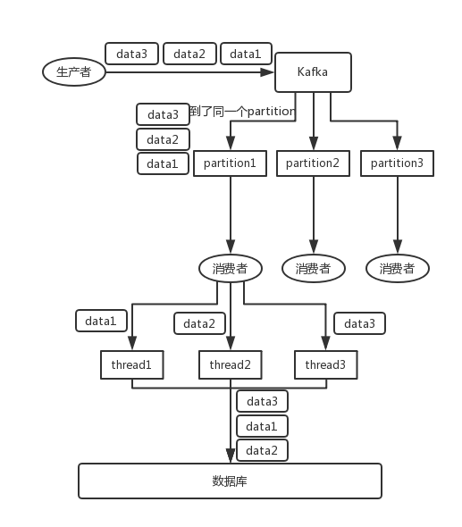

# Kafka

## 术语

  - **Broker**：Kafka 集群包含一个或多个服务器，这种服务器被称为 `broker` 。
  - **Topic**：每条发布到 Kafka 集群的消息都有一个类别，这个类别被称为 Topic。（物理上不同 Topic 的消息分开存储，逻辑上一个 Topic 的消息虽然保存于一个或多个 broker 上，但用户只需指定消息的 Topic 即可生产或消费数据而不必关心数据存于何处）。
  - **Partition**： `Partition` 是物理上的概念，每个 `Topic` 包含一个或多个 `Partition` 。
  - **Producer**：负责发布消息到 Kafka broker。
  - **Consumer**：消息消费者，向 Kafka broker 读取消息的客户端。
  - **Consumer Group**：每个 `Consumer` 属于一个特定的 `Consumer Group`（可为每个 Consumer 指定 group name，若不指定 group name 则属于默认的 group）。

## 拓扑结构

如上图所示，一个典型的 `Kafka` 集群中包含若干 `Producer` （可以是web前端产生的Page View，或者是服务器日志，系统CPU、Memory等），若干 `broker` （Kafka支持水平扩展，一般broker数量越多，集群吞吐率越高），若干 `Consumer Group` ，以及一个 `Zookeeper` 集群。 `Kafka` 通过 `Zookeeper` 管理集群配置，选举 `leader` ，以及在 `Consumer Group` 发生变化时进行 rebalance。 `Producer` 使用 push 模式将消息发布到broker，Consumer使用pull模式从broker订阅并消费消息。

## Topic & Partition

**Topic 在逻辑上可以被认为是一个 queue** ，每条消费都必须指定它的 `Topic` ，可以简单理解为必须指明把这条消息放进哪个 `queue` 里。为了使得 Kafka 的吞吐率可以线性提高，**物理上把 `Topic` 分成一个或多个 `Partition`** ，每个 `Partition` 在物理上对应一个文件夹，该文件夹下存储这个 `Partition` 的所有消息和索引文件。若创建 `topic1` 和 `topic2` 两个 `topic` ，且分别有 13 个和 19 个分区，则整个集群上会相应会生成共 32 个文件夹（本文所用集群共8个节点，此处 `topic1` 和 `topic2` `replication-factor` 均为1）。

> Partition 都是通过 顺序读写，所以效率很高

> replication-factor 配置 partition 副本数。配置副本之后,每个 partition 都有一个唯一的 leader ，有 0 个或多个 follower 。所有的读写操作都在 leader 上完成，followers 从 leader 消费消息来复制 message，就跟普通的 consumer 消费消息一样。一般情况下 partition 的数量大于等于 broker 的数量，并且所有 partition 的 leader 均匀分布在 broker 上。

对于传统的 MQ 而言，一般会删除已经被消费的消息，而 Kafka 集群会保留所有的消息，无论其被消费与否。当然，因为磁盘限制，不可能永久保留所有数据（实际上也没必要），因此 Kafka 提供两种策略删除旧数据。一是基于时间，二是基于 Partition 文件大小。

## Producer 消息路由

Producer 发送消息到 broker 时，会根据 Paritition 机制选择将其存储到哪一个 Partition 。如果 Partition 机制设置合理，所有消息可以均匀分布到不同的 Partition 里，这样就实现了负载均衡。如果一个 Topic 对应一个文件，那这个文件所在的机器I/O将会成为这个 Topic 的性能瓶颈，而有了 Partition 后，不同的消息可以并行写入不同 broker 的不同 Partition 里，极大的提高了吞吐率。

可以在 `$KAFKA_HOME/config/server.properties` 中通过配置项 `num.partitions` 来指定新建 `Topic` 的默认 `Partition` 数量，也可在创建 `Topic` 时通过参数指定，同时也可以在 Topic 创建之后通过 Kafka 提供的工具修改。

在发送一条消息时，可以指定这条消息的 `key` ，Producer 根据这个 `key` 和 Partition 机制来判断应该将这条消息发送到哪个 Parition 。Paritition机制可以通过指定 Producer 的 `paritition.class` 这一参数来指定，该 class 必须实现 `kafka.producer.Partitioner` 接口。

## Consumer Group

这是 Kafka 用来实现一个 Topic 消息的广播（发给所有的 Consumer ）和单播（发给某一个 Consumer ）的手段。一个 Topic 可以对应多个 Consumer Group 。如果需要实现广播，只要每个 Consumer 有一个独立的 Group 就可以了。要实现单播只要所有的 Consumer 在同一个 Group 里。用 Consumer Group 还可以将 Consumer 进行自由的分组而不需要多次发送消息到不同的 Topic 。

## Consumer 个数与 Parition 数有什么关系？

**topic 下的一个分区只能被同一个 consumer group 下的一个 consumer 线程来消费**，但反之并不成立，即一个 consumer 线程可以消费多个分区的数据。比如 Kafka 提供的 `ConsoleConsumer` ，默认就只是一个线程来消费所有分区的数据。

> 即分区数决定了同组消费者个数的上限

所以，如果你的分区数是 N ，那么最好线程数也保持为 N ，这样通常能够达到最大的吞吐量。超过 N 的配置只是浪费系统资源，因为多出的线程不会被分配到任何分区。

## Push vs. Pull　　

作为一个消息系统，Kafka 遵循了传统的方式，选择由 Producer 向 broker `push` 消息并由 Consumer 从 broker `pull` 消息。事实上，push 模式和 pull 模式各有优劣。

  - Push模式 很难适应消费速率不同的消费者，因为消息发送速率是由broker决定的。push模式的目标是尽可能以最快速度传递消息，但是这样很容易造成 Consumer 来不及处理消息，典型的表现就是拒绝服务以及网络拥塞。
  - Pull模式 可以根据Consumer的消费能力以适当的速率消费消息。

对于 Kafka 而言，Pull模式 更合适。Pull模式 可简化 broker 的设计，Consumer 可自主控制消费消息的速率，同时 Consumer 可以自己控制消费方式——即可批量消费也可逐条消费，同时还能选择不同的提交方式从而实现不同的传输语义。

## 高可用性

`Kafka 0.8` 以前，是没有 HA 机制的，就是任何一个 `broker` 宕机了，那个 `broker` 上的 `partition` 就废了，没法写也没法读，没有什么高可用性可言。

比如说，我们假设创建了一个 `topic` ，指定其 `partition` 数量是 `3` 个，分别在三台机器上。但是，如果第二台机器宕机了，会导致这个 `topic` 的 `1/3` 的数据就丢了，因此这个是做不到高可用的。

`Kafka 0.8` 以后，提供了 `HA` 机制，就是 `replica` **副本机制**。每个 `partition` 的数据都会同步到其它机器上，形成自己的多个 `replica` 副本。所有 `replica` 会选举一个 `leader` 出来，那么生产和消费都跟这个 `leader` 打交道，然后其他 `replica` 就是 `follower` 。写的时候， `leader` 会负责把数据同步到所有 `follower` 上去，读的时候就直接读 `leader` 上的数据即可。 `Kafka` 会均匀地将一个 `partition` 的所有 `replica` 分布在不同的机器上，这样才可以提高容错性。

这么搞，就有所谓的高可用性了，因为如果某个 `broker` 宕机了，没事儿，那个 `broker` 上面的 `partition` 在其他机器上都有副本的，如果这上面有某个 `partition` 的 `leader` ，那么此时会从 `follower` 中 **重新选举** 一个新的 `leader` 出来，大家继续读写那个新的 `leader` 即可。这就有所谓的高可用性了。

  - **写数据** 的时候，生产者就写 `leader` ，然后 `leader` 将数据落地写本地磁盘，接着其他 `follower` 自己主动从 `leader` 来 `pull` 数据。一旦所有 `follower` 同步好数据了，就会发送 `ack` 给 `leader` ， **`leader` 收到所有 `follower` 的 `ack` 之后，就会返回写成功的消息给生产者**。（当然，这只是其中一种模式，还可以适当调整这个行为）
  - **消费** 的时候，只会从 `leader` 去读，但是 **只有当一个消息已经被所有 `follower` 都同步成功返回 `ack` 的时候，这个消息才会被消费者读到**。

## 消息幂等性

`Kafka` 实际上有个 `offset` 的概念，就是每个消息写进去，都有一个 `offset` ，代表消息的序号，然后 **`consumer` 消费了数据之后，每隔一段时间（定时定期），会把自己消费过的消息的 `offset` 提交一下**，表示“我已经消费过了，下次我要是重启啥的，你就让我继续从上次消费到的 `offset` 来继续消费吧”。

但是凡事总有意外，比如我们之前生产经常遇到的，就是你有时候重启系统，看你怎么重启了，如果碰到点着急的，直接 `kill` 进程了，再重启。这会导致 `consumer` 有些消息处理了，但是没来得及提交 `offset` ，尴尬了。重启之后，**少数消息会再次消费一次**。

幂等性，通俗点说，**一个数据，或者一个请求，给你重复来多次，你得确保对应的数据是不会改变的，不能出错**。其实重复消费不可怕，可怕的是你没考虑到重复消费之后，怎么保证幂等性？其实还是得 **结合业务来思考**，这里给几个思路：
  - 比如你拿个数据要写库，你先根据主键查一下，如果这数据都有了，你就别插入了，update 一下好吧。
  - 比如你是写 Redis ，那没问题了，反正每次都是 set，天然幂等性。
  - 比如你不是上面两个场景，那做的稍微复杂一点，你需要让生产者发送每条数据的时候，里面加一个全局唯一的 id，类似订单 id 之类的东西，然后你这里消费到了之后，先根据这个 id 去比如 Redis 里查一下，之前消费过吗？如果没有消费过，你就处理，然后这个 id 写 Redis。如果消费过了，那你就别处理了，保证别重复处理相同的消息即可。
  - 比如基于数据库的唯一键来保证重复数据不会重复插入多条。因为有唯一键约束了，重复数据插入只会报错，不会导致数据库中出现脏数据。

## 消息丢失

### 消费端弄丢了数据

唯一可能导致消费者弄丢数据的情况，就是说，你消费到了这个消息，然后消费者那边 **自动提交了 `offset`** ，让 `Kafka` 以为你已经消费好了这个消息，但其实你才刚准备处理这个消息，你还没处理，你自己就挂了，此时这条消息就丢咯。

`Kafka` 会自动提交 `offset` ，那么只要关闭自动提交 `offset` ，在处理完之后自己手动提交 `offset` ，就可以保证数据不会丢。但是此时确实还是可能会有重复消费，比如你刚处理完，还没提交 `offset` ，结果自己挂了，此时肯定会重复消费一次，自己 **保证幂等性** 就好了。

### Kafka 弄丢了数据

这块比较常见的一个场景，就是 `Kafka` 某个 `broker` 宕机，然后重新选举 `partition` 的 `leader` 。大家想想，要是此时其他的 `follower` 刚好还有些数据没有同步，结果此时 `leader` 挂了，然后选举某个 `follower` 成 `leader` 之后，不就少了一些数据？这就丢了一些数据啊。

此时一般是要求起码设置如下 4 个参数：
  - 给 `topic` 设置 `replication.factor` 参数：这个值必须大于 1，要求每个 `partition` 必须有 **至少** 2 个副本。
  - 在 `Kafka` 服务端设置 `min.insync.replicas` 参数：这个值必须大于 1，这个是 **要求一个 `leader` 至少感知到有至少一个 `follower` 还跟自己保持联系**，没掉队，这样才能确保 `leader` 挂了还有一个 `follower` 吧。
  - 在 `producer` 端设置 `acks=all`：这个是要求每条数据，**必须是写入所有 `replica` 之后，才能认为是写成功了**。
  - 在 `producer` 端设置 `retries=MAX`（很大很大很大的一个值，无限次重试的意思）：这个是要求 **一旦写入失败，就无限重试**，卡在这里了。

这样配置之后，至少在 Kafka `broker` 端就可以保证在 `leader` 所在 `broker` 发生故障，进行 `leader` 切换时，数据不会丢失。

### 生产者会不会弄丢数据？

如果按照上述的思路设置了 `acks=all`，一定不会丢，要求是，你的 `leader` 接收到消息，所有的 `follower` 都同步到了消息之后，才认为本次写成功了。如果没满足这个条件，生产者可以自动不断的重试，重试无限次。

## 消息的顺序性

比如说我们建了一个 `topic` ，有三个 `partition` 。生产者在写的时候，其实可以指定一个 `key` ，比如说我们指定了某个订单 `id` 作为 `key` ，那么这个订单相关的数据，一定会被分发到同一个 `partition` 中去，而且这个 `partition` 中的数据一定是有顺序的。

消费者从 `partition` 中取出来数据的时候，也一定是有顺序的。到这里，顺序还是 `ok` 的，没有错乱。接着，我们在消费者里可能会搞 **多个线程来并发处理消息**。而多个线程并发跑的话，顺序可能就乱掉了。

解决方案：
  - 一个 `topic` ，一个 `partition` ，一个 `consumer` ，内部单线程消费，单线程吞吐量太低，一般不会用这个。
  - 写 `N` 个内存 `queue` ，具有相同 `key` 的数据都到同一个内存 `queue` ；然后对于 N 个线程，每个线程分别消费一个内存 `queue` 即可，这样就能保证顺序性。

## 参考

[Kafka设计解析](http://www.jasongj.com/2015/03/10/KafkaColumn1/)
[Kafka的高可用](https://github.com/doocs/advanced-java/blob/master/docs/high-concurrency/how-to-ensure-high-availability-of-message-queues.md#kafka-%E7%9A%84%E9%AB%98%E5%8F%AF%E7%94%A8%E6%80%A7)
[Kafka幂等性](https://github.com/doocs/advanced-java/blob/master/docs/high-concurrency/how-to-ensure-that-messages-are-not-repeatedly-consumed.md)
[Kafka消息丢失](https://github.com/doocs/advanced-java/blob/master/docs/high-concurrency/how-to-ensure-the-reliable-transmission-of-messages.md#kafka)
