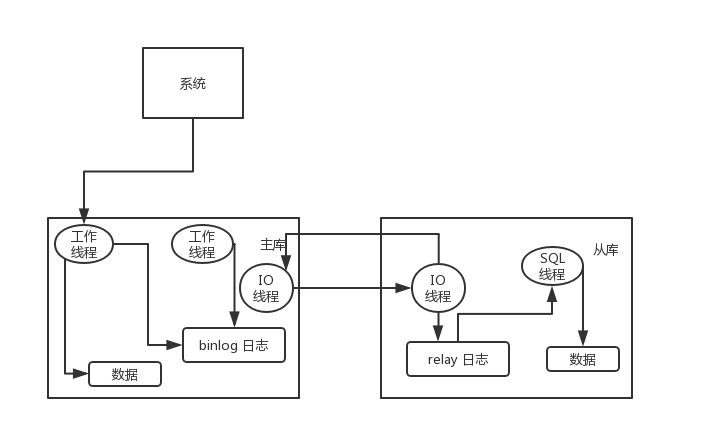
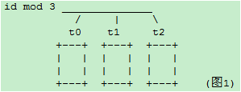

# MySql

## 引擎

## [MVCC](https://www.jianshu.com/p/f692d4f8a53e)

`InnoDB` 支持 `MVCC` 来提高系统读写并发性能。InnoDB MVCC 的实现基于 `Undo log`，通过回滚段来构建需要的版本记录。通过 `ReadView` 来判断哪些版本的数据可见。同时 `Purge` 线程是通过 `ReadView` 来清理旧版本数据。

MVCC最大的优势：**读不加锁，读写不冲突**。在读多写少的OLTP应用中，读写不冲突是非常重要的，极大的增加了系统的并发性能

### [MYSQL 事务日志](https://draveness.me/mysql-transaction)
事务日志可以帮助提高事务的效率。使用事务日志，存储引擎在修改表的数据时只需要修改其内存拷贝，再把该修改行为记录到持久在硬盘上的事务日志中，而不用每次都将修改的数据本身持久到磁盘。

事务日志采用的是追加的方式，因此写日志的操作是磁盘上一小块区域内的顺序I/O，而不像随机I/O需要在磁盘的多个地方移动磁头，所以采用事务日志的方式相对来说要快得多。事务日志持久以后，内存中被修改的数据在后台可以慢慢地刷回到磁盘。目前大多数存储引擎都是这样实现的，我们通常称之为预写式日志（Write-Ahead Logging），修改数据需要写两次磁盘。

如果数据的修改已经记录到事务日志并持久化，但数据本身还没有写回磁盘，此时系统崩溃，存储引擎在重启时能够自动恢复这部分修改的数据。

`MySQL Innodb`中跟数据持久性、原子性有关的日志，有以下几种：`Redo Log`、`Undo Log`。

#### 回滚日志 -- Undo Log

想要保证事务的 **原子性**，就需要在异常发生时，对已经执行的操作进行回滚，而在 MySQL 中，恢复机制是通过回滚日志（`undo log`）实现的，**所有事务进行的修改都会先记录到这个回滚日志中，然后在对数据库中的对应行进行写入**。


这个过程其实非常好理解，为了能够在发生错误时撤销之前的全部操作，肯定是需要将之前的操作都记录下来的，这样在发生错误时才可以回滚。

回滚日志除了能够在发生错误或者用户执行 `ROLLBACK` 时提供回滚相关的信息，它还能够在整个系统发生崩溃、数据库进程直接被杀死后，当用户再次启动数据库进程时，还能够立刻通过查询回滚日志将之前未完成的事务进行回滚，这也就需要回滚日志必须先于数据持久化到磁盘上，是我们需要先写日志后写数据库的主要原因。

回滚日志并不能将数据库物理地恢复到执行语句或者事务之前的样子；它是逻辑日志，**当回滚日志被使用时，它只会按照日志逻辑地将数据库中的修改撤销掉**，可以理解为，我们在事务中使用的每一条 `INSERT` 都对应了一条 `DELETE` ，每一条 `UPDATE` 也都对应一条相反的 `UPDATE` 语句。


#### 重做日志 -- Redo Log

与原子性一样，事务的持久性也是通过日志来实现的，**MySQL 使用重做日志（redo log）实现事务的持久性**，重做日志由两部分组成，一是 **内存** 中的重做日志缓冲区，因为重做日志缓冲区在内存中，所以它是易失的，另一个就是在 **磁盘** 上的重做日志文件，它是持久的。


当我们在一个事务中尝试对数据进行修改时，它会先将数据从磁盘读入内存，并更新内存中缓存的数据，然后生成一条重做日志并写入重做日志缓存，当事务真正提交时，MySQL 会将重做日志缓存中的内容刷新到重做日志文件，再将内存中的数据更新到磁盘上，图中的第 `4、5` 步就是在事务提交时执行的。

在 InnoDB 中，重做日志都是以 `512` 字节的块的形式进行存储的，同时因为块的大小与磁盘扇区大小相同，所以重做日志的写入可以保证原子性，不会由于机器断电导致重做日志仅写入一半并留下脏数据。

除了所有对数据库的修改会产生重做日志，因为回滚日志也是需要持久存储的，它们也会创建对应的重做日志，在发生错误后，数据库重启时会从重做日志中找出未被更新到数据库磁盘中的日志重新执行以满足事务的持久性。

#### 回滚日志和重做日志

在数据库系统中，事务的原子性和持久性是由事务日志（transaction log）保证的，在实现时也就是上面提到的两种日志，前者用于对事务的影响进行撤销，后者在错误处理时对已经提交的事务进行重做，它们能保证两点：

  - 发生错误或者需要回滚的事务能够成功回滚（原子性）；
  - 在事务提交后，数据没来得及写会磁盘就宕机时，在下次重新启动后能够成功恢复数据（持久性）；

在数据库中，这两种日志经常都是一起工作的，我们可以将它们整体看做一条事务日志，其中包含了事务的 `ID`、修改的`行元素`以及`修改前后的值`。


一条事务日志同时包含了修改前后的值，能够非常简单的进行回滚和重做两种操作，在这里我们也不会对重做和回滚日志展开进行介绍，可能会在之后的文章谈一谈数据库系统的恢复机制时提到两种日志的使用。

### MySQL Server 日志

`binlog` 是 Mysql sever 层维护的一种二进制日志，与 innodb 引擎中的 `redo/undo log` 是完全不同的日志；其主要是用来记录对 mysql 数据更新或潜在发生更新的 SQL 语句，并以"事务"的形式保存在磁盘中；作用主要有：

  - 复制：MySQL Replication 在 Master 端开启 `binlog` ，Master 把它的二进制日志传递给 `slaves` 并回放来达到 `master-slave` 数据一致的目的
  - 数据恢复：通过 mysqlbinlog 工具恢复数据
  - 增量备份

### Buffer Pool

如果 MySQL 不使用内存缓冲池，每次读取数据时，都需要访问磁盘，会大大的增加磁盘的IO请求，导致效率低下；在 Innodb 引擎在读取数据的时候，把相应的数据和索引载入到内存的缓冲池（`buffer pool`）中，一定程度的提高了数据的读写速度。

缓存包括：`索引页`，`数据页`，`undo页`，`插入缓冲`，`自适应哈希索引`，`innodb存储的锁信息`，`数据字典`等。工作方式是将数据库文件按照页（每页16k）读取到缓冲池，然后按照最近最少使用算法（LRU）来保留缓冲池中的缓冲数据。如果数据库文件需要修改，总是首先修改在缓冲池中的页（发生修改后即成为脏页），然后在按照一定的频率将缓冲池中的脏页刷新到文件

MySQL 中的原则是日志先行。为了满足事务的持久性，防止 `buffer pool` 数据丢失以及事务持久性， InnoDB 引入了 `redo log`。为了满足事务的原子性，innodb 引入了 `undo log`。

### MVCC实现

**MVCC是通过在每行记录后面保存两个隐藏的列来实现的。这两个列，一个保存了行的创建时间，一个保存行的过期时间（或删除时间）**。当然存储的并不是实际的时间值，而是系统版本号（`system version number`)。每开始一个新的事务，系统版本号都会自动递增。**事务开始时刻的系统版本号会作为事务的版本号，用来和查询到的每行记录的版本号进行比较。**

下面看一下在 `REPEATABLE READ` 隔离级别下，MVCC 具体是如何操作的：

  - `SELECT`：InnoDB 会根据以下两个条件检查每行记录：
    1. InnoDB 只查找版本早于当前事务版本的数据行（也就是，行的系统版本号小于或等于事务的系统版本号），这样可以确保事务读取的行，要么是在事务开始前已经存在的，要么是事务自身插入或者修改过的。
    2. 行的删除版本要么未定义，要么大于当前事务版本号。这可以确保事务读取到的行，在事务开始之前未被删除。只有符合上述两个条件的记录，才能返回作为查询结果

  - `INSERT`：InnoDB 为新插入的每一行保存当前系统版本号作为行版本号。

  - `DELETE`：InnoDB 为删除的每一行保存当前系统版本号作为行删除标识。

  - `UPDATE`：InnoDB 插入一行新记录，**保存当前系统版本号作为行版本号，同时保存当前系统版本号到原来的行作为行删除标识**。保存这两个额外系统版本号，使大多数读操作都可以不用加锁。这样设计使得读数据操作很简单，性能很好，并且也能保证只会读取到符合标准的行，不足之处是每行记录都需要额外的存储空间，需要做更多的行检查工作，以及一些额外的维护工作

## 主从同步

简单来说，就是保证主SQL（`Master`）和从SQL（`Slave`）的数据是一致性的，向 Master 插入数据后，Slave 会自动从 Master 把修改的数据同步过来（有一定的延迟），通过这种方式来保证数据的一致性，就是主从复制。

### MySQL主从能解决什么问题

#### 高可用
因为数据都是相同的，所以当Master挂掉后，可以指定一台Slave充当Master继续保证服务运行，因为数据是一致性的（如果当插入Master就挂掉，可能不一致，因为同步也需要时间），当然这种配置不是简单的把一台Slave充当Master，毕竟还要考虑后续的Salve同步Master，当然本文并不是将高可用的配置，所以这里就不多讲了。

#### 负载均衡
因为读写分离也算是负载均衡的一种，所以就不单独写了，因为一般都是有多台Slave的，所以可以将读操作指定到Slave服务器上（需要代码控制），然后再用负载均衡来选择那台Slave来提供服务，同时也可以吧一些大量计算的查询指定到某台Slave，这样就不会影响Master的写入以及其他查询

#### 数据备份
一般我们都会做数据备份，可能是写定时任务，一些特殊行业可能还需要手动备份，有些行业要求备份和原数据不能在同一个地方，所以主从就能很好的解决这个问题，不仅备份及时，而且还可以多地备份，保证数据的安全

#### 业务模块化
可以一个业务模块读取一个Slave，再针对不同的业务场景进行数据库的索引创建和根据业务选择MySQL存储引擎

#### 高扩展（硬件扩展）
主从复制支持2种扩展方式：
  1. `scale-up`：向上扩展或者纵向扩展，主要是提供比现在服务器更好性能的服务器，比如增加CPU和内存以及磁盘阵列等，因为有多台服务器，所以可扩展性比单台更大
  2. `scale-out`：向外扩展或者横向扩展，是指增加服务器数量的扩展，这样主要能分散各个服务器的压力

### 主从复制的缺点

#### 成本增加
无可厚非的是搭建主从肯定会增加成本，毕竟一台服务器和两台服务器的成本完全不同，另外由于主从必须要开启二进制日志，所以也会造成额外的性能消耗

#### 数据延迟
Slave从Master复制过来肯定是会有一定的数据延迟的，所以当刚插入就出现查询的情况，可能查询不出来，当然如果是插入者自己查询，那么可以直接从Master中查询出来，当然这个也是需要用代码来控制的

#### 写入更慢
主从复制主要是针对读远大于写或者对数据备份实时性要求较高的系统中，因为 `Master` 在写中需要更多操作，而且只有一台写入的 Master，写入的压力并不能被分散

#### 复制方式
MySQL5.6开始主从复制有两种方式：基于日志（binlog）、基于GTID（全局事务标示符）。

### [主从延时如何解决？](https://github.com/doocs/advanced-java/blob/master/docs/high-concurrency/mysql-read-write-separation.md)

MySQL 实际上在有两个同步机制，一个是半同步复制，用来 **解决主库数据丢失问题**；一个是并行复制，用来 **解决主从同步延时问题**。

  - **半同步复制**，也叫 `semi-sync` 复制，指的就是主库写入 `binlog` 日志之后，就会将强制此时立即将数据同步到从库，从库将日志写入自己本地的 `relay log` 之后，接着会返回一个 `ack` 给主库，主库接收到至少一个从库的 `ack` 之后才会认为写操作完成了。
  - **并行复制**，指的是从库开启多个线程，并行读取 `relay log` 中不同库的日志，然后并行重放不同库的日志，这是库级别的并行。

以前线上确实处理过因为主从同步延时问题而导致的线上的 bug，属于小型的生产事故。有个同学是这样写代码逻辑的。先插入一条数据，再把它查出来，然后更新这条数据。在生产环境高峰期，写并发达到了 `2000/s`，这个时候，主从复制延时大概是在小几十毫秒。线上会发现，每天总有那么一些数据，我们期望更新一些重要的数据状态，但在高峰期时候却没更新。用户跟客服反馈，而客服就会反馈给我们。

我们通过 MySQL 命令：

```
  show status
```

查看 `Seconds_Behind_Master` ，可以看到从库复制主库的数据落后了几 `ms`。一般来说，如果主从延迟较为严重，有以下解决方案：

  - **分库**，将一个主库拆分为多个主库，每个主库的写并发就减少了几倍，此时主从延迟可以忽略不计。
  - **打开 MySQL 支持的并行复制**，多个库并行复制。如果说某个库的写入并发就是特别高，单库写并发达到了 2000/s，并行复制还是没意义。
  - **重写代码**，写代码的同学，要慎重，插入数据时立马查询可能查不到。
  - 如果确实是存在必须先插入，立马要求就查询到，然后立马就要反过来执行一些操作，对这个查询设置 **直连主库**。不推荐这种方法，你要是这么搞，读写分离的意义就丧失了。


### 复制原理
  1. Master 将数据改变记录到二进制日志(`binary log`)中，也就是配置文件log-bin指定的文件，这些记录叫做二进制日志事件(`binary log events`)
  2. Slave 通过I/O线程读取 `Master` 中的`binary log events`并写入到它的中继日志(`relay log`)
  3. Slave 重做中继日志中的事件，把中继日志中的事件信息一条一条的在本地执行一次，完成数据在本地的存储，从而实现将改变反映到它自己的数据(数据重放)



### 要求
  1. 主从服务器操作系统版本和位数一致
  2. Master和Slave数据库的版本要一致
  3. Master和Slave数据库中的数据要一致
  4. Master开启二进制日志，Master和Slave的server_id在局域网内必须唯一

## [分库、扩容的时候的数据迁移](http://jm.taobao.org/2013/11/15/590/)

### 分库分表

目前绝大多数应用采取的两种分库分表规则
  - mod方式
  - dayofweek系列日期方式（所有星期1的数据在一个库/表,或所有?月份的数据在一个库表）

这两种方式有个本质的特点，就是 **离散性加周期性**。例如以一个表的主键对 `3` 取余数的方式分库或分表：



那么随着数据量的增大，每个表或库的数据量都是各自增长。当一个表或库的数据量增长到了一个极限，要加库或加表的时候，
介于这种分库分表算法的离散性，必需要做数据迁移才能完成。例如从3个扩展到5个的时候：


需要将原先以 `mod3` 分类的数据，重新以 `mod5` 分类，不可避免的带来数据迁移。每个表的数据都要被重新分配到多个新的表
相似的例子比如从 `dayofweek` 分的 `7` 个库/表,要扩张为以 `dayofmonth` 分的 `31` 张库/表，同样需要进行数据迁移。

数据迁移带来的问题是
  - 业务至少要两次发布
  - 要专门写工具来导数据。由于各业务之间的差别，很难做出统一的工具。目前几乎都是每个业务写一套
  - 要解决增量、全量、时间点，数据不一致等问题

如何在数据量扩张到现有库表极限，加库加表时避免数据迁移呢？

通常的数据增长往往是随着时间的推移增长的。随着业务的开展，时间的推移，数据量不断增加。

考虑到数据增长的特点，如果我们以代表时间增长的字段，按递增的范围分库，则可以避免数据迁移。这样的方式下，在数据量再增加达到前几个库/表的上限时，则继续水平增加库表，原先的数据就不需要迁移了。但是这样的方式会带来一个 **热点问题**：当前的数据量达到某个库表的范围时，所有的插入操作，都集中在这个库/表了。

所以在满足基本业务功能的前提下，分库分表方案应该尽量避免的两个问题：
  1. 数据迁移
  2. 热点

**如何既能避免数据迁移又能避免插入更新的热点问题呢？**

结合离散分库/分表和连续分库/分表的优点，如果一定要写热点和新数据均匀分配在每个库，同时又保证易于水平扩展，可以考虑这样的模式：

### 水平扩展scale-out方案 -- 模式一

#### 阶段一

一个库 `DB0` 之内分4个表，id%4 ：


#### 阶段二

增加 `DB1` 库，t2和t3整表搬迁到 `DB1`


#### 阶段三

增加 `DB2` 和 `DB3` 库，t1 整表搬迁到 `DB2` ，t3整表搬迁的 `DB3`：


为了规则表达，通过内部名称映射或其他方式，我们将DB1和DB2的名称和位置互换得到下图：

```
dbRule: “DB” + (id % 4)
tbRule: “t”  + (id % 4)
```


即逻辑上始终保持4库4表，每个表一个库。这种做法也是目前店铺线图片空间采用的做法。

上述方案有一个缺点，就是在从一个库到 4 个库的过程中，单表的数据量一直在增长。当单表的数据量超过一定范围时，可能会带来性能问题。比如索引的问题，历史数据清理的问题。另外当开始预留的表个数用尽，到了 4 物理库每库 1 个表的阶段，再进行扩容的话，不可避免的要从表上下手。

### 水平扩展scale-out方案 -- 模式二

#### 阶段一

一个数据库，两个表，`rule0 = id % 2`

```
分库规则dbRule: “DB0″
分表规则tbRule: “t” + (id % 2)
```


#### 阶段二

当单库的数据量接近 1千万，单表的数据量接近 500 万时，进行扩容（数据量只是举例，具体扩容量要根据数据库和实际压力状况决定）：增加一个数据库 `DB1`，将 `DB0.t0` 整表迁移到新库 `DB1.t1`。每个库各增加1个表，未来10M-20M的数据mod2分别写入这2个表：`t0_1，t1_1`：


分库规则dbRule:
```
“DB” + (id % 2)
```

分表规则tbRule:

```
    if(id < 1千万){
        return "t"+ (id % 2);   //1千万之前的数据，仍然放在t0和t1表。t1表从DB0搬迁到DB1库
    }else if(id < 2千万){
        return "t"+ (id % 2) +"_1"; //1千万之后的数据，各放到两个库的两个表中: t0_1,t1_1
    }else{
        throw new IllegalArgumentException("id outof range[20000000]:" + id);
    }
```

这样 `10M` 以后的新生数据会均匀分布在 `DB0` 和 `DB1`; 插入更新和查询热点仍然能够在每个库中均匀分布。每个库中同时有老数据和不断增长的新数据。每表的数据仍然控制在 `500万` 以下。

#### 阶段三

当两个库的容量接近上限继续水平扩展时，进行如下操作：
  - 新增加两个库：`DB2`和`DB3`，以`id % 4`分库。余数`0、1、2、3`分别对应`DB`的下标. `t0`和`t1`不变，
  - 将`DB0.t0_1`整表迁移到`DB2`; 将`DB1.t1_1`整表迁移到`DB3`

`20M-40M`的数据 mod4 分为 4 个表：`t0_2，t1_2，t2_2，t3_2`，分别放到4个库中：


新的分库分表规则如下：

分库规则dbRule:
```
  if(id < 2千万){
      //2千万之前的数据，4个表分别放到4个库
      if(id < 1千万){
          return "db"+  (id % 2);     //原t0表仍在db0, t1表仍在db1
      }else{
          return "db"+ ((id % 2) +2); //原t0_1表从db0搬迁到db2; t1_1表从db1搬迁到db3
      }
  }else if(id < 4千万){
      return "db"+ (id % 4);          //超过2千万的数据，平均分到4个库
  }else{
      throw new IllegalArgumentException("id out of range. id:"+id);
  }
```
分表规则tbRule:
```
  if(id < 2千万){        //2千万之前的数据，表规则和原先完全一样，参见阶段二
      if(id < 1千万){
          return "t"+ (id % 2);       //1千万之前的数据，仍然放在t0和t1表
      }else{
          return "t"+ (id % 2) +"_1"; //1千万之后的数据，仍然放在t0_1和t1_1表
      }
  }else if(id < 4千万){
      return "t"+ (id % 4)+"_2";      //超过2千万的数据分为4个表t0_2，t1_2，t2_2，t3_2
  }else{
      throw new IllegalArgumentException("id out of range. id:"+id);
  }
```

随着时间的推移，当第一阶段的`t0/t1`，第二阶段的`t0_1/t1_1`逐渐成为历史数据，不再使用时，可以直接`truncate`掉整个表。省去了历史数据迁移的麻烦。

### 水平扩展scale-out方案 -- 模式三

非倍数扩展：如果从上文的阶段二到阶段三不希望一下增加两个库呢？尝试如下方案：

迁移前：


新增库为`DB2`，`t0、t1`都放在 `DB0`，

```
t0_1整表迁移到 DB1
t1_1整表迁移到 DB2
```

迁移后：


这时 `DB0` 退化为旧数据的读库和更新库。新增数据的热点均匀分布在 `DB1` 和 `DB2`
4无法整除3，因此如果从4表2库扩展到3个库，不做行级别的迁移而又保证热点均匀分布看似无法完成。

当然如果不限制每库只有两个表，也可以如下实现：


小于 `10M` 的 `t0` 和 `t1` 都放到 `DB0` ，以 `mod2` 分为两个表，原数据不变
`10M-20M`的，以 `mod2` 分为两个表 `t0_1、t1_1`，原数据不变，分别搬迁到 `DB1` ，和 `DB2` `20M` 以上的以 `mod3` 平均分配到 3 个 DB 库的 `t_0、t_2、t_3`表中

这样 `DB1` 包含最老的两个表，和最新的 `1/3` 数据。`DB1` 和 `DB2` 都分表包含次新的两个旧表 `t0_1、t1_1` 和最新的 `1/3` 数据。新旧数据读写都可达到均匀分布。

### 总结

总而言之，两种规则映射（函数）：
  - `离散映射`：如mod或dayofweek， 这种类型的映射能够很好的解决热点问题，但带来了数据迁移和历史数据问题。
  - `连续映射`；如按id或gmt_create_time的连续范围做映射。这种类型的映射可以避免数据迁移，但又带来热点问题。

**离散映射和连续映射这两种相辅相成的映射规则，正好解决热点和迁移这一对相互矛盾的问题**。

我们之前只运用了离散映射，引入连续映射规则后，两者结合，精心设计，应该可以设计出满足避免热点和减少迁移之间任意权衡取舍的规则。

基于以上考量，分库分表规则的设计和配置，长远说来必须满足以下要求
  - 可以动态推送修改
  - **规则可以分层级叠加**，旧规则可以在新规则下继续使用，新规则是旧规则在更宽尺度上的拓展，以此支持新旧规则的兼容，避免数据迁移
  - 用 `mod` 方式时，最好选 2 的指数级倍分库分表，这样方便以后切割。

## [分库分表后全局ID怎么做](https://github.com/doocs/advanced-java/blob/master/docs/high-concurrency/database-shard-global-id-generate.md)

  - 数据库自增 id
  - 设置数据库 sequence 或者表自增字段步长
  - UUID
  - 获取系统当前时间
  - Snowflake 算法

### Snowflake

twitter 开源的分布式 id 生成算法，采用 `Scala` 语言实现，是把一个 `64` 位的 `long` 型的 `id` ，`1` 个 `bit` 是不用的，用其中的 `41` `bit` 作为毫秒数，用 `10` `bit` 作为工作机器 `id` ，`12` `bit` 作为序列号。

`|–1位符号位–|--41位时间戳–|--10位机器ID–|--12位序列号–|`

  - **1 bit**：不用，为啥呢？因为二进制里第一个 `bit` 为如果是 1，那么都是负数，但是我们生成的 id 都是正数，所以第一个 bit 统一都是 0。
  - **41 bit**：表示的是时间戳，单位是毫秒。`41 bit` 可以表示的数字多达 `2^41 - 1`，也就是可以标识 `2^41 - 1` 个毫秒值，换算成年就是表示`69`年的时间。
  - **10 bit**：记录工作机器 `id`，代表的是这个服务最多可以部署在 `2^10`台机器上哪，也就是`1024`台机器。但是 10 bit 里 5 个 bit 代表机房 id，5 个 bit 代表机器 id。意思就是最多代表 `2^5`个机房（32个机房），每个机房里可以代表 `2^5` 个机器（32台机器）。
  - **12 bit**：这个是用来记录同一个毫秒内产生的不同 id，`12 bit` 可以代表的最大正整数是 `2^12 - 1 = 4096`，也就是说可以用这个 `12 bit` 代表的数字来区分同一个毫秒内的 `4096` 个不同的 id。

#### Snowflake 的问题

Snowflake 这样依赖时间的ID生成算法注定存在一个问题：**时间的准确度问题**。这一算法有一个默认前提：分布式环境下时间获取总是准确的，即时间总是递增的。而现实环境中，这样的条件很难满足。总会因为硬件、软件、人的原因造成时间变化。如果你的硬件时间本身就比正常时间快，而你接入了一个 NTP 服务，每当进行 NTP 时间校准时，你的机器时间总会向后 **回拨** 一段时间，这时悲剧就来了：有极大可能性生成重复ID。

针对上面提到的两个问题，可如下改进：

1. 时间戳由毫秒变为秒 
2. 使用环形列表对时间戳对应的序列进行缓存 
3. 使用CAS操作避免大粒度悲观锁

为了 **缓解** 时钟回拨问题，对之前的序列进行缓存，而原生算法很显然是不利于缓存的，最坏的情况下每秒需要缓存 1000 个值，这显然对内存很不友好。于是我将时间戳改为秒为单位。同时可以把省出来的位交给序列。此时缓存一个小时的数据（即可以容忍一个小时的时钟回拨）也就只需要缓存 3600 个序列，完全可以接受。改进后的 Snowflake 生成的ID是这样组成的：

`|–1位符号位–|--32位时间戳–|--10位机器ID–|--21位序列号–|`

> 环形列表：即整个列表的容量是一定的，当列表满了以后再加入的元素会按照入列的先后顺序覆盖之前的元素。
