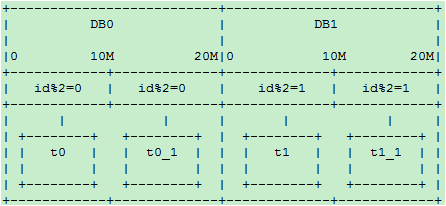

## 分库分表

### 垂直拆分

**垂直分表** 也就是 *大表拆小表*，基于列字段进行的。一般是表中的字段较多，将不常用的， 数据较大，长度较长（比如text类型字段）的拆分到 *扩展表*。 一般是针对那种几百列的大表，也避免查询时，数据量太大造成的 off-page 问题。

**垂直分库** 针对的是一个系统中的不同业务进行拆分。将多个业务系统的数据放在单个数据库中（**服务化**拆分），这会让数据库的单库处理能力成为瓶颈。将单个数据库，按业务进行拆分，同一业务领域的数据表放到同一数据库中。并且多个数据库分布在多个机器上，防止由于单机的磁盘、内存、IO等资源造成 MySQL 性能下降。

数据库的连接资源比较宝贵且单机处理能力也有限，在高并发场景下，垂直分库一定程度上能够突破 IO、连接数等单机硬件资源的瓶颈。

### 水平拆分

目前绝大多数应用采取的两种分库分表规则
  - `离散映射`：如 mod 或 dayofweek ， 这种类型的映射能够很好的解决热点问题，但带来了数据迁移和历史数据问题。
  - `连续映射`；如按 id 或 gmt_create_time 的连续范围做映射。这种类型的映射可以避免数据迁移，但又带来热点问题。

随着数据量的增大，每个表或库的数据量都是各自增长。当一个表或库的数据量增长到了一个极限，要加库或加表的时候，介于这种分库分表算法的离散性，必需要做 **数据迁移** 才能完成。

考虑到数据增长的特点，如果我们以代表时间增长的字段，按递增的范围分库，则可以避免数据迁移。这样的方式下，在数据量再增加达到前几个库/表的上限时，则继续水平增加库表，原先的数据就不需要迁移了。但是这样的方式会带来一个 **热点问题**：当前的数据量达到某个库表的范围时，所有的插入操作，都集中在这个库/表了。

结合离散分库/分表和连续分库/分表的优点，可使要热点和新数据均匀分配在每个库，同时又保证易于水平扩展。分库分表的主要经历以下三个阶段：

#### 阶段一

一个数据库，两个表，`rule0 = id % 2`

```
分库规则dbRule: “DB0″
分表规则tbRule: “t” + (id % 2)
```


#### 阶段二

当单库的数据量接近 1千万，单表的数据量接近 500 万时，进行扩容（数据量只是举例，具体扩容量要根据数据库和实际压力状况决定）：增加一个数据库 `DB1`，将 `DB0.t0` 整表迁移到新库 `DB1.t1`。每个库各增加1个表，未来10M-20M的数据mod2分别写入这2个表：`t0_1，t1_1`：



分库规则dbRule:
```
“DB” + (id % 2)
```

分表规则tbRule:

```
    if(id < 1千万){
        return "t"+ (id % 2);   //1千万之前的数据，仍然放在t0和t1表。t1表从DB0搬迁到DB1库
    }else if(id < 2千万){
        return "t"+ (id % 2) +"_1"; //1千万之后的数据，各放到两个库的两个表中: t0_1,t1_1
    }else{
        throw new IllegalArgumentException("id outof range[20000000]:" + id);
    }
```

这样 `10M` 以后的新生数据会均匀分布在 `DB0` 和 `DB1`; 插入更新和查询热点仍然能够在每个库中均匀分布。每个库中同时有老数据和不断增长的新数据。每表的数据仍然控制在 `500万` 以下。

#### 阶段三

当两个库的容量接近上限继续水平扩展时，进行如下操作：
  - 新增加两个库：`DB2`和`DB3`，以`id % 4`分库。余数`0、1、2、3`分别对应`DB`的下标. `t0`和`t1`不变，
  - 将`DB0.t0_1`整表迁移到`DB2`; 将`DB1.t1_1`整表迁移到`DB3`

`20M-40M`的数据 mod4 分为 4 个表：`t0_2，t1_2，t2_2，t3_2`，分别放到4个库中：


新的分库分表规则如下：

分库规则dbRule:
```
  if(id < 2千万){
      //2千万之前的数据，4个表分别放到4个库
      if(id < 1千万){
          return "db"+  (id % 2);     //原t0表仍在db0, t1表仍在db1
      }else{
          return "db"+ ((id % 2) +2); //原t0_1表从db0搬迁到db2; t1_1表从db1搬迁到db3
      }
  }else if(id < 4千万){
      return "db"+ (id % 4);          //超过2千万的数据，平均分到4个库
  }else{
      throw new IllegalArgumentException("id out of range. id:"+id);
  }
```
分表规则tbRule:
```
  if(id < 2千万){        //2千万之前的数据，表规则和原先完全一样，参见阶段二
      if(id < 1千万){
          return "t"+ (id % 2);       //1千万之前的数据，仍然放在t0和t1表
      }else{
          return "t"+ (id % 2) +"_1"; //1千万之后的数据，仍然放在t0_1和t1_1表
      }
  }else if(id < 4千万){
      return "t"+ (id % 4)+"_2";      //超过2千万的数据分为4个表t0_2，t1_2，t2_2，t3_2
  }else{
      throw new IllegalArgumentException("id out of range. id:"+id);
  }
```

随着时间的推移，当第一阶段的`t0/t1`，第二阶段的`t0_1/t1_1`逐渐成为历史数据，不再使用时，可以直接`truncate`掉整个表。省去了历史数据迁移的麻烦。

分库分表规则的设计和配置，长远说来必须满足以下要求
  - 可以动态推送修改
  - **规则可以分层级叠加**，旧规则可以在新规则下继续使用，新规则是旧规则在更宽尺度上的拓展，以此支持新旧规则的兼容，避免数据迁移
  - 用 `mod` 方式时，最好选 2 的指数级倍分库分表，这样方便以后切割。

### 数据迁移

在上述的水平扩容方案中，如何进行数据迁移，是在扩容中需要考虑的问题。一般情况下，数据迁移分为：停机迁移、双写迁移。

**停机迁移** 是最简单、最安全、最快速的迁移方案，但一般线上业务系统很少允许停机迁移。在停机迁移中，首先停掉数据库 A 的写入请求，复制 A 数据到 B，待复制完成后，切换线上数据源。

**双写迁移** 方案就是同时写两个库，一个是老库，一个是新库。也就是在线上系统里面，除了对所有老库的增删改地方，同时对新库同样执行增删改。主要经历以下三个阶段：

1. 导入历史数据，数据库双写（事务成功以老数据源为准），查询走老数据源，通过定时任务补全新老差异数据
2. 新老数据无差异，依旧双写（事务成功以新数据源为准），查询走新数据源
3. 稳定运行无误后，下线老数据源

### Join

在拆分之前，系统中很多列表和详情页所需的数据是可以通过 Join 来完成的。而拆分后，数据库可能是分布式在不同实例和不同的主机上，Join 将变得非常麻烦。首先要考虑下垂直分库的设计问题，如果可以调整，那就优先调整。如果无法调整的情况，可以考虑以下解决方案：

- **全局表**：就是有可能系统中所有模块都可能会依赖到的一些表。为了避免跨库 join 查询，我们可以将这类表在其他每个数据库中均保存一份。同时，这类数据通常也很少发生修改（甚至几乎不会），所以也不用太担心 *一致性* 问题；
- **字段冗余**：字段冗余能带来便利，是一种 *空间换时间* 的体现。但其适用场景也比较有限，比较适合依赖字段较少的情况。最复杂的还是数据一致性问题，这点很难保证；
- **系统层组装**：在系统层面，通过调用不同模块的组件或者服务，获取到数据并进行字段拼装；

## 主从复制

MySQL 主从复制涉及到三个线程，一个运行在主节点（log dump thread），其余两个(I/O thread, SQL thread)运行在从节点。

- **Log Dump Thread**：当从节点连接主节点时，主节点会创建一个 log dump 线程，用于发送 bin-log 的内容。在读取 bin-log 中的操作时，此线程会对主节点上的 bin-log 加锁，当读取完成，甚至在发动给从节点之前，锁会被释放。

- **I/O Thread**：当从节点上执行 `start slave` 命令之后，从节点会创建一个 I/O 线程用来连接主节点，请求主库中更新的 bin-log。I/O线程接收到主节点 binlog dump 进程发来的更新之后，保存在本地 relay-log 中。

- **SQL Thread**：负责读取 relay log 中的内容，解析成具体的操作并执行，最终保证主从数据的一致性。

一个 slave 节点可同时从多个 master 进行数据复制，在这种情况下，不同 master 的 bin-log 存储在不同的 relay log中。

### 同步模式

**异步模式（mysql async-mode）**：MySQL增删改操作会全部记录在 binary log 中，当 slave 节点连接 master 时，会主动从 master 处获取最新的 bin log 文件。

**半同步模式(mysql semi-sync)**：这种模式下主节点只需要接收到其中一台从节点的返回信息，就会 `commit` ；否则需要等待直到超时时间然后切换成异步模式再提交；这样做的目的可以使主从数据库的数据延迟缩小，可以提高数据安全性，确保了事务提交后，binlog 至少传输到了一个从节点上，不能保证从节点将此事务更新到 db 中。性能上会有一定的降低，响应时间会变长。

**全同步模式** 是指主节点和从节点全部执行了commit并确认才会向客户端返回成功。

### 主从复制的延迟问题

进行主从同步的过程中，如果使用异步或半异步模式，均会有主从节点数据不一致的窗口时间。同时，从节点上的 `SQL Thread` 只能串行执行 `relay-log` 中的记录，当某条 DDL/DML 耗时较长时，会加剧这个窗口时间；再者在某些场景下会使用 slave 节点进行数据读取，这也可能导致数据加锁等待。基于以上原因在处理主从复制延迟问题上有以下几种方向：

1. 优化主从节点之间的网络延迟
2. 降低 master 负载，以减少 TPS
3. 降低 slave 负载，slave 只做备份使用，不提供服务
4. 调整 slave 参数：关闭 slave bin-log 等
5. 多线程的主从复制：不同 schema 下的表并发提交时的数据不会相互影响，即 slave 节点可以用对 relay log 中不同的 schema 各分配一个SQL Thread，来重放 relay log 中主库已经提交的事务

## 全局ID

  - 数据库自增 id
  - 设置数据库 sequence 或者表自增字段步长
  - UUID
  - Snowflake 算法

### Snowflake

twitter 开源的分布式 id 生成算法，采用 `Scala` 语言实现，是把一个 `64` 位的 `long` 型的 `id` ，`1` 个 `bit` 是不用的，用其中的 `41` `bit` 作为毫秒数，用 `10` `bit` 作为工作机器 `id` ，`12` `bit` 作为序列号。

`|–1位符号位–|--41位时间戳–|--10位机器ID–|--12位序列号–|`

  - **1 bit**：不用，为啥呢？因为二进制里第一个 `bit` 为如果是 1，那么都是负数，但是我们生成的 id 都是正数，所以第一个 bit 统一都是 0。
  - **41 bit**：表示的是时间戳，单位是毫秒。`41 bit` 可以表示的数字多达 `2^41 - 1`，也就是可以标识 `2^41 - 1` 个毫秒值，换算成年就是表示`69`年的时间。
  - **10 bit**：记录工作机器 `id`，代表的是这个服务最多可以部署在 `2^10`台机器上哪，也就是`1024`台机器。但是 10 bit 里 5 个 bit 代表机房 id，5 个 bit 代表机器 id。意思就是最多代表 `2^5`个机房（32个机房），每个机房里可以代表 `2^5` 个机器（32台机器）。
  - **12 bit**：这个是用来记录同一个毫秒内产生的不同 id，`12 bit` 可以代表的最大正整数是 `2^12 - 1 = 4096`，也就是说可以用这个 `12 bit` 代表的数字来区分同一个毫秒内的 `4096` 个不同的 id。

#### Snowflake 的问题

Snowflake 这样依赖时间的 ID 生成算法注定存在一个问题：**时间的准确度问题**。这一算法有一个默认前提：分布式环境下时间获取总是准确的，即时间总是递增的。而现实环境中，这样的条件很难满足。总会因为硬件、软件、人的原因造成时间变化。如果你的硬件时间本身就比正常时间快，而你接入了一个 NTP 服务，每当进行 NTP 时间校准时，你的机器时间总会向后 **回拨** 一段时间，这时悲剧就来了：有极大可能性生成重复ID。

针对上面提到的两个问题，可如下改进：

1. 时间戳由毫秒变为秒 
2. 使用环形列表对时间戳对应的序列进行缓存 
3. 使用 CAS 操作避免大粒度悲观锁

为了 **缓解** 时钟回拨问题，对之前的序列进行缓存，而原生算法很显然是不利于缓存的，最坏的情况下每秒需要缓存 1000 个值，这显然对内存很不友好。于是我将时间戳改为秒为单位，同时可以把省出来的位交给序列。此时缓存一个小时的数据（即可以容忍一个小时的时钟回拨）也就只需要缓存 3600 个序列，完全可以接受。改进后的 Snowflake 生成的ID是这样组成的：

`|–1位符号位–|--32位时间戳–|--10位机器ID–|--21位序列号–|`

> 环形列表：即整个列表的容量是一定的，当列表满了以后再加入的元素会按照入列的先后顺序覆盖之前的元素。
