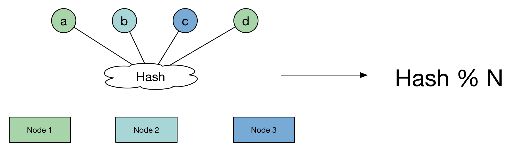
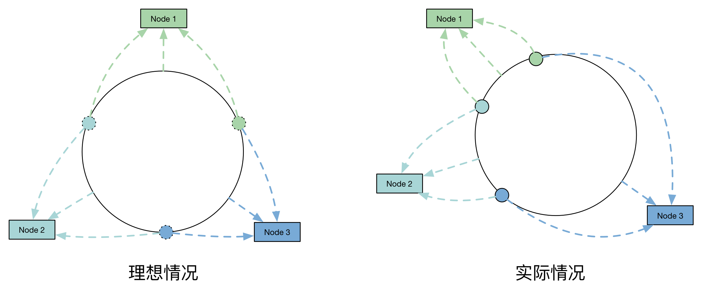
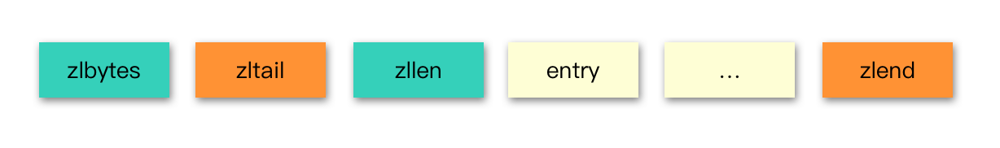

# Redis

## 线程模型

Redis 在处理网络请求是使用单线程模型，并通过 IO 多路复用来提高并发。但是在其他模块，比如：持久化，会使用多个线程。

Redis 内部使用文件事件处理器 `file event handler`，**这个文件事件处理器是单线程的，所以 `Redis` 才叫做单线程的模型**。它采用 IO 多路复用机制同时监听多个 `socket` ，将产生事件的 `socket` 压入内存队列中，事件分派器根据 `socket` 上的事件类型来选择对应的事件处理器进行处理。

文件事件处理器的结构包含 4 个部分：
  - 多个 socket
  - IO 多路复用程序
  - 文件事件分派器
  - 事件处理器（连接应答处理器、命令请求处理器、命令回复处理器）

多个 `socket` 可能会并发产生不同的操作，每个操作对应不同的文件事件，但是 `IO` 多路复用程序会监听多个 `socket` ，会将产生事件的 `socket` 放入队列中排队，事件分派器每次从队列中取出一个 `socket` ，根据 `socket` 的事件类型交给对应的事件处理器进行处理。

客户端与 Redis 的一次通信过程：


### 为啥 Redis 单线程模型也能效率这么高？
  - 纯内存操作
  - 核心是基于非阻塞的 IO 多路复用机制
  - 单线程反而避免了多线程的频繁上下文切换问题

## 持久化

### RDB

RDB 持久化机制，是对 Redis 中的数据执行周期性的持久化。

  - RDB 会生成多个数据文件，每个数据文件都代表了某一个时刻中 Redis 的数据，**非常适合做冷备**
  - RDB 对 Redis 对外提供的读写服务，影响非常小，可以让 Redis 保持高性能，因为 Redis 主进程只需要 fork 一个子进程，让子进程执行磁盘 IO 操作来进行 RDB 持久化即可。
  - 相对于 AOF 持久化机制来说，直接基于 RDB 数据文件来重启和恢复 Redis 进程，更加快速。
  - 一般来说，RDB 数据快照文件，都是每隔 5 分钟，或者更长时间生成一次，这个时候就得接受一旦 Redis 进程宕机，那么会丢失最近 5 分钟的数据。
  - RDB 每次在 `fork` 子进程来执行 RDB 快照数据文件生成的时候，如果数据文件特别大，可能会导致对客户端提供的服务暂停数毫秒，或者甚至数秒。


### AOF

AOF 机制对每条写入命令作为日志，以 `append-only` 的模式写入一个日志文件中，在 Redis 重启的时候，可以通过回放 AOF 日志中的写入指令来重新构建整个数据集

  - AOF 可以更好的保护数据不丢失，一般 AOF 会每隔 1 秒，通过一个后台线程执行一次 `fsync` 操作，最多丢失 1 秒钟的数据。
  - AOF 日志文件以 `append-only` 模式写入，所以没有任何磁盘寻址的开销，写入性能非常高，而且文件不容易破损，即使文件尾部破损，也很容易修复。
  - AOF 日志文件即使过大的时候，出现后台重写操作，也不会影响客户端的读写。因为在 **`rewrite log`** 的时候，会对其中的指令进行压缩，创建出一份需要恢复数据的最小日志出来。在创建新日志文件的时候，老的日志文件还是照常写入。当新的 `merge` 后的日志文件 `ready` 的时候，再交换新老日志文件即可。
  - AOF 日志文件的命令通过非常可读的方式进行记录，这个特性非常 **适合做灾难性的误删除的紧急恢复**。比如某人不小心用 `flushall` 命令清空了所有数据，只要这个时候后台 `rewrite` 还没有发生，那么就可以立即拷贝 AOF 文件，将最后一条 `flushall` 命令给删了，然后再将该 AOF 文件放回去，就可以通过恢复机制，自动恢复所有数据。
  - 对于同一份数据来说，AOF 日志文件通常比 RDB 数据快照文件更大。
  - **AOF 开启后，支持的写 QPS 会比 RDB 支持的写 QPS 低**，因为 AOF 一般会配置成每秒 `fsync` 一次日志文件，当然，每秒一次 `fsync` ，性能也还是很高的。（如果实时写入，那么 QPS 会大降，Redis 性能会大大降低）
  - 以前 AOF 发生过 bug，就是通过 AOF 记录的日志，进行数据恢复的时候，没有恢复一模一样的数据出来。所以说，类似 AOF 这种较为复杂的基于命令日志 / merge / 回放的方式，比基于 RDB 每次持久化一份完整的数据快照文件的方式，更加脆弱一些，容易有 bug。不过 AOF 就是为了避免 rewrite 过程导致的 bug，因此每次 rewrite 并不是基于旧的指令日志进行 merge 的，而是基于当时内存中的数据进行指令的重新构建，这样健壮性会好很多。

### RDB 和 AOF 到底该如何选择

1. 不要仅仅使用 RDB，因为那样会导致你丢失很多数据；
2. 也不要仅仅使用 AOF，因为那样有两个问题：第一，你通过 AOF 做冷备，没有 RDB 做冷备来的恢复速度更快；第二，RDB 每次简单粗暴生成数据快照，更加健壮，可以避免 AOF 这种复杂的备份和恢复机制的 bug；
3. Redis 支持同时开启开启两种持久化方式，我们可以综合使用 AOF 和 RDB 两种持久化机制，用 AOF 来保证数据不丢失，作为数据恢复的第一选择; 用 RDB 来做不同程度的冷备，在 AOF 文件都丢失或损坏不可用的时候，还可以使用 RDB 来进行快速的数据恢复。


## 一致性哈希算法

一致哈希 是一种特殊的哈希算法。在使用一致哈希算法后，哈希表槽位数（大小）的改变平均只需要对 `K/n` 个关键字重新映射，其中 `K` 是关键字的数量，`n` 是槽位数量。然而在传统的哈希表中，添加或删除一个槽位的几乎需要对所有关键字进行重新映射。

> 一致哈希也可用于实现健壮缓存来减少大型 Web 应用中系统部分失效带来的负面影响

### 需求

在使用 `n` 台缓存服务器时，一种常用的负载均衡方式是，对资源 `o` 的请求使用 `hash(o)= o mod n` 来映射到某一台缓存服务器。当增加或减少一台缓存服务器时这种方式可能会改变所有资源对应的 `hash` 值，也就是所有的缓存都失效了，这会使得缓存服务器大量集中地向原始内容服务器更新缓存。

因此需要一致哈希算法来避免这样的问题。 一致哈希尽可能使同一个资源映射到同一台缓存服务器。这种方式要求增加一台缓存服务器时，新的服务器尽量分担存储其他所有服务器的缓存资源。减少一台缓存服务器时，其他所有服务器也可以尽量分担存储它的缓存资源。

一致哈希算法的主要思想是将每个缓存服务器与一个或多个哈希值域区间关联起来，其中区间边界通过计算缓存服务器对应的哈希值来决定。如果一个缓存服务器被移除，则它所对应的区间会被并入到邻近的区间，其他的缓存服务器不需要任何改变。

### 实现

一致哈希将每个对象映射到圆环边上的一个点，系统再将可用的节点机器映射到圆环的不同位置。查找某个对象对应的机器时，需要用一致哈希算法计算得到对象对应圆环边上位置，沿着圆环边上查找直到遇到某个节点机器，这台机器即为对象应该保存的位置。

当删除一台节点机器时，这台机器上保存的所有对象都要移动到下一台机器。添加一台机器到圆环边上某个点时，这个点的下一台机器需要将这个节点前对应的对象移动到新机器上。更改对象在节点机器上的分布可以通过调整节点机器的位置来实现。

## [实践](https://yikun.github.io/2016/06/09/%E4%B8%80%E8%87%B4%E6%80%A7%E5%93%88%E5%B8%8C%E7%AE%97%E6%B3%95%E7%9A%84%E7%90%86%E8%A7%A3%E4%B8%8E%E5%AE%9E%E8%B7%B5/)

> 假设有1000w个数据项，100个存储节点，请设计一种算法合理地将他们存储在这些节点上。

看一看普通Hash算法的原理：



```
for item in range(ITEMS):
    k = md5(str(item)).digest()
    h = unpack_from(">I", k)[0]
    # 通过取余的方式进行映射
    n = h % NODES
    node_stat[n] += 1
```

普通的Hash算法均匀地将这些数据项打散到了这些节点上，并且分布最少和最多的存储节点数据项数目小于 `1%`。之所以分布均匀，主要是依赖 Hash 算法（实现使用的MD5算法）能够比较随机的分布。

然而，我们看看存在一个问题，由于 **该算法使用节点数取余的方法，强依赖 `node` 的数目**，因此，当是 `node` 数发生变化的时候，`item` 所对应的 `node` 发生剧烈变化，而发生变化的成本就是我们需要在 `node` 数发生变化的时候，数据需要迁移，这对存储产品来说显然是不能忍的。

#### 一致性哈希

普通 `Hash` 算法的劣势，即当 `node` 数发生变化（增加、移除）后，数据项会被重新“打散”，导致大部分数据项不能落到原来的节点上，从而导致大量数据需要迁移。

那么，一个亟待解决的问题就变成了：当 `node` 数发生变化时，如何保证尽量少引起迁移呢？即当增加或者删除节点时，对于大多数 item ，保证原来分配到的某个 node ，现在仍然应该分配到那个 node ，将数据迁移量的降到最低。


```
for n in range(NODES):
    h = _hash(n)
    ring.append(h)
    ring.sort()
    hash2node[h] = n
for item in range(ITEMS):
    h = _hash(item)
    n = bisect_left(ring, h) % NODES
    node_stat[hash2node[ring[n]]] += 1
```

**虽然一致性Hash算法解决了节点变化导致的数据迁移问题，但是，数据项分布的均匀性很差**。



主要是因为这 100 个节点 Hash 后，在环上分布不均匀，导致了每个节点实际占据环上的区间大小不一造成的。

#### 改进 -- 虚节点

当我们将 node 进行哈希后，这些值并没有均匀地落在环上，因此，最终会导致，这些节点所管辖的范围并不均匀，最终导致了数据分布的不均匀。


```
for n in range(NODES):
    for v in range(VNODES):
        h = _hash(str(n) + str(v))
        # 构造ring
        ring.append(h)
        # 记录hash所对应节点
        hash2node[h] = n
ring.sort()
for item in range(ITEMS):
    h = _hash(str(item))
    # 搜索ring上最近的hash
    n = bisect_left(ring, h) % (NODES*VNODES)
    node_stat[hash2node[ring[n]]] += 1
```

通过增加虚节点的方法，使得每个节点在环上所“管辖”更加均匀。这样就既保证了在节点变化时，尽可能小的影响数据分布的变化，而同时又保证了数据分布的均匀。也就是靠增加“节点数量”加强管辖区间的均匀。

## 集群

### 主从复制

单机的 Redis ，能够承载的 QPS 大概就在上万到几万不等。对于缓存来说，一般都是用来支撑读高并发的。因此架构做成 **主从(Master-Slave)架构** ，一主多从，主负责写，并且将数据复制到其它的 Slave 节点，从节点负责读。所有的读请求全部走从节点。这样也可以很轻松实现水平扩容，支撑读高并发。


Redis 默认采用异步方式复制数据到 Slave Node，同时 Slave Node 会周期性地确认自己每次复制的数据量：

1. 当 Master 和 Slave 网络连接顺畅时，Master 会持续向 Slave 推送命令，以保持在 Master 数据集合上执行的：客户端写、Key 过期、Key 淘汰等均在 Slave 数据集合上执行。
2. 当 Master 和 Slave 网络连接由于网络问题、超时等中断时， Slave 会尝试重连并进行连接断开期间的命令 **部分同步（partial resynchronization）**。
3. 当部分同步不可用时，Slave 会请求全量同步。在这个过程中，Master 会创建当前所有数据的镜像，发送给 Slave 并继续推送命令。

Redis 主从复制包含以下几个要点：

1. 一个 Master 可以有多个 Slave
2. Slave 支持级联结构，即 Slave 可以连接到其他 Slave 上
3. Redis 在复制过程中，不阻塞 Master ，不论是全量同步还是部分同步
4. 在大部分时间里，复制也不会阻塞 Slave 。当 Slave 在进行初始化同步时，Slave 会先使用旧的数据集提供服务。但当初始化同步完成时，会删除旧数据集，这时 Slave 会拒绝服务。
5. Redis 主从复制可以用来做水平扩容，以提供读写分离，或作为数据备份和高可用
6. 在主从复制的情况下，可以通过配置避免数据持久化，将 Slave 作为数据的备份或开启 Slave 的 AOF。但是这种情况下也会有风险：当 Master 重启后数据集将清空，这时如果 Slave 同步 Master 就会导致数据也被清空

#### 当 Master 不进行持久化如何保证数据安全

在生产环境中，强烈建议开启 Redis 持久化，不论是在 Master 还是在 Slave。如果由于磁盘速度等问题，不能开启持久化，那么需要 **避免 Redis 进程的自动重启**。

### 哨兵

`Sentinel` 是 Redis 官方推荐的 **高可用性( `HA` )解决方案**，当用 Redis 做主从复制的高可用方案时，假如 Master 宕机了， Redis 本身都没有实现自动进行主备切换，而哨兵本身也是一个独立运行的进程，它能监控多个节点，发现 Master 宕机后能进行自动切换。

它的主要功能有以下几点

- 集群监控：负责监控 Redis Master 和 Slave 进程是否正常工作。
- 消息通知：如果某个 Redis 实例有故障，那么哨兵负责发送消息作为报警通知给管理员。
- 故障转移：如果 Master node 挂掉了，会自动转移到 Slave node 上。
- 配置中心：如果故障转移发生了，通知 client 客户端新的 Master 地址。

#### 哨兵的核心知识

1. 哨兵至少需要 3 个实例，来保证自己的健壮性。
2. 哨兵 + Redis 主从的部署架构，是 **不保证数据零丢失** 的，只能保证 Redis 集群的高可用性。
3. 对于哨兵 + Redis 主从这种复杂的部署架构，尽量在测试环境和生产环境，都进行充足的测试和演练。
4. 哨兵的个数与集群节点个数无关，每个哨兵都会 Check 所有节点
5. 当启用哨兵后，客户端的连接是通过哨兵连接到 Node 的

哨兵集群必须部署 2 个以上节点，如果哨兵集群仅仅部署了 2 个哨兵实例，`Quorum` = 1。

```log
+----+         +----+
| M1 |---------| R1 |
| S1 |         | S2 |
+----+         +----+
```

如果 Master 宕机， `S1` 和 `S2` 中只要有 1 个哨兵认为 Master 宕机了，就可以进行切换，同时 `S1` 和 `S2` 会选举出一个哨兵来执行故障转移。但是同时这个时候，需要 `Majority` ，也就是超过半数的哨兵都是运行的。

如果此时仅仅是 `M1` 进程宕机了，哨兵 `s1` 正常运行，那么故障转移是 OK 的。但是如果是整个 `M1` 和 `S1` 运行的机器宕机了，那么哨兵只有 1 个，此时就没有 `Majority` 来允许执行故障转移，虽然另外一台机器上还有一个 R1，但是故障转移不会执行。

经典的 3 节点哨兵集群是这样的：

```log
       +----+
       | M1 |
       | S1 |
       +----+
          |
+----+    |    +----+
| R2 |----+----| R3 |
| S2 |         | S3 |
+----+         +----+
```

配置 `Quorum=2`，如果 `M1` 所在机器宕机了，那么三个哨兵还剩下 2 个， `S2` 和 `S3` 可以一致认为 Master 宕机了，然后选举出一个来执行故障转移，同时 3 个哨兵的 `Majority` 是 2，所以还剩下的 2 个哨兵运行着，就可以允许执行故障转移。

#### Slave 选主算法

如果一个 Master 被认为宕机，而且 `Majority` 数量的哨兵都允许主备切换，那么某个哨兵就会执行主备切换操作，此时首先要选举一个 Slave 来，会考虑 Slave 的一些信息：

- 跟 Master 断开连接的时长
- Slave 优先级
- 复制 offset
- run id

接下来会对 Slave 进行排序：

- 按照 Slave 优先级进行排序，Slave Priority 越低，优先级就越高。
- 如果 Slave Priority 相同，那么看 Replica Offset，哪个 Slave 复制了越多的数据，Offset 越靠后，优先级就越高。
- 如果上面两个条件都相同，那么选择一个 run id 比较小的那个 Slave。

### Redis Cluster

Redis Cluster 是一种服务器 `Sharding` 技术，提供内置的高可用支持，部分 master 不可用时，还可以继续工作。Redis Cluster 功能强大，直接集成了 **主从复制** 和 **哨兵** 的功能。

- **高性能**：在 Cluster 集群中没有代理，主从之间使用异步复制，并且不会对 Key 进行合并操作；
- **可接受的写入安全**：当客户端连接到 majority master 时集群尽最大努力保留所有客户端的写操作。通常情况下，在一小段窗口时间内写请求会被丢失，当客户端连接到 minority master 时这个窗口时间会很大；
- **可用性**：当 Redis Cluster 中大部分 master 是可达的，并且不可达 master 均有一个可用的 slave 时，Redis Cluster 能够在 `NODE_TIMEOUT` 时间后进行故障转移，使 Cluster 重新可用。此外，Cluster 还提供 **副本迁移（replicas migration）**，当 master 没有 slave 时，可从其他 master 下重新分配一个 slave ；

> majority master：能与大多数 master 连通的 master
> minority master：未能与大多数 master 连通的 master

#### 内部节点通信

在 Cluster 架构下，每个 Redis 都需要开启额外的端口来进行节点间通信，这种机制被称之为 **Cluster Bus**。

Redis 维护集群元数据采用 **gossip 协议**，所有节点都持有一份元数据，不同的节点如果出现了元数据的变更，就不断将元数据发送给其它的节点，让其它节点也进行元数据的变更。

gossip 好处在于，元数据的更新比较分散，不是集中在一个地方，更新请求会陆陆续续打到所有节点上去更新，降低了压力；不好在于，元数据的更新有延时，可能导致集群中的一些操作会有一些滞后。


#### 寻址算法

Redis Cluster 有固定的 16384 个 Hash Slot，对每个 key 计算 `CRC16` 值，然后对 `16384` 取模，可以获取 key 对应的 Hash Slot。Redis Cluster 中**每个 Master 都会持有部分 Slot**，Slot 的分配在 Cluster 未进行重配置（reconfiguration）时是稳定的。当 Cluster 稳定时，一个 Hash Slot 只在一个 master 上提供服务。不过一个 master 会有一个或多个 slave ，以在发生网络分区或故障时，替换 master。这些 slave 还可以缓解 master 的读请求的压力。

> 重配置：Hash Slot 从一个节点转移到另一个节点

Keys hash tags 可以破坏上述的分配规则，Hash tags 是一种保证多个键被分配到同一个槽位的方法。

#### 重定向

Redis Cluster 为了提高性能，不会提供代理，而是使用重定向的方式让 client 连接到正确的节点。

##### MOVED

Redis 客户端可以向集群的任意一个节点发送查询请求，节点接收到请求后会对其进行解析，如果是操作单个 key 的命令或者是包含多个在相同槽位 key 的命令，那么该节点就会去查找这个 key 是属于哪个槽位的。如果 key 所属的槽位由该节点提供服务，那么就直接返回结果。否则就会返回一个 `MOVED` 错误：

```log
GET x
-MOVED 3999 127.0.0.1:6381
```

这个错误包括了对应的 key 属于哪个槽位（3999）以及该槽位所在的节点的 IP 地址和端口号。client 收到这个错误信息后，就将这些信息存储起来以便可以更准确的找到正确的节点。

当客户端收到 `MOVED` 错误后，可以使用 `CLUSTER NODES` 或 `CLUSTER SLOTS` 命令来更新整个集群的信息，因为当重定向发生时，很少会是单个槽位的变更，一般都会是多个槽位一起更新。因此，在收到 `MOVED` 错误时，客户端应该尽早更新集群的分布信息。当集群达到稳定状态时，客户端保存的槽位和节点的对应信息都是正确的，cluster 的性能也会达到非常高效的状态。

##### ASK

对于 Redis Cluster 来讲， `MOVED` 重定向意味着请求的 slot 永久的由另一个节点提供服务，而 `ASK` 重定向仅代表将当前查询重定向到指定节点，不影响后续查询。在 Redis Cluster 迁移的时候会用到 ASK 重定向，下面看下 ASK 的处理流程：

1. Client 向节点 A 查询数据 `x`，A 发现数据 `x` 所在的 slot 状态为 `MIGRATING`，如果 `x` 存在则返回，否则返回 `ASK` 重定向；
2. Client 向 `ASK` 重定向节点 B 发送 `ASKING` ，再查询数据 `x`；
3. B 查找 `x` 发现其所在 slot 状态为 `IMPORTING`，则 B 会进行查询。若第二步未发送 `ASKING` ，则 B 会返回 `MOVED`命令，重定向到 A；

Redis Cluster 的迁移是以槽位单位的，一个槽位从节点 A 迁移到节点 B 需要经过以下步骤：

1. 节点 A 将待迁移 slot 设置为 `MIGRATING` 状态，将 B 节点 slot 设置为 `IMPORTING` 状态
2. A 获取 slot 中的 key，逐个调用 `MIGRATE` 命令
3. `MIGRATE` 会将特定的 key 从 A 迁移到 B，这个过程是原子操作（A、B均会进行加锁）

#### 容错能力

Redis Cluster和大多数集群一样，是通过心跳来判断一个节点是否存活的。心跳包的内容可以分为 header 和 gossip 消息两部分，其中header包含以下信息：

- NODE ID 节点在集群中的唯一标识
- currentEpoch 和 configEpoch 字段
- node flag，标识节点是 master 还是 slave ，另外还有一些其他的标识位
- 节点提供服务的 hash slot 的 bitmap
- 发送者的 TCP 端口
- 发送者认为的集群状态（down or ok）
- 如果是slave，则包含 master 的 NODE ID

gossip包含了该节点认为的其他节点的状态，不过不是集群的全部节点。具体有以下信息：

- NODE ID
- 节点的IP和端口
- NODE flags

##### 故障检测

故障检测用于识别集群中的不可达节点是否已下线，如果一个 master 下线，则会将它的 slave提 升为master。如果无法提升，则集群会处于错误状态。在 gossip 消息中，`NODE flags` 的值包括两种 PFAIL 和 FAIL。

如果一个节点发现另外一个节点不可达的时间超过 `NODE_TIMEOUT` ，则会将这个节点标记为 PFAIL，也就是 Possible failure。 PFAIL 标志只是一个节点本地的信息，为了使 slave 提升为 master ，需要将 PFAIL 升级为 FAIL 。当集群中大部分节点都将某个节点标记为 PFAIL 时，则可升级为 FAIL。

FAIL 状态是单向的，只能从 PFAIL 升级为 FAIL ，当节点重新可达时，可清除 FAIL 标记。

## 数据结构

Redis 的数据结构包含两个层面，首先是 API 层面，即 Redis Client 操作的数据结构。另外就是 Redis 在实现 API 层面的数据结构使用的底层数据结构。

Redis API 层面的数据结构主要包括：`String`、`List`、`Set`、`Sorted Set`、`Hash`、`BitMap`，这些数据结构在 [Redis 官方文档](https://redis.io/topics/data-types-intro)中有详细介绍。

下面我们主要介绍 Redis 底层数据结构，包括 `SDS`、`dict`、`ziplist`、`quicklist`、`skiplist`。

### SDS

Redis 没有直接使用 C 语言传统的字符串表示（以空字符结尾的字符数组，以下简称 C 字符串）， 而是自己构建了一种名为 **简单动态字符串（simple dynamic string，SDS）**的抽象类型， 并将 SDS 用作 Redis 的默认字符串表示。

在 Redis 里面， C 字符串只会作为字符串字面量（string literal）， 用在一些无须对字符串值进行修改的地方， 比如打印日志。

当 Redis 需要的不仅仅是一个字符串字面量， 而是一个可以被修改的字符串值时， Redis 就会使用 SDS 来表示字符串值： 比如在 Redis 的数据库里面， 包含字符串值的键值对在底层都是由 SDS 实现的。

| C字符串     | SDS     |
| :------------- | :------------- |
|获取字符串长度的复杂度为 O(N) 。	|获取字符串长度的复杂度为 O(1) 。|
|API 是不安全的，可能会造成缓冲区溢出。	|API 是安全的，不会造成缓冲区溢出。|
|修改字符串长度 N 次必然需要执行 N 次内存重分配。	|修改字符串长度 N 次最多需要执行 N 次内存重分配。|
|只能保存文本数据。	|可以保存文本或者二进制数据。|
|可以使用所有 <string.h> 库中的函数。	|可以使用一部分 <string.h> 库中的函数。|

#### 缓冲区溢出

因为 C 字符串不记录自身的长度， 所以 `strcat` 假定用户在执行这个函数时， 已经为 `dest` 分配了足够多的内存， 可以容纳 `src` 字符串中的所有内容， 而一旦这个假定不成立时， 就会产生缓冲区溢出。

举个例子， 假设程序里有两个在内存中紧邻着的 C 字符串 `s1` 和 `s2` ， 其中 s1 保存了字符串 `"Redis"` ， 而 s2 则保存了字符串 `"MongoDB"` ， 如图所示。


如果一个程序员决定通过执行：

```
strcat(s1, " Cluster");
```

将 `s1` 的内容修改为 `"Redis Cluster"` ， 但粗心的他却忘了在执行 `strcat` 之前为 `s1` 分配足够的空间， 那么在 `strcat` 函数执行之后， `s1` 的数据将溢出到 `s2` 所在的空间中， 导致 `s2` 保存的内容被意外地修改， 如图所示。


与 `C` 字符串不同， `SDS` 的空间分配策略完全杜绝了发生缓冲区溢出的可能性： **当 SDS API 需要对 SDS 进行修改时， API 会先检查 SDS 的空间是否满足修改所需的要求**， 如果不满足的话， API 会自动将 `SDS` 的空间扩展至执行修改所需的大小， 然后才执行实际的修改操作， 所以使用 `SDS` 既不需要手动修改 `SDS` 的空间大小， 也不会出现前面所说的缓冲区溢出问题。

#### 减少修改字符串时带来的内存重分配次数

  - 空间预分配：解决 append 问题
  - 惰性空间释放：解决 strim 问题

#### 二进制安全

C 字符串中的字符必须符合某种编码（比如 `ASCII`）， 并且 **除了字符串的末尾之外， 字符串里面不能包含空字符**， 否则最先被程序读入的空字符将被误认为是字符串结尾 —— 这些限制使得 C 字符串只能保存文本数据， 而不能保存像图片、音频、视频、压缩文件这样的二进制数据。

### dict

在 Redis 中， dict 也是一个基于哈希表的算法。和传统的哈希算法类似，它采用哈希函数从 key 计算得到在哈希表中的位置，采用 **拉链法** 解决冲突，并在装载因子（load factor）超过预定值时自动扩展内存，引发重哈希（rehashing）。

Redis 的 dict 实现最显著的一个特点，就在于它的重哈希。它采用了一种称为 **增量式重哈希（incremental rehashing）** 的方法，在需要扩展内存时避免一次性对所有 key 进行重哈希，而是将重哈希操作分散到对于 dict 的各个增删改查的操作中去。这种方法能做到每次只对一小部分 key 进行重哈希，而每次重哈希之间不影响 dict 的操作。 

> dict 之所以这样设计，是为了避免重哈希期间单个请求的响应时间剧烈增加。

为了实现增量式重哈希（incremental rehashing），dict的数据结构里包含 **两个哈希表**。在重哈希期间，数据从一个哈希表向另一个哈希表迁移。

### ziplist

ziplist 是一个经过特殊编码的 **双向链表**，它的设计目标就是为了提高存储效率。 ziplist 可以用于存储字符串或整数，其中整数是按真正的二进制表示进行编码的，而不是编码成字符串序列。它能以 O(1) 的时间复杂度在表的两端提供 `push` 和 `pop` 操作。

一个普通的双向链表，链表中每一项都占用独立的一块内存，各项之间用地址指针（或引用）连接起来。这种方式会带来大量的内存碎片，而且地址指针也会占用额外的内存。而 ziplist 却是将表中每一项存放在前后 **连续的地址空间** 内，一个 ziplist 整体占用一大块内存。它是一个表（list），但其实不是一个链表（linked list）。

另外，ziplist 为了在细节上节省内存，对于值的存储采用了 **变长编码方式**，大概意思是说，对于大的整数，就多用一些字节来存储，而对于小的整数，就少用一些字节来存储。ziplist 的底层结构如下所示：



- **zlbytes**: 32bit，表示 ziplist 占用的字节总数。
- **zltail**: 32bit，表示 ziplist 表中最后一项（entry）在 ziplist 中的偏移字节数。
- **zllen**: 16bit， 表示 ziplist 中数据项（entry）的个数。 zllen 可以表达的最大值为 2^{16}-1。当 ziplist 长度超过 2^{16}-1时， zllen 不表示长度，长度需要进行遍历计算。
- **entry**: 表示真正存放数据的数据项，长度不定。一个数据项（entry）也有它自己的内部结构。
- **zlend**:  ziplist 最后1个字节，是一个结束标记，值固定等于 255。

当ziplist变得很大的时候，它有如下几个缺点：

- 每次插入或修改引发的 realloc 操作会有更大的概率造成内存拷贝，从而降低性能。
- 一旦发生内存拷贝，内存拷贝的成本也相应增加，因为要拷贝更大的一块数据。
- 当 ziplist 数据项过多的时候，在它上面查找指定的数据项就会性能变得很低，因为 ziplist 上的查找需要进行遍历。

总之， ziplist 本来就设计为各个数据项挨在一起组成连续的内存空间，这种结构并不擅长做修改操作。一旦数据发生改动，就会引发内存realloc，可能导致内存拷贝。

### quicklist

quicklist 是由 ziplist 为节点组成的双向链表。 ziplist 本身也是一个能维持数据项先后顺序的列表（按插入位置），而且是一个内存紧缩的列表（各个数据项在内存上前后相邻）。比如，一个包含 3 个节点的 quicklist ，如果每个节点的 ziplist 又包含 4 个数据项，那么对外表现上，这个 list 就总共包含 12 个数据项。

quicklist 的结构为什么这样设计呢？总结起来，大概又是一个空间和时间的折中：

- 双向链表便于在表的两端进行 push 和 pop 操作，但是它的内存开销比较大。首先，它在每个节点上除了要保存数据之外，还要额外保存两个指针；其次，双向链表的各个节点是单独的内存块，地址不连续，节点多了容易产生内存碎片。
- ziplist 由于是一整块连续内存，所以存储效率很高。但是 **不利于修改操作**，每次数据变动都会引发一次内存的 realloc （扩容）。特别是当 ziplist 长度很长的时候，一次 realloc 可能会导致大批量的数据拷贝，进一步降低性能。

quicklist 节点上的 ziplist 要保持一个合理的长度。那到底多长合理呢？这可能取决于具体应用场景。实际上，Redis提供了一个配置参数`list-max-ziplist-size` ，就是为了让使用者可以来根据自己的情况进行调整。

### skiplist

**跳跃表（skiplist）** 是一种有序数据结构，它通过在每个节点中维持多个指向其他节点的指针，从而达到快速访问节点的目的。

**Redis 只在两个地方用到了跳跃表， 一个是实现有序集合键， 另一个是在集群节点中用作内部数据结构**， 除此之外， 跳跃表在 Redis 里面没有其他用途。

### intset

intset 是一个由整数组成的 **有序集合**，从而便于在上面进行二分查找，用于快速地判断一个元素是否属于这个集合。它在内存分配上与 ziplist 有些类似，是连续的一整块内存空间，而且对于大整数和小整数（按绝对值）采取了不同的编码，尽量对内存的使用进行了优化。

对于小集合使用 intset 来存储，主要的原因是节省内存。特别是当存储的元素个数较少的时候， dict 所带来的内存开销要大得多（包含两个哈希表、链表指针以及大量的其它元数据）。所以，当存储大量的小集合而且集合元素都是数字的时候，用 intset 能节省下一笔可观的内存空间。

实际上，从时间复杂度上比较， intset 的平均情况是没有 dict 性能高的。以查找为例，intset 是 O(\lg^n) 的，而 dict 可以认为是 O(1) 的。但是，由于使用 intset 的时候集合元素个数比较少，所以这个影响不大。

### API数据结构的实现

|API数据结构|限制|底层数据结构|
|:--|:--|:--|
|string|512 MB|SDS|
|list|最大长度 2^{32}-1|quicklist|
|set|最大容量 2^{32}-1|- intset（小整数集） <br> - dict|
|sort set|最大容量 2^{32}-1|- ziplist（小集合） <br> - dict + skiplist|
|hash|最大KV容量 2^{32}-1|- ziplist（小集合） <br> - dict|
|bitmap|512 MB|SDS|


## 缓存穿透、缓存击穿、缓存雪崩

### 缓存穿透

访问一个不存在的key，缓存不起作用，请求会穿透到 DB，流量大时 DB 会挂掉。

#### 解决方案

  - 采用布隆过滤器，使用一个足够大的`bitmap`，用于存储可能访问的 `key`，不存在的key直接被过滤；

  - 访问key未在DB查询到值，也将空值写进缓存，但可以设置较短过期时间。

### 缓存雪崩

大量的 key 设置了相同的过期时间，导致在缓存在同一时刻全部失效，造成瞬时DB请求量大、压力骤增，引起雪崩。

#### 解决方案

可以给缓存设置过期时间时加上一个随机值时间，使得每个 key 的过期时间分布开来，不会集中在同一时刻失效。

### 缓存击穿

对于一些设置了过期时间的key，如果这些key可能会在某些时间点被超高并发地访问，是一种非常“热点”的数据。这个时候，需要考虑一个问题：缓存被“击穿”的问题，这个和缓存雪崩的区别在于这里针对某一 key 缓存，前者则是很多key。

缓存在某个时间点过期的时候，恰好在这个时间点对这个Key有大量的并发请求过来，这些请求发现缓存过期一般都会从后端DB加载数据并回设到缓存，这个时候大并发的请求可能会瞬间把后端 DB 压垮。

#### 解决方案

在缓存失效的时候（判断拿出来的值为空），不是立即去 `load db` ，而是先使用缓存工具的某些带成功操作返回值的操作（比如Redis的 `SETNX`）去 `set` 一个 `mutex key` ，当操作返回成功时，再进行 `load db` 的操作并回设缓存；否则，就重试整个 `get` 缓存的方法。

## 数据淘汰机制

### 对象过期

Redis回收过期对象的策略：定期删除+惰性删除

  - **惰性删除**：当读/写一个已经过期的key时，会触发惰性删除策略，直接删除掉这个过期key
  - **定期删除**：由于惰性删除策略无法保证冷数据被及时删掉，所以Redis会定期主动淘汰一批已过期的key

### 内存淘汰

Redis提供了下面几种淘汰策略供用户选择，其中默认的策略为noeviction策略：

  - `noeviction`：当内存使用达到阈值的时候，所有引起申请内存的命令会报错。
  - `allkeys-lru`：在主键空间中，优先移除最近未使用的key。
  - `volatile-lru`：在设置了过期时间的键空间中，优先移除最近未使用的key。
  - `allkeys-random`：在主键空间中，随机移除某个key。
  - `volatile-random`：在设置了过期时间的键空间中，随机移除某个key。
  - `volatile-ttl`：在设置了过期时间的键空间中，具有更早过期时间的key优先移除。

> 这里补充一下主键空间和设置了过期时间的键空间，举个例子，假设我们有一批键存储在Redis中，则有那么一个哈希表用于存储这批键及其值，如果这批键中有一部分设置了过期时间，那么这批键还会被存储到另外一个哈希表中，这个哈希表中的值对应的是键被设置的过期时间。设置了过期时间的键空间为主键空间的子集。

#### 非精准的LRU

上面提到的LRU（Least Recently Used）策略，实际上 **Redis 实现的 LRU 并不是可靠的 LRU**，也就是名义上我们使用LRU算法淘汰键，但是实际上被淘汰的键并不一定是真正的最久没用的，这里涉及到一个权衡的问题，如果需要在全部键空间内搜索最优解，则必然会增加系统的开销，Redis是单线程的，也就是同一个实例在每一个时刻只能服务于一个客户端，所以耗时的操作一定要谨慎。

为了在一定成本内实现相对的LRU，早期的 Redis 版本是 **基于采样的 LRU** ，也就是放弃全部键空间内搜索解改为采样空间搜索最优解。自从 Redis3.0 版本之后，Redis 作者对于基于采样的 LRU 进行了一些优化，目的是在一定的成本内让结果更靠近真实的 LRU。


## 参考链接

- [Redis内部数据结构详解(1)——dict](http://zhangtielei.com/posts/blog-redis-dict.html)