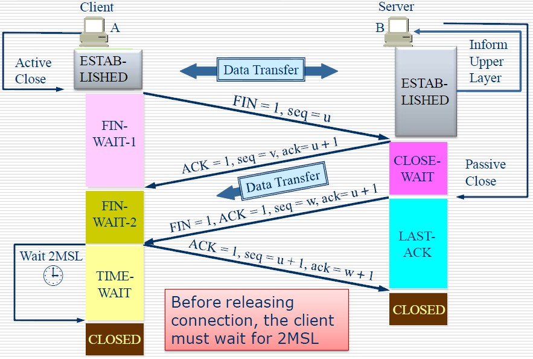

# TCP

## TCP概述

### TCP的特点

  - TCP是面向连接的传输层协议。
  - TCP连接是点对点的（套接字--IP:Port到套接字）。
  - TCP提供可靠交付的服务。
  - TCP提供全双工通信。
  - 面向字节流。

### TCP与UDP的区别

  ||TCP |UDP |
  |:---|:--|:--|
  |是否连接| 面向连接 |面向非连接|
  |传输可靠性| 可靠| 不可靠|
  |应用场合| 传输大量数据| 少量数据|
  |速度| 慢| 快|

## TCP报文结构


- **源端口、目的端口**：16位长。标识出远端和本地的端口号。
- **序列号（seq）**：32位长
  - 如果含有同步标识（SYN），则此为最初的序列号；第一个数据比特的序列码为本序列号加一
  - 如果没有同步标识（SYN），则此为第一个数据比特的序列码
- **确认号（ack）**：32位长。希望收到的下一个数据报的序列号，表明到序列号 `N-1` 为止的所有数据已经正确收到。
- TCP协议数据报头长：4位长。表明TCP头中包含多少个 4字节
- 保留：置0
- **ACK**：期望收到的数据的开始序列号。也即已经收到的数据的字节长度加1
- PSH：表示是带有PUSH标志的数据。接收方因此请求数据报一到便可送往应用程序而不必等到缓冲区装满时才传送。
- **RST**：用于复位由于主机崩溃或其它原因而出现的错误的连接。还可以用于拒绝非法的数据报或拒绝连接请求。
- **SYN**：用于建立连接。
- **FIN**：用于释放连接。
- **窗口大小（WIN）**：16位长。表示从确认号开始，本报文的发送方（数据发送端 or 数据接收端）可以接收的字节数，即接收窗口大小。用于流量控制。
- **校验和（Checksum）**：16位长。是为了确保高可靠性而设置的。它校验头部、数据和伪TCP头部之和。
- 紧急指针：`URG=1`时才有意义。
- 可选项：长度可变，最长40个字节。每个选项的开始是 1 字节的 kind 字段，说明选项的类型。
  - 0：选项表结束（1字节）
  - 1：无操作（1字节）用于选项字段之间的字边界对齐
  - 2：**MMS** 最大报文段长度，通常在创建连接而设置 SYN 标志的数据包中指明这个选项，指明本端所能接收的最大长度的报文段。通常将 MSS 设置为（MTU-40）字节，携带 TCP 报文段的 IP 数据报的长度就不会超过 MTU（MTU最大长度为1518字节，最短为64字节），从而避免本机发生IP分片。只能出现在同步报文段中，否则将被忽略。
  - 3：**窗口扩大因子（4字节，wscale）**，取值 0-14 。用来把 TCP 的窗口的值左移的位数，使窗口值乘倍。只能出现在同步报文段中，否则将被忽略。
  - 4：**sackOK** 发送端支持并同意使用SACK选项。
  - 5：**SACK** 选择确认选项
  - 8：**时间戳** 计算 RTT；用于处理TCP序号超过 2^32 的情况，又称为防止序号回绕（PAWS）。
    - 发送端的时间戳（Timestamp）
    - 时间戳回显应答（Timestamp Echo）

> TCP最小长度为 20 个字节。

## 三次握手


  - 第一次握手：建立连接时，客户端发送 SYN 包（seq=j）到服务器，并进入`SYN_SENT`状态，等待服务器确认。
  - 第二次握手：服务器收到 SYN 包，必须确认客户的 SYN（ack=j+1），同时自己也发送一个 SYN 包（seq=k），即 SYN + ACK 包，此时服务器进入 `SYN_RECV` 状态；
  - 第三次握手：客户端收到服务器的 SYN+ACK 包，向服务器发送确认包 ACK（ack=k+1），此包发送完毕，客户端和服务器进入`ESTABLISHED`（TCP连接成功）状态，完成三次握手。

TCP 连接使用三次握手的首要原因：为了 **阻止历史的重复连接初始化造成的混乱问题**。如果通信双方的通信次数只有两次，那么发送方一旦发出建立连接的请求之后它就没有办法撤回这一次请求，如果在网络状况复杂或者较差的网络中，发送方连续发送多次建立连接的请求，如果 TCP 建立连接只能通信两次，那么接收方只能选择接受或者拒绝发送方发起的请求，它并不清楚这一次请求是不是由于网络拥堵而早早过期的连接。

所以，TCP 选择使用三次握手来建立连接并在连接引入了 RST 这一控制消息，接收方当收到请求时会将发送方发来的 SEQ+1 发送给对方，这时由发送方来判断当前连接是否是历史连接：

- 如果当前连接是历史连接，即 SEQ 过期或者超时，那么发送方就会直接发送 RST 控制消息中止这一次连接；
- 如果当前连接不是历史连接，那么发送方就会发送 ACK 控制消息，通信双方就会成功建立连接；

使用三次握手和 RST 控制消息将是否建立连接的最终控制权交给了发送方，因为只有发送方有足够的上下文来判断当前连接是否是错误的或者过期的，这也是 TCP 使用三次握手建立连接的最主要原因。

### 内核对 TCP 的处理

Socket 是一个由 （源IP、源Port、目标IP、目标Port、协议） 组成的五元组，唯一标示一个 socket 连接。

TCP 建立连接的整体流程：

  1. 服务器端在调用 `listen` 之后，内核会建立两个队列，`SYN`队列和`ACCEPT`队列，其中`ACCPET`队列的长度由`backlog`指定。
  2. 服务器端在调用 `accpet` 之后，将阻塞，等待 `ACCPT` 队列有元素。
  3. 客户端在调用 `connect` 之后，将开始发起 `SYN` 请求，请求与服务器建立连接，此时称为第一次握手。
  4. 服务器端在接受到 `SYN` 请求之后，把请求方放入 `SYN` 队列中，并给客户端回复一个确认帧 `ACK` ，此帧还会携带一个请求与客户端建立连接的请求标志，也就是 `SYN` ，这称为第二次握手
  5. 客户端收到 `SYN+ACK` 帧后， `connect` 返回，并发送确认建立连接帧 `ACK` 给服务器端。这称为第三次握手
  6. 服务器端收到 `ACK` 帧后，会把请求方从 `SYN` 队列中移出，放至 `ACCEPT` 队列中，而 `accept` 函数也等到了自己的资源，从阻塞中唤醒，从 `ACCEPT` 队列中取出请求方，重新建立一个新的 `sockfd` ，并返回。

在服务端如何分发多个连接的请求？

由于 `TCP/IP` 协议栈是维护着一个接收和发送缓冲区的。在接收到来自客户端的数据包后，服务器端的 `TCP/IP` 协议栈应该会做如下处理：

  1. 如果收到的是请求连接的数据包，则传给监听着连接请求端口的 `socetfd` 套接字。
  2. 如果是已经建立过连接后的客户端数据包，则将数据放入接收缓冲区。这样，当服务器端需要读取指定客户端的数据时，则可以利用 `socketfd_new` 套接字通过 `recv` 或者 `read` 函数到缓冲区里面去取指定的数据（因为 `socketfd_new` 代表的 `socket` 对象记录了客户端IP和端口，因此可以鉴别）。

数据包如何找到相对应的 socket ，这个方法在 Linux Kernel 代码里也是有体现的：

```
static inline struct sock *__inet_lookup(struct net *net,
                     struct inet_hashinfo *hashinfo,
                     const __be32 saddr, const __be16 sport,
                     const __be32 daddr, const __be16 dport,
                     const int dif)
{
    u16 hnum = ntohs(dport);
    /* 先尝试查找处于连接成功的 socket */
    struct sock *sk = __inet_lookup_established(net, hashinfo,
                saddr, sport, daddr, hnum, dif);
     /* 如果没有找到连接成功的socket，那么就去处于 listen 状态的 socket 查找 */
    return sk ? : __inet_lookup_listener(net, hashinfo, daddr, hnum, dif);
}
```

## 四次挥手



由于TCP连接是全双工的，因此每个方向都必须单独进行关闭。

  - 客户端A发送一个FIN，用来关闭客户A到服务器B的数据传送（报文段4）。
  - 服务器B收到这个FIN，它发回一个ACK，确认序号为收到的序号加1（报文段5）。和SYN一样，一个FIN将占用一个序号。
  - 服务器B关闭与客户端A的连接，发送一个FIN给客户端A（报文段6）。
  - 客户端A发回ACK报文确认，并将确认序号设置为收到序号加1（报文段7）

对于复杂的网络状态，TCP 的实现提出了多种应对措施， `TIME_WAIT` 状态的提出就是为了应对其中一种异常状况。在 `TIME_WAIT` 阶段，主动端等待 2*MSL（**最大分段寿命**：表示一个 TCP 分段可以存在于互联网系统中的最大时间，由 TCP 的实现，超出这个寿命的分片都会被丢弃） 时间， MSL 建议为 2 分钟。

如果没有 `TIME_WAIT` 状态，Client 不再保存这个连接的信息，收到一个不存在的连接的包，Client 会响应 `RST` 包，导致 Server 端异常响应。此时， `TIME_WAIT` 是为了 **保证全双工的 TCP 连接正常终止**。

如果双方挥手之后，一个 网络四元组（src/dst ip/port）被回收，而此时网络中还有一个迟到的数据包没有被 Server 接收，Client 应用程序又立刻使用了同样的四元组再创建了一个新的连接后，这个迟到的数据包才到达 Server，那么这个数据包就会让 Server 以为是 Client 刚发过来的。此时， `TIME_WAIT` 的存在是为了 **保证网络中迷失的数据包正常过期**。

> TCP采用四次挥手关闭连接如图所示为什么建立连接协议是三次握手，而关闭连接却是四次握手呢？
> 
> 这是因为服务端的 LISTEN 状态下的 SOCKET 当收到 SYN 报文的建连请求后，它可以把 ACK 和 SYN （ACK起应答作用，而SYN起同步作用）放在一个报文里来发送。但关闭连接时，当收到对方的FIN报文通知时，它仅仅表示对方没有数据发送给你了；但未必你所有的数据都全部发送给对方了，所以你可以未必会马上会关闭SOCKET,也即你可能还需要发送一些数据给对方之后，再发送FIN报文给对方来表示你同意现在可以关闭连接了，所以它这里的ACK报文和FIN报文多数情况下都是分开发送的。


## 数据传输

### 可靠传输

通常在每个 TCP 报文段中都有一对序号和确认号。TCP报文发送者称自己的字节流的编号为 **序号** （sequence number），称接收到对方的字节流编号为 **确认号** 。TCP 报文的接收者为了确保可靠性，在接收到一定数量的连续字节流后才发送确认。这是对 TCP 的一种扩展，称为选择确认（Selective Acknowledgement）。选择确认使得 TCP 接收者可以对乱序到达的数据块进行确认。**每一个字节传输过后，SN号都会递增1**。

通过使用序号和确认号，TCP 层可以把收到的报文段中的字节按正确的顺序交付给应用层。序号是 32 位的无符号数，在它增大到 2^{32}-1 时，便会回绕到 0。对于初始化序列号(ISN)的选择是 TCP 中关键的一个操作，它可以确保强壮性和安全性。

TCP 协议使用序号标识每端发出的字节的顺序，从而另一端接收数据时可以重建顺序，无惧传输时的包的乱序交付或丢包。在发送第一个包时（SYN包），选择一个 **随机数** 作为序号的初值，以克制 TCP 序号预测攻击。

发送确认包（Acks），携带了接收到的对方发来的字节流的编号，称为确认号，以告诉对方 **已经成功接收的数据流的字节位置**。Ack并不意味着数据已经交付了上层应用程序。可靠性通过发送方检测到丢失的传输数据并重传这些数据。包括 **超时重传**（Retransmission timeout，RTO）与 **重复累计确认** （duplicate cumulative acknowledgements，DupAcks）。

#### 重复累计确认重传

如果一个包（不妨设它的序号是 100 ，即该包始于第 100 字节）丢失，接收方就不能确认这个包及其以后的包，因为采用了 **累计ACK** 。接收方在收到 100 以后的包时，发出对包含第 99 字节的包的确认。这种重复确认是包丢失的信号。**发送方如果收到 3 次对同一个包的确认，就重传最后一个未被确认的包**。阈值设为 3 被证实可以减少乱序包导致的无作用的重传（spurious retransmission）现象。**选择性确认（SACK）**的使用能明确反馈哪个包收到了，极大改善了TCP重传必要的包的能力。

#### 超时重传

发送方使用一个保守估计的时间作为收到数据包的确认的超时上限。如果超过这个上限仍未收到确认包，发送方将重传这个数据包。每当发送方收到确认包后，会重置这个重传定时器。典型地，定时器的值设定为 {\text{smoothed RTT}}+\max(G,4\times {\text{RTT variation}}) 其中 G 是时钟粒度。进一步，如果重传定时器被触发，仍然没有收到确认包，定时器的值将被设为前次值的二倍（直到特定阈值）。这可对抗 中间人攻击方式的拒绝服务攻击，这种攻击愚弄发送者重传很多次导致接受者被压垮。

#### 数据传输举例


1. 发送方首先发送第一个包含序列号为1（可变化）和 1460 字节数据的 TCP 报文段给接收方。接收方以一个没有数据的 TCP 报文段来回复（只含报头），用确认号 1461 来表示已完全收到并请求下一个报文段。
2. 发送方然后发送第二个包含序列号为 1461 ，长度为 1460 字节的数据的 TCP 报文段给接收方。正常情况下，接收方以一个没有数据的 TCP 报文段来回复，用确认号 2921（1461+1460）来表示已完全收到并请求下一个报文段。发送接收这样继续下去。
3. **然而当这些数据包都是相连的情况下，接收方没有必要每一次都回应**。比如，他收到第 1 到 5 条TCP报文段，只需回应第五条就行了。在例子中第3条TCP报文段被丢失了，所以尽管他收到了第 4 和 5 条，然而他只能回应第 2 条。
4. 发送方在发送了第三条以后，没能收到回应，因此当时钟（timer）过时（expire）时，他重发第三条。（每次发送者发送一条TCP报文段后，都会再次启动一次时钟：RTT）。
5. 这次第三条被成功接收，接收方可以直接确认第5条，因为4，5两条已收到。


### 流量控制

流量控制用来避免主机分组发送得过快而使接收方来不及完全收下，一般由接收方通告给发送方进行调控，这里的窗口被称为 **接收通知窗口（Receiver's Advertised Window）**。

流量控制通过 **滑动窗口机制** 来实现： **报文发送方** 在 **WIN** 域指出还可接收的字节数量（rwnd）。报文接收方在没有新的确认包的情况下至多发送 WIN 允许的字节数量。在数据传输过程中，报文发送方可修改 WIN 的值。

> 报文发送方：即可以是握手的发起方（客户端），也可以是握手的被动接收方（服务端）


1. 报文段 2 中提供的窗口大小为 6144 字节；
2. 由于这是一个较大的窗口，因此发送端立即连续发送了6个报文段（4~9），停止；
3. 报文段 10 确认了所有的数据（从第 1 到 6144 字节），但提供的窗口大小却为 2048，这很可能是接收程序不能读取多于 2048 字节的数据；
4. 报文段 11 和 12 完成了客户的数据传输，且最后一个报文段带有 FIN 标志；
5. 报文段 13 包含与报文段 10 相同的确认序号，但通告了一个更大的窗口大小；
6. 报文段 14 确认了最后的 2048 字节的数据和 FIN ；
7. 报文段 15 和 16 仅用于通告一个更大的窗口大小；
8. 报文段 17 和 18 完成通常的关闭过程；

当接收方宣布接收窗口的值为 0，发送方停止进一步发送数据，开始了 **保持定时器（persist timer）**，以 **避免因随后的修改接收窗口的数据包丢失使连接的双侧进入死锁** ，发送方无法发出数据直至收到接收方修改窗口的指示。当定时器到期时， TCP 发送方尝试恢复发送一个小的 **ZWP 包（Zero Window Probe）**，期待接收方回复一个带着新的接收窗口大小的确认包。一般 ZWP 包会设置成 3 次，如果 3 次过后还是 0 的话，有的 TCP 实现就会发 RST 把链接断了。

### 拥塞控制

TCP 拥塞控制算法是互联网上主要的拥塞控制措施，它使用一套基于 **线増积减**（Additive increase/multiplicative decrease，AIMD）的网络拥塞控制方法来控制拥塞，**防止过多的数据注入到网络中，这样可以使网络中的路由器或链路不致过载**。

除了 **拥塞窗口大小（cwnd）** 之外，TCP 连接的双方都有 **接收窗口大小（rwnd）**。客户端能够同时传输的最大数据段的数量是接收窗口大小和拥塞窗口大小的最小值，即 min(rwnd, cwnd) 。

TCP 协议使用慢启动阈值（Slow start threshold, ssthresh）来决定使用慢启动或者拥塞避免算法：

- 当拥塞窗口大小小于慢启动阈值时，使用慢启动；
- 当拥塞窗口大小大于慢启动阈值时，使用拥塞避免算法；
- 当拥塞窗口大小等于慢启动阈值时，使用慢启动或者拥塞避免算法；

#### 慢开始和拥塞避免

客户端维持一个 **拥塞窗口 `cwnd`** 的状态变量，初始值一般为 2\times MSS。

- `慢开始`：**由小到大的指数增大拥塞窗口**。首先将 cwnd 设置为一个最大报文段 MMS ，在收到一个对新的报文段的确认后，把拥塞窗口增加一个 MMS 。

- `拥塞避免`：当慢开始到阈值（ssthresh）后，使用拥塞避免算法（ cwnd 每次加1 ）。当发送方发送的数据包丢包时，将 ssthresh 置为 cwnd 的一半，将 cwnd 置为1，再次执行慢开始。

#### 快重传和快恢复

**快速重传和恢复（fast retransmit and recovery，FRR）** 是一种拥塞控制算法，它能快速恢复丢失的数据包。没有 FRR，如果数据包丢失了，TCP 将会使用定时器来要求传输暂停。在暂停的这段时间内，没有新的或复制的数据包被发送。有了FRR，如果接收机接收到一个不按顺序的数据段，它会立即给客户端发送一个重复确认。如果客户端接收到三个重复确认，它会认定数据段丢失，并立即重传这些丢失的数据段。

有了 FRR，就不会因为重传时要求的暂停被耽误。当有单独的数据包丢失时，快速重传和恢复（FRR）能最有效地工作。当有多个数据信息包在某一段很短的时间内丢失时，它则不能很有效地工作。

#### BBR

BBR（Bottleneck Bandwidth and Round-trip propagation time）是 Google 研发的新的拥塞控制算法。自从 20 世纪 80年代后， TCP 中的拥塞控制算法都使用的是 **基于丢包的拥塞控制**（拥塞避免），在之前的网络带宽、路由器 Buffer 的情况下，该算法效果良好。

但是在当前的网络条件下，基于丢包的拥塞控制算法则会导致 TCP 性能问题：

  - 在小 Buffer 路由器环境下，丢包发生在拥塞之前。在高速，长途链路中，基于丢包的拥塞控制会导致吞吐量过低，因为它反应过度，即使丢包是由瞬时流量突发引起的，也会因丢包而将发送速率减半（即使链路大部分处于空闲状态，这种丢包也可能非常频繁）
  - 在大 Buffer 路由器环境下，拥塞发生在丢包之前。在互联网的边缘，基于丢包的拥塞控制通过反复填充大量的缓存，从而导致了臭名昭著的 **bufferbloat** 问题。

> bufferbloat 问题：由于路由器的大缓存，减少链路丢包。再加上网络中 TCP 大量使用基于丢包的拥塞控制算法（丢包才触发速度下调，但是要丢包，缓存就得先被填满，缓存都填满，延迟更高）

BBR 算法使用最大带宽和往返时间来建立网络的显式模型。每次对包传递进行累积或选择性确认，都会生成一个速率样本，该速率采样记录在数据包传输与该包确认之间的时间间隔内传递的数据量，从而使拥塞控制算法能够提供更高的吞吐量和更低的延迟。

## 最大分段大小

**最大分段大小 (MSS)** 是在单个分段中 TCP 愿意接受的数据的字节数最大值。MSS应当足够小以避免IP分片，它会导致丢包或过多的重传。

**在 TCP 连接创建时，双端在 SYN 报文中用 MSS 选项宣布各自的 MSS ，这是从双端各自直接相连的数据链路层的最大传输单元(MTU)的尺寸减去固定的 IP 首部和 TCP 首部长度**。以太网MTU为 1500 字节， MSS值可达 1460 字节。使用 IEEE 802.3 的 MTU 为 1492 字节，MSS 可达 1452 字节。

如果目的IP地址为“非本地的”，MSS通常的默认值为 536（这个默认值允许 20 字节的 IP 首部和 20 字节的 TCP 首部以适合 576字节 IP 数据报）。此外，发送方可用传输路径 MTU 发现（RFC 1191）推导出从发送方到接收方的网络路径上的最小 MTU，以此动态调整 MSS 以避免网络 IP 分片。

MSS 发布也被称作“MSS协商”（MSS negotiation）。严格讲，这并非是协商出来一个统一的MSS值，TCP 允许连接两端使用各自不同的MSS值。例如，这会发生在参与 TCP 连接的一台设备使用非常少的内存处理到来的 TCP 分组。

## 选择确认

**最初采取累计确认的 TCP 协议在丢包时效率很低**。例如，假设通过10个分组发出了1万个字节的数据。如果第一个分组丢失，在纯粹的累计确认协议下，接收方不能说它成功收到了 1,000 到 9,999 字节，但未收到包含 0 到 999 字节的第一个分组。因而，发送方可能必须重传所有1万个字节。

为此，TCP采取了 **选择确认（selective acknowledgment，SACK）** 选项。RFC 2018 对此定义为 **允许接收方确认它成功收到的分组的不连续的块**，以及基础 TCP 确认的成功收到最后连续字节序号。这种确认可以指出 SACK block，包含了已经成功收到的连续范围的开始与结束字节序号。在上述例子中，接收方可以发出 SACK 指出序号 1000 到 9999 ，发送方因此知道只需重发第一个分组(字节 0 到 999)。

TCP 发送方会把乱序收包当作丢包，因此会重传乱序收到的包，导致连接的性能下降。重复SACK选项（duplicate-SACK option）是定义在RFC 2883中的SACK的一项扩展，可解决这一问题。接收方发出 D-SACK 指出没有丢包，接收方恢复到高传输率。 D-SACK 使用了 SACK 的第一个段来做标志：

- 如果 SACK 的第一个段的范围被 ACK 所覆盖，那么就是 D-SACK;
- 如果 SACK 的第一个段的范围被 SACK 的第二个段覆盖，那么就是 D-SACK

> D-SACK旨在告诉发送端：收到了重复的数据，数据包没有丢，丢的是ACK包；

SACK 选项并不是强制的。仅当双端都支持时才会被使用。 TCP 连接创建时会在 TCP 头中协商 SACK 细节。在 Linux下，可以通过 `tcp_sack` 参数打开 SACK 功能（Linux 2.4后默认打开）。Linux下的 `tcp_dsack` 参数用于开启D-SACK功能（Linux 2.4后默认打开）。选择确认也用于流控制传输协议 (SCTP)。