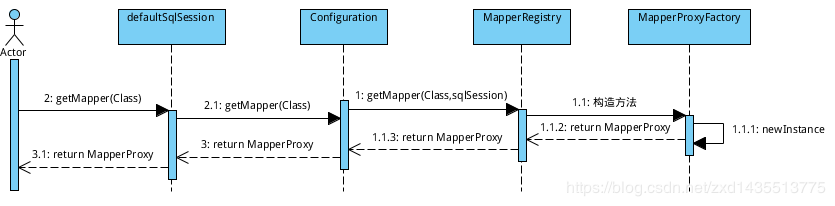

# Mybatis 动态代理

## 获取代理类流程

获取Mapper代理类的时序图如下：



重点说下MapperProxy类，声明如下：

```
public class MapperProxy<T> implements InvocationHandler, Serializable
```

获取到 `MapperProxy` 之后，根据调用不同的方法，会将最终的参数传递给 `SqlSession`。
