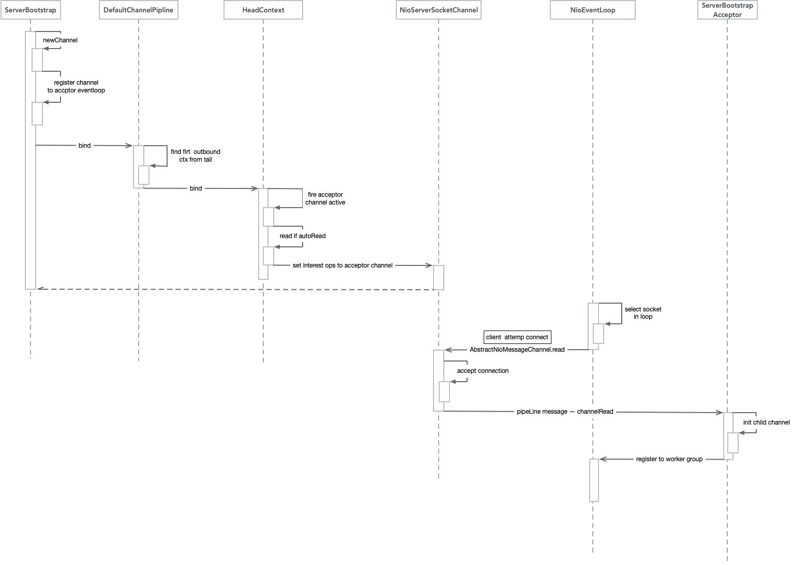

# Netty

Netty 是一个 异步 事件驱动 的网络应用框架，用于快速开发高性能、可扩展协议的服务器和客户端

## [Reactor](https://www.infoq.cn/article/netty-threading-model)

无论是 C++ 还是 Java 编写的网络框架，大多数都是基于 Reactor 模式进行设计和开发，Reactor 模式基于事件驱动，特别适合处理海量的 I/O 事件。

[反应器设计模式-维基百科](https://zh.wikipedia.org/wiki/%E5%8F%8D%E5%BA%94%E5%99%A8%E6%A8%A1%E5%BC%8F) -- 反应器设计模式(`Reactor pattern`)是一种为处理服务请求并发 提交到一个或者多个服务处理程序的事件设计模式。当请求抵达后，服务处理程序使用解多路分配策略，然后同步地派发这些请求至相关的请求处理程序。

### 单线程模型

Reactor 单线程模型，指的是所有的 IO 操作都在同一个 NIO 线程上面完成，NIO 线程的职责如下：

  1. 作为 NIO 服务端，接收客户端的 TCP 连接；
  1. 作为 NIO 客户端，向服务端发起 TCP 连接；
  1. 读取通信对端的请求或者应答消息；
  1. 向通信对端发送消息请求或者应答消息。


由于 `Reactor` 模式使用的是`异步非阻塞 IO`，所有的 `IO` 操作都不会导致阻塞，理论上一个线程可以独立处理所有 `IO` 相关的操作。从架构层面看，一个 `NIO` 线程确实可以完成其承担的职责。例如，通过 `Acceptor` 类接收客户端的 TCP 连接请求消息，链路建立成功之后，通过 `Dispatch` 将对应的 `ByteBuffer` 派发到指定的 `Handler` 上进行消息解码。用户线程可以通过消息编码通过 `NIO` 线程将消息发送给客户端。

对于一些小容量应用场景，可以使用单线程模型。但是 **对于高负载、大并发的应用场景却不合适**。

### 多线程模型

Rector 多线程模型与单线程模型最大的区别就是有一组 NIO 线程处理 IO 操作，它的原理图如下：


Reactor 多线程模型的特点：

  1. 有专门一个 `NIO` 线程 `Acceptor` 线程用于监听服务端，接收客户端的 `TCP` 连接请求；
  1. 网络 `IO` 操作 - 读、写等由一个 `NIO` 线程池负责，线程池可以采用标准的 `JDK` 线程池实现，它包含一个任务队列和 `N` 个可用的线程，由这些 `NIO` 线程负责消息的读取、解码、编码和发送；
  1. 1 个 `NIO` 线程可以同时处理 N 条链路，但是 1 个链路只对应 1 个 `NIO` 线程，防止发生并发操作问题。

### 主从多线程模型

主从 `Reactor` 线程模型的特点是：服务端用于接收客户端连接的不再是个 `1` 个单独的 `NIO` 线程，而是一个独立的 `NIO` 线程池。 `Acceptor` 接收到客户端 `TCP` 连接请求处理完成后（可能包含接入认证等），将新创建的 `SocketChannel` 注册到 IO 线程池（`sub reactor` 线程池）的某个 IO 线程上，由它负责 `SocketChannel` 的读写和编解码工作。 `Acceptor` 线程池仅仅只用于客户端的登陆、握手和安全认证，一旦链路建立成功，就将链路注册到后端 `subReactor` 线程池的 `IO` 线程上，由 `IO` 线程负责后续的 `IO` 操作。


它的工作流程总结如下：

  1. 从主线程池中随机选择一个 `Reactor` 线程作为 `Acceptor` 线程，用于绑定监听端口，接收客户端连接；
  1. Acceptor 线程接收客户端连接请求之后创建新的 `SocketChannel` ，将其注册到主线程池的其它 Reactor 线程上，由其负责接入认证、IP 黑白名单过滤、握手等操作；
  1. 步骤 2 完成之后，业务层的链路正式建立，将 `SocketChannel` 从主线程池的 `Reactor` 线程的多路复用器上摘除，重新注册到 `Sub` 线程池的线程上，用于处理 I/O 的读写操作。


## Netty 的优势

  - 多路复用，并在 NIO 的基础上进行更高层次的抽象
  - 事件机制
  - 功能强大，预置了多种编解码功能，支持多种主流协议
  - 定制能力强，可以通过ChannelHandler对通信框架进行灵活的扩展

### Netty 为什么性能好？

  1. 纯异步：`Reactor` 线程模型
  2. IO 多路复用
  3. GC 优化：更少的分配内存、池化（Pooling）、复用、选择性的使用 `sun.misc.Unsafe`
  4. 更多的硬件相关优化（mechanical sympathy）
  5. 内存泄漏检测
  6. "Zero Copy"

### Zero Copy

Netty 的 Zero-copy 体现在如下几个个方面:

  - `Netty` 提供了 `CompositeByteBuf` 类, 它可以将多个 `ByteBuf` 合并为一个逻辑上的 `ByteBuf` , 避免了各个 `ByteBuf` 之间的拷贝.
  - 通过 `wrap` 操作, 我们可以将 `byte[]` `数组、ByteBuf` 、 `ByteBuffer` 等包装成一个 `Netty ByteBuf` 对象, 进而避免了拷贝操作.
  - `ByteBuf` 支持 `slice` 操作, 因此可以将 `ByteBuf` 分解为多个共享同一个存储区域的 `ByteBuf`, 避免了内存的拷贝.
  - 通过 `FileRegion` 包装的 `FileChannel.tranferTo` 实现文件传输, 可以直接将文件缓冲区的数据发送到目标 `Channel` , 避免了传统通过循环 `write` 方式导致的内存拷贝问题.

### 垃圾回收

Netty 里 `HeapByteBuffer` 底下的 `byte[]` 能够依赖JVM GC自然回收；而 DirectByteBuffer 底下是 Java 堆外内存，除了等JVM GC，最好也能主动进行回收；所以，Netty ByteBuf需要在 JVM 的 GC 机制之外，有自己的引用计数器和回收过程。
> 原生的 JVM GC 很难回收掉 DirectByteBuffer 所占用的 Native Memory

Netty 中采用引用计数对 DirectByteBuffer 进行对象可达性检测，当 DirectByteBuffer 上的引用计数为 0 时将对象释放。

```java
@Override
public boolean release() {
    for (;;) {
        int refCnt = this.refCnt;
        if (refCnt == 0) {
            throw new IllegalReferenceCountException(0, -1);
        }
        if (refCntUpdater.compareAndSet(this, refCnt, refCnt - 1)) {
            if (refCnt == 1) {
                deallocate();
                return true;
            }
            return false;
        }
    }
}
```

Netty 内存泄漏，主要是针对池化的 ByteBuf 。 ByteBuf 对象被 JVM GC 掉之前，没有调用 `release()` 把底下的 `DirectByteBuffer` 或`byte[]` 归还，会导致池越来越大。而非池化的 ByteBuf ，即使像 `DirectByteBuf` 那样可能会用到 `System.gc()` ，但终归会被 release 掉的，不会出大事。因此 Netty 默认会从分配的 ByteBuf 里抽样出大约 1% 的来进行跟踪。

## 源码

### ByteBuf

  1. ByteBuf 扩容采用先倍增后步进的方式

#### DirectBuffer vs HeapBuffer

在执行网络IO或者文件IO时，如果是使用 `DirectBuffer` 就会少一次内存拷贝。**如果是非 `DirectBuffer` ，JDK 会先创建一个 `DirectBuffer` ，再去执行真正的写操作**。这是因为，当我们把一个地址通过 `JNI` 传递给底层的C库的时候，有一个基本的要求，就是这个地址上的内容不能失效。然而，在 `GC` 管理下的对象是会在 `Java` 堆中移动的。也就是说，有可能我把一个地址传给底层的 `write` ，但是这段内存却因为 `GC` 整理内存而失效了。所以我必须要把待发送的数据放到一个 `GC` 管不着的地方。这就是调用 `native` 方法之前，数据一定要在堆外内存的原因。

### Netty 启动以及链接建立过程



## Epoll 触发

有两种模式，一是水平触发（LT），二是边缘触发（ET）。

在LT模式下，只要某个fd还有数据没读完，那么下次轮询还会被选出。而在ET模式下，只有fd状态发生改变后，该fd才会被再次选出。ET模式的特殊性，使在ET模式下的一次轮询必须处理完本次轮询出的fd的所有数据，否则该fd将不会在下次轮询中被选出。

  - `NioChannel`：是水平触发
  - `EpollChannel`：是边缘触发，Netty 为保证数据完整会在特定条件下自己触发 Epoll Event，来读取数据

## [JDK NIO BUG](https://bugs.java.com/bugdatabase/view_bug.do?bug_id=6403933)

  - 正常情况下，`selector.select()` 操作是阻塞的，只有被监听的 `fd` 有读写操作时，才被唤醒
  - 但是，在这个 `bug` 中，没有任何 `fd` 有读写请求，但是 `select()` 操作依旧被唤醒
  - 很显然，这种情况下，`selectedKeys()` 返回的是个空数组
  - 然后按照逻辑执行到 `while(true)` 处，循环执行，导致死循环。

Netty 解决方案：

```java
long currentTimeNanos = System.nanoTime();
for (;;) {
    // 1.定时任务截止事时间快到了，中断本次轮询
    //...
    // 2.轮询过程中发现有任务加入，中断本次轮询
    //...
    // 3.阻塞式select操作
    selector.select(timeoutMillis);
    // 4.解决jdk的nio bug
    long time = System.nanoTime();
    if (time - TimeUnit.MILLISECONDS.toNanos(timeoutMillis) >= currentTimeNanos) {
        selectCnt = 1;
    } else if (SELECTOR_AUTO_REBUILD_THRESHOLD > 0 &&
            selectCnt >= SELECTOR_AUTO_REBUILD_THRESHOLD) {

        rebuildSelector();
        selector = this.selector;
        selector.selectNow();
        selectCnt = 1;
        break;
    }
    currentTimeNanos = time;
    //...
 }
```

`netty` 会在每次进行 `selector.select(timeoutMillis)` 之前记录一下开始时间 `currentTimeNanos` ，在 `select` 之后记录一下结束时间，**判断 `select` 操作是否至少持续了 `timeoutMillis` 秒**。如果持续的时间大于等于 `timeoutMillis` ，说明就是一次有效的轮询，重置 `selectCnt` 标志，否则，表明该阻塞方法并没有阻塞这么长时间，可能触发了 `jdk` 的空轮询 `bug` ，当空轮询的次数超过一个阀值的时候，默认是 `512` ，就开始重建 `selector`
