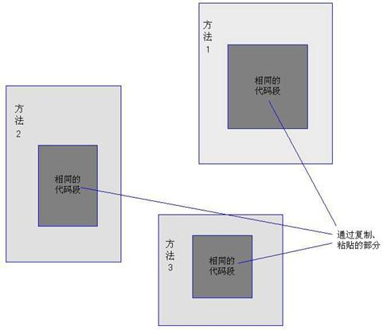

# AOP

## AOP 的存在价值

在传统 OOP 编程里以对象为核心，整个软件系统由系列相互依赖的对象所组成，而这些对象将被抽象成一个一个的类，并允许使用类继承来管理类与类之间一般到特殊的关系。随着软件规模的增大，应用的逐渐升级，慢慢出现了一些 OOP 很难解决的问题。

我们可以通过分析、抽象出一系列具有一定属性与行为的对象，并通过这些对象之间的协作来形成一个完整的软件功能。由于对象可以继承，因此我们可以把具有相同功能或相同特性的属性抽象到一个层次分明的类结构体系中。随着软件规范的不断扩大，专业化分工越来越系列，以及 OOP 应用实践的不断增多，随之也暴露出了一些 OOP 无法很好解决的问题。

现在假设系统中有 3 段完全相似的代码，这些代码通常会采用“复制”、“粘贴”方式来完成，通过这种“复制”、“粘贴”方式开发出来的软件如图 1 所示。

看到如上图所示的示意图，可能有的读者已经发现了这种做法的不足之处：如果有一天，上图中的深色代码段需要修改，那是不是要打开 3 个地方的代码进行修改？如果不是 3 个地方包含这段代码，而是 100 个地方，甚至是 1000 个地方包含这段代码段，那会是什么后果？

为了解决这个问题，我们通常会采用将如上图所示的深色代码部分定义成一个方法，然后在 3 个代码段中分别调用该方法即可。在这种方式下，软件系统的结构如下图所示。

