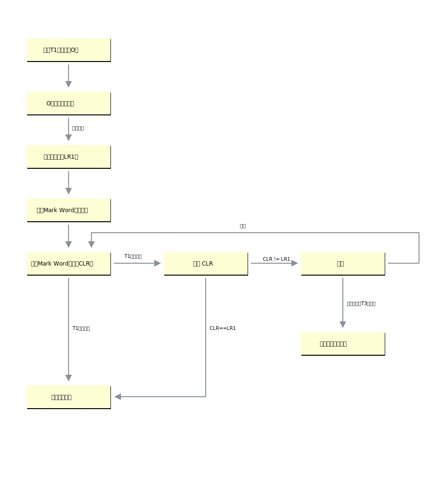

# Synchronized原理

## 基础

在多线程并发编程中 `Synchronized` 一直是元老级角色，很多人都会称呼它为重量级锁，但是随着 `Java SE1.6` 对 `Synchronized` 进行了各种优化，引入了 **偏向锁** 和 **轻量级锁**。所以在 Java SE1.6 里锁一共有四种状态，`无锁状态`，`偏向锁状态`，`轻量级锁状态`和`重量级锁状态`，它会随着竞争情况逐渐升级。**锁可以升级但不能降级**，意味着偏向锁升级成轻量级锁后不能降级成偏向锁，但是偏向锁状态可以被重置为无锁状态（锁撤销）。这种锁升级却不能降级的策略，目的是为了提高获得锁和释放锁的效率。

| 锁状态    | 优点     |缺点|适用场景|
| :--- | :--- |:--|:--|
| 偏向锁     | 加锁、解锁无额外消耗，和非同步方式近似  |如果竞争线程多，会有额外锁撤销的消耗|基本没有线程竞争的场景|
|轻量级锁|竞争线程不会阻塞，使用自旋等待|如果长时间不能获取锁，会消耗CPU|少量线程竞争，且线程持有锁时间不长|
|重量级锁|竞争线程被阻塞，减少CPU空转|线程阻塞，响应时间长|很多线程竞争，锁持有时间长|

Java中的每一个对象都可以作为锁。

  - 对于同步方法，锁是当前实例对象。
  - 对于静态同步方法，锁是当前对象的Class对象。
  - 对于同步方法块，锁是`Synchonized`括号里配置的对象。

当一个线程试图访问同步代码块时，它首先必须得到锁，退出或抛出异常时必须释放锁。

## 锁的升级

目前锁一共有4种状态，级别从低到高依次是：无锁、偏向锁、轻量级锁和重量级锁。锁状态只能升级不能降级。

### 偏向锁

大多数情况下，锁不仅不存在多线程竞争，而且总是由同一线程多次获得。偏向锁是为了在只有一个线程执行同步块时提高性能。

### 轻量级锁

这里解释下其中几个重要的步骤：
- 复制 Mark Word 到锁记录：拷贝对象头中的 Mark Word 到锁记录中。
- 更新 Mark Word 指针：拷贝成功后，虚拟机将使用 CAS 操作尝试将对象的 Mark Word 更新为指向 Lock Record 指针，并将 Lock Record 里的 owner 指针指向对象的 Mark Word。

### 重量级锁

在重量级锁的状态下， JVM 基于进入和退出 `Monitor` 对象来实现方法同步和代码块同步，`Monitor` 的引用存储在对象头中。

`Monitor` 本身是依赖与操作系统的互斥锁（mutex lock）实现的。由于 JVM 线程是映射到操作系统的原生线程之上的，如果要阻塞或唤醒一条线程，都需要操作系统来帮忙完成，这就需要从用户态转换到核心态中，因此这种转换需要耗费很多的 CPU 时间。

## 锁粗化

同步块的作用范围应该尽可能小，仅在共享数据的实际作用域中才进行同步，这样做的目的是为了使需要同步的操作数量尽可能缩小，缩短阻塞时间，如果存在锁竞争，那么等待锁的线程也能尽快拿到锁。 

但是加锁解锁也需要消耗资源，如果存在一系列的连续加锁解锁操作，可能会导致不必要的性能损耗。 **锁粗化就是 JVM 将多个连续的加锁、解锁操作连接在一起**，扩展成一个范围更大的锁，避免频繁的加锁解锁操作。

## 锁消除

Java 虚拟机在 JIT 编译时(可以简单理解为当某段代码即将第一次被执行时进行编译，又称即时编译)，通过对运行上下文的扫描，经过逃逸分析，**去除不可能存在共享资源竞争的锁，通过这种方式消除没有必要的锁**，可以节省毫无意义的请求锁时间

## Synchronized vs ReentrantLock

1. synchronized 是 Java 关键字，ReentrantLock 是基于 AQS 的 API 层面的互斥锁
2. ReentrantLock 设置等待超时时间
3. ReentrantLock 可进行公平锁与非公平锁设置
4. ReentrantLock 可绑定多个 Condition
5. synchronized 不需要手动释放锁
6. synchronized 可以修饰方法、代码块

## 参考链接

- [不可不说的Java“锁”事](https://tech.meituan.com/2018/11/15/java-lock.html)
- [Threads and Locks](https://docs.oracle.com/javase/specs/jls/se7/html/jls-17.html)
- [从jvm源码看 synchronized](https://www.linuxidc.com/Linux/2018-02/150798.htm)