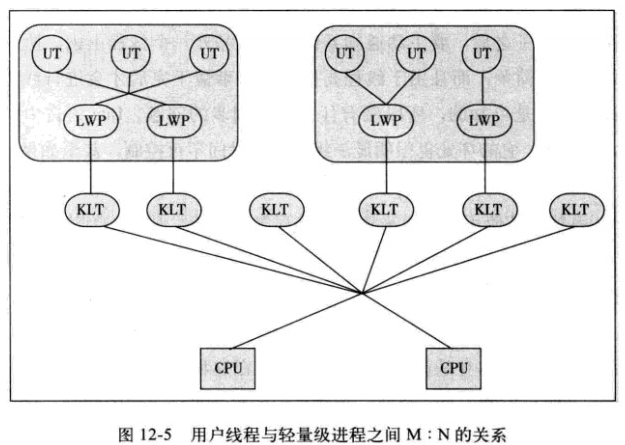
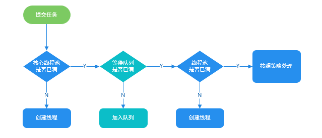

# Java线程

## 线程定义

**线程（Thread）是操作系统能够进行运算调度的最小单位**。它被包含在进程之中，是进程中的实际运作单位。一条线程指的是进程中一个单一顺序的控制流，一个进程中可以并发多个线程，每条线程并行执行不同的任务。

线程是独立调度和分派的基本单位。线程可以操作系统内核调度的内核线程，如Win32线程；由用户进程自行调度的用户线程，如Linux平台的`POSIX Thread`；或者由内核与用户进程，如Windows 7的线程，进行混合调度。

同一进程中的多条线程将共享该进程中的全部系统资源，如虚拟地址空间，文件描述符和信号处理等等。但同一进程中的多个线程有各自的调用栈（`call stack`），自己的寄存器环境（`register context`），自己的线程本地存储（`thread-local storage`）。

## 线程实现

Java中的线程都是调用的原生系统的本地函数，Java线程模型是基于操作系统原生线程模型实现的，实现线程有三种方式：内核线程实现、用户线程实现、混合线程实现。

### 内核线程实现

直接由操作系统内核支持的线程，通过内核来完成进程切换。每个内核线程就是一个内核的分身，这样操作系统就可以同时处理多件事情，支持多线程的内核被称为多线程内核。

程序一般不直接使用内核线程，而是使用一种高级接口——轻量级进程，轻量级进程就是我们通常意义上的线程，可以获得内核线程的支持，与内核线程构成`1:1`的线程模型。


由于得到内核线程的支持，每个轻量级进程都成为一个独立的调度单元，即时有一个轻量级进程在系统调用中阻塞，也不会影响整个进程，但也有其局限性：由于是基于内核线程实现的，各种操作，如创建、销毁及同步，都需要进行系统调用。而系统调用代价较高，需要在内核态和用户态来回切换。

### 用户线程实现

从广义上说，一个线程不是内核线程，就是用户线程，所以轻量级进程也属于用户线程。狭义的用户线程是指完全建立在用户空间上的，系统内核不能感知到其存在。

用户线程的创建、同步、销毁和调度都是在用户空间实现的，因此相对较快，代价相对较低。这种用户线程和进程是`N:1`的线程模型。


由于用户线程没有内核的支持，线程的创建、切换和调度是需要自己实现的，而且由于操作系统只把CPU资源分配到进程，那诸如“阻塞如何处理”、“多处理器系统中如何将线程映射到其他处理器”这类问题解决起来异常复杂。

### 混合实现

这种实现模式将内核线程与用户线程一起使用，在这种方式下既存在用户线程，也存在轻量级进程。用户线程还是完全建立在用户空间，因此用户线程的创建、切换等操作依旧低廉。而操作系统提供的轻量级进程则作为用户线程和内核线程的桥梁，这样就可以使用内核提供的线程调度及处理器映射。这种实现下，用户线程和轻量级进程是`M:N`的模式。



## Java线程调度

线程调度分为协同式和抢占式。

  * `协同式调度`：线程的执行时间由线程自己控制，这种的实现很简单，但是很可能造成很严重的后果。
  * `抢占式调度`：由操作系统分配线程执行的时间，线程切换的决定权在操作系统。

有时候我们需要为某些线程多分配时间，这时我们就需要用到线程优先级的方法，Java提供了10种优先级。Java优先级是在操作系统的原生线程优先级上实现的，所以对于同一个优先级，不同的操作系统可能有不同的表现，也就是说 **Java线程优先级不是可靠的**。

## Java线程状态切换

Java线程模型定义了 6 种状态，在任意一个时间点，一个线程有且只有其中一个状态：

  * `新建（New）`：新建的Thread，尚未开始。
  * `运行（Runable）`：包含操作系统线程状态中的Running、Ready，也就是处于正在执行或正在等待CPU分配时间的状态。
  * `无限期等待（Waiting）`：处于这种状态的线程不会被分配CPU时间，等待其他线程唤醒。
  * `限期等待（Timed Waiting）`：处于这种状态的线程不会被分配CPU时间，在一定时间后会由系统自动唤醒。
  * `阻塞（Blocked）`：在等待获得排他锁。
  * `结束（Terminated）`：已终止的线程。


## 线程安全

多线程访问同一代码，不会产生不确定的结果。

## Java 线程池

线程池提供了一种限制和管理资源（包括执行一个任务）。 每个线程池还维护一些基本统计信息，例如已完成任务的数量。使用线程池的好处：

- **降低资源消耗**：通过重复利用已创建的线程降低线程创建和销毁造成的消耗。
- **提高响应速度**：当任务到达时，任务可以不需要的等到线程创建就能立即执行。
- **提高线程的可管理性**：线程是稀缺资源，如果无限制的创建，不仅会消耗系统资源，还会降低系统的稳定性，使用线程池可以进行统一的分配，调优和监控。

在创建线程池时不允许使用 `Executors` 去创建，而是通过 `ThreadPoolExecutor` 的方式，这样的处理方式让写的同学更加明确线程池的运行规则，规避资源耗尽的风险。`Executors` 返回线程池对象的弊端如下：

- **FixedThreadPool** 和 **SingleThreadExecutor** ： 允许请求的队列长度为 Integer.MAX_VALUE ，可能堆积大量的请求，从而导致OOM。
- **CachedThreadPool** 和 **ScheduledThreadPool** ： 允许创建的线程数量为 Integer.MAX_VALUE ，可能会创建大量线程，从而导致OOM。

`ThreadPoolExecutor` 构造函数重要参数：

- **corePoolSize** : 核心线程数线程数定义了最小可以同时运行的线程数量。
- **maximumPoolSize** : 当队列中存放的任务达到队列容量的时候，当前可以同时运行的线程数量变为最大线程数。
- **workQueue**: 当新任务来的时候会先判断当前运行的线程数量是否达到核心线程数，如果达到的话，新任务就会被存放在队列中。
- **keepAliveTime**：当线程池中的线程数量大于 corePoolSize 的时候，如果这时没有新的任务提交，核心线程外的线程不会立即销毁，而是会等待，直到等待的时间超过了 keepAliveTime才会被回收销毁；
- **unit** ：keepAliveTime 参数的时间单位。
- **threadFactory** ：executor 创建新线程的时候会用到。
- **handler** ：饱和策略。

### 线程池提交任务

为了搞懂线程池的原理，我们需要首先分析一下 `execute` 方法。我们使用 `executor.execute(worker)` 来提交一个任务到线程池中去，这个方法非常重要，下面我们来看看它的源码：

```java
   // 存放线程池的运行状态 (runState) 和线程池内有效线程的数量 (workerCount)
   private final AtomicInteger ctl = new AtomicInteger(ctlOf(RUNNING, 0));

    private static int workerCountOf(int c) {
        return c & CAPACITY;
    }

    private final BlockingQueue<Runnable> workQueue;

    public void execute(Runnable command) {
        // 如果任务为null，则抛出异常。
        if (command == null)
            throw new NullPointerException();
        // ctl 中保存的线程池当前的一些状态信息
        int c = ctl.get();

        //  下面会涉及到 3 步 操作
        // 1.首先判断当前线程池中之行的任务数量是否小于 corePoolSize
        // 如果小于的话，通过addWorker(command, true)新建一个线程，并将任务(command)添加到该线程中；然后，启动该线程从而执行任务。
        if (workerCountOf(c) < corePoolSize) {
            if (addWorker(command, true))
                return;
            c = ctl.get();
        }
        // 2.如果当前之行的任务数量大于等于 corePoolSize 的时候就会走到这里
        // 通过 isRunning 方法判断线程池状态，线程池处于 RUNNING 状态才会被并且队列可以加入任务，该任务才会被加入进去
        if (isRunning(c) && workQueue.offer(command)) {
            int recheck = ctl.get();
            // 再次获取线程池状态，如果线程池状态不是 RUNNING 状态就需要从任务队列中移除任务，并尝试判断线程是否全部执行完毕。同时执行拒绝策略。
            if (!isRunning(recheck) && remove(command))
                reject(command);
                // 如果当前线程池为空就新创建一个线程并执行。
            else if (workerCountOf(recheck) == 0)
                addWorker(null, false);
        }
        //3. 通过addWorker(command, false)新建一个线程，并将任务(command)添加到该线程中；然后，启动该线程从而执行任务。
        //如果addWorker(command, false)执行失败，则通过reject()执行相应的拒绝策略的内容。
        else if (!addWorker(command, false))
            reject(command);
    }
```

