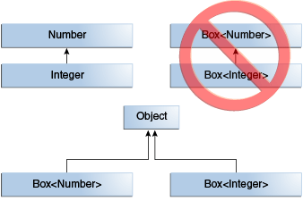
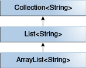
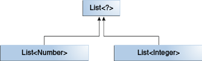

## 为什么使用泛型

简而言之，泛型可以使类型（类和接口）在定义类、接口和方法时进行参数化。与在方法定义的形参类似，类型参数化能让不同的输入使用同一份代码。差别在于，形参传入的是值，而类型参数化传入的是类型。

在使用泛型相比于直接使用 `Object` 有以下几个好处：

1. **强制的类型检查**：Java 编译器会对泛型代码进行强制类型检查，如果违反类型安全则会抛出错误。在编译阶段解决类型错误，能更有效的减少 Bug
2. **消除类型强制转换**：如果不使用泛型，则在进行代码编写是需要手动进行类型转换
3. **允许程序员实现通用算法**：通过泛型，程序员能在不同类型的集合上实现通用算法

## 泛型类型

泛型类型是指被参数化的类或接口，首先我们来看看一个简单的类：`Box`。其方法接收和返回的都是 `Object` 类型，因此可以除基本类型外的其他任何类型。这样也导致在编译期间不能进行任何校验。如果 `Box` 期望的是一个 `Integer` 类型，然而外部调用时，传入 `String` 类型，这就会在程序运行时抛出异常。

```java
public class Box {
    private Object object;

    public void set(Object object) { this.object = object; }
    public Object get() { return object; }
}
```

下面我们来看看泛型类型版本的 `Box`：

```java
/**
 * Generic version of the Box class.
 * @param <T> the type of the value being boxed
 */
public class Box<T> {
    // T stands for "Type"
    private T t;

    public void set(T t) { this.t = t; }
    public T get() { return t; }
}
```

如上面代码所示，所有 `Object` 都被替换为了 `T`，`T` 是一个可以代表除基本类型外的所有类型：任意类、任意接口、任意数组类型甚至还可以是其他的类型参数（eg: `List<T>`）。

### 原始类型

原始类型是泛型类型没有类型参数的形式，例如上面的 `Box<T>` ，其原始类型就是 `Box`，但 **非泛型类类型不是原始类型**。原始类型的出现，只是为兼容 JDK5 之前的历史代码，比如：`Collections`。因此，将一个泛型类型赋值给原始类型是可以的：

```java
Box<String> stringBox = new Box<>();
Box rawBox = stringBox;               // OK
```

如果将原始类型赋值给泛型类型，编译器会报告一个警告：

```java
Box rawBox = new Box();           // rawBox is a raw type of Box<T>
Box<Integer> intBox = rawBox;     // warning: unchecked conversion
```

同样的，如果将一个原始类型参数传递给泛型方法，也会报告一个警告：
```java
Box<String> stringBox = new Box<>();
Box rawBox = stringBox;
rawBox.set(8);  // warning: unchecked invocation to set(T)
```

## 泛型方法

泛型方法与泛型类型类似，只不过泛型方法拥有自己的参数化类型，并且其作用域只限制在声明的方法中。泛型方法可以是静态的、非静态以及构造函数。泛型方法的声明必须在返回参数之前，即：

```java
public class Util {
    public static <K, V> boolean compare(Pair<K, V> p1, Pair<K, V> p2) {
        return p1.getKey().equals(p2.getKey()) &&
               p1.getValue().equals(p2.getValue());
    }
}

public class Pair<K, V> {

    private K key;
    private V value;

    //泛型方法
    public Pair(K key, V value) {
        this.key = key;
        this.value = value;
    }

    //泛型方法
    public void setKey(K key) { this.key = key; }
    public void setValue(V value) { this.value = value; }
    public K getKey()   { return key; }
    public V getValue() { return value; }
}
```

## 有界类型参数

当一个方法进行数字计算，并且想接收所有 `Number` 类型及其子类时，就需要用到有界类型参数。要声明一个有界类型参数，先列出该类型参数的名称，然后是 `extends` 关键字，然后是其上界，在这里是 `Number`。

> 在这里 `extends` 即可以表示 `extends`，也可以表示 `implements`。

```java
public <U extends Number> void inspect(U u){
    System.out.println("T: " + t.getClass().getName());
    System.out.println("U: " + u.getClass().getName());
}
```

在进行有界类型参数定义后，可使用在上界类型中定义的方法，在这里就可以调用 `Number` 内的所有方法，例如：`intValue`。

### 多上界

前面的示例说明了使用带单个界限的类型参数，但是类型参数可以具有多个界限：

```java
<T extends B1 & B2 & B3>
```

有多个上界时，如果上界中包含类型（Class），则需要放在第一位。

## 泛型&继承&子类型

如 Java 语言规范所描述，只要类型兼容，就可以将一种类型的对象分配给另一种类型的对象。例如：我们可以将 `Integer` 对象赋值给 `Object` ，因为 `Object` 是 `Integer` 的父类之一。

```java
Object someObject = new Object();
Integer someInteger = new Integer(10);
someObject = someInteger;   // OK
```

用面向对象的术语来说，这是一种 `is a` 的关系。因为，`Integer` 是一种 `Object` ，这样的赋值也是允许的。同时，`Integer` 也是一种 `Number` 所以以下代码均正确：

```java
public void someMethod(Number n) { /* ... */ }

someMethod(new Integer(10));   // OK
someMethod(new Double(10.1));   // OK
```

这种关系同样可以在泛型中使用：

```java
Box<Number> box = new Box<Number>();
box.add(new Integer(10));   // OK
box.add(new Double(10.1));  // OK
```

但是在泛型方法上会有所不同，比如以下方法：

```java
public void boxTest(Box<Number> n) { /* ... */ }
```

这个方法能够接收什么类型的参数呢？是否能够将 `Box<Integer>` 或者 `Box<Double>` 类型的对象传入呢？答案是 “否”，因为 `Box<Integer>` 和 `Box<Double>` 均不是 `Box<Number>` 的子类型。

> 这是一个常见的误解



不论 `Integer` 和 `Number` 是什么关系，`Box<Integer>` 和 `Box<Number>` 的共同父类均是 `Object`。

### 子类型

可以通过 `extends` 或者 `implement` 创建泛型类型的子类型，他们之间的关系只依赖与被 `extends` 或者被 `implements`。我们可以看看 `Collections` 的相关类型，`ArrayList<E>` 实现 `List<E>` 并且 `List<E>` 继承自 `Collection<E>`，所以，`ArrayList<String>` 是 `List<String>` 的子类型，`List<String>` 是 `Collection<String>` 的子类型。



现在我们需要自己定义一个 list 接口：`PayloadList`，它拥有一个可选的泛型类型 `P`：

```java
interface PayloadList<E,P> extends List<E> {
  void setPayload(int index, P val);
  ...
}
```

以下所有的 `PayloadList` 都是 `List<String>` 的子类型:

```java
PayloadList<String,String>
PayloadList<String,Integer>
PayloadList<String,Exception>
```


## 通配符

在泛型中，使用 `?` 做为通配符，代表未知类型。有界类型参数在上面已有介绍： `List<? extends Number>`。类似的，通配符可以没有上界，即 `List<?>`，这被称之为未知类型的List。这种未知类型的泛型在下面两个场景中很适用：
1. 泛型类型中只使用 Object 中声明的方法
2. 泛型类型中的代码不依赖与类型参数，例如：`List.size`、`List.clear`

另外，通配符还可声明类型参数的下界：`List<? super Integer>`。

### 通配符&子类型

当有了通配符后，泛型的继承关系又有新的规则。尽管 Integer 是 Number 的子类型，但 `List<Integer>` 不是 `List<Number>` 的子类型，实际上，这两种类型无关。 `List<Number>` 和 `List<Integer>` 的公共父类是 `List<?>`。



```java
List<? extends Integer> intList = new ArrayList<>();
List<? extends Number>  numList = intList;  // OK. List<? extends Integer> is a subtype of List<? extends Number>
```

因为 `Integer` 是 `Number` 的子类型，并且 `numList` 是 `Number` 对象的列表，所以 `intList` （一个 Integer 对象的列表）和 `numList` 之间存在关系。下图显示了使用上下界通配符声明的几个 List 类之间的关系。


## 类型擦除

Java 语言引入了泛型，以在编译时提供更严格的类型检查并支持泛型编程。为实现泛型 Java 编译器会进行类型擦除：
1. 替换所有类型参数为他们的上界或者 `Object`，因此，字节码仅包含普通的类，接口和方法。
2. 必要时插入类型转换，以保持类型安全。
3. 生成桥接方法以在扩展的泛型类型中保留多态。

类型擦除可确保不会为参数化类型创建新的类；因此，泛型不会产生运行时开销。

### 泛型类型的擦除

在类型擦除过程中，Java 编译器将擦除所有类型参数，如果类型参数是有界的，则将每个参数替换为其第一个边界；如果类型参数是无界的，则将其替换为 `Object`。

```java
public class Node<T> {

    private T data;
    private Node<T> next;

    public Node(T data, Node<T> next) {
        this.data = data;
        this.next = next;
    }

    public T getData() { return data; }
    // ...
}
```

由于 `T` 是无界的，所以其类型擦除后的代码为：

```java
public class Node {

    private Object data;
    private Node next;

    public Node(Object data, Node next) {
        this.data = data;
        this.next = next;
    }

    public Object getData() { return data; }
    // ...
}
```

而对于以下代码的擦除又不一样：

```java
public class Node<T extends Comparable<T>> {

    private T data;
    private Node<T> next;

    public Node(T data, Node<T> next) {
        this.data = data;
        this.next = next;
    }

    public T getData() { return data; }
    // ...
}
```

擦除后：

```java
public class Node {

    private Comparable data;
    private Node next;

    public Node(Comparable data, Node next) {
        this.data = data;
        this.next = next;
    }

    public Comparable getData() { return data; }
    // ...
}
```

### 泛型方法擦除

泛型方法的擦除规则和泛型类型的擦除规则类似：

```java
// Counts the number of occurrences of elem in anArray.
public static <T> int count(T[] anArray, T elem) {
    int cnt = 0;
    for (T e : anArray)
        if (e.equals(elem))
            ++cnt;
        return cnt;
}
public static <T extends Shape> void draw(T shape) { /* ... */ }
```

擦除后：

```java
public static int count(Object[] anArray, Object elem) {
    int cnt = 0;
    for (Object e : anArray)
        if (e.equals(elem))
            ++cnt;
        return cnt;
}
public static void draw(Shape shape) { /* ... */ }
```

### 桥接方法

对于以下两个类：

```java
public class Node<T> {

    public T data;

    public Node(T data) { this.data = data; }

    public void setData(T data) {
        System.out.println("Node.setData");
        this.data = data;
    }
}

public class MyNode extends Node<Integer> {
    public MyNode(Integer data) { super(data); }

    public void setData(Integer data) {
        System.out.println("MyNode.setData");
        super.setData(data);
    }
}
```

类型擦除：

```java
public class Node {

    public Object data;

    public Node(Object data) { this.data = data; }

    public void setData(Object data) {
        System.out.println("Node.setData");
        this.data = data;
    }
}

public class MyNode extends Node {

    public MyNode(Integer data) { super(data); }

    public void setData(Integer data) {
        System.out.println("MyNode.setData");
        super.setData(data);
    }
}
```

在类型擦除后，方法的签名不匹配，导致重写的方法不生效，`Node.setData(T)` 变成了 `Node.setData(Object)`。为解决这个问题，Java 编译器在子类型中生成桥接方法，对于 `MyNode` 其生成的方法如下：

```java
class MyNode extends Node {

    // Bridge method generated by the compiler
    //
    public void setData(Object data) {
        setData((Integer) data);
    }

    public void setData(Integer data) {
        System.out.println("MyNode.setData");
        super.setData(data);
    }

    // ...
}
```

这样，在类型擦除之后，`MyNode` 具有与 `Node` 的 `setData(Object)` 方法相同的方法签名的桥接方法，并将其委托给的 `setData(Integer)` 方法。

### 未擦除的泛型

类型擦除只局限于 **泛型类型** 和 **泛型方法**，对于 `MyNode` 这种非泛型类型，泛型信息并不会擦除。在 `MyNode` 内同样可以通过反射获取到它父类的泛型信息。

```java
public static void main(String[] args) throws Exception {
  ParameterizedTypeImpl superclass = (ParameterizedTypeImpl) MyNode.class.getGenericSuperclass();
  System.out.println(Arrays.toString(superclass.getActualTypeArguments()));//[class java.lang.Integer]
}
```