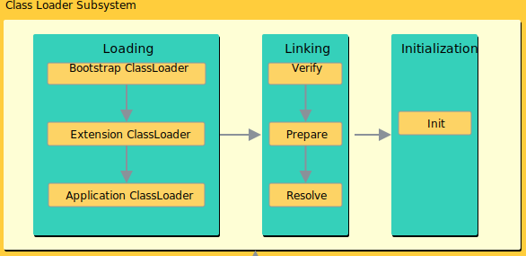

# 类加载器

类加载器是 Java 运行时环境（Java Runtime Environment）的一部分，负责动态加载 Java 类到 Java 虚拟机的内存空间中。**类通常是按需加载，即第一次使用该类时才加载。** 由于有了类加载器，Java 运行时系统不需要知道文件与文件系统。每个 Java 类必须由某个类加载器装入到内存。

类装载器除了要定位和导入二进制 class 文件外，还必须负责验证被导入类的正确性，为变量分配初始化内存，以及帮助解析符号引用。这些动作必须严格按一下顺序完成：

  1. **装载**：查找并装载类型的二进制数据。
  2. **链接**：执行验证、准备以及解析(可选)
    - **验证**：确保被导入类型的正确性
    - **准备**：为类变量分配内存，并将其初始化为默认值。
    - **解析**：把类型中的符号引用转换为直接引用。
  3. **初始化**：把类变量初始化为正确的初始值。

## 装载

### 类加载器分类

在Java虚拟机中存在多个类装载器，Java应用程序可以使用两种类装载器：
  - **Bootstrap ClassLoader**：此装载器是 Java 虚拟机实现的一部分。由原生代码（如C语言）编写，不继承自 `java.lang.ClassLoader` 。负责加载核心 Java 库，启动类装载器通常使用某种默认的方式从本地磁盘中加载类，包括 Java API。
  - **Extention Classloader**：用来在`<JAVA_HOME>/jre/lib/ext` ,或 `java.ext.dirs` 中指明的目录中加载 Java 的扩展库。 Java 虚拟机的实现会提供一个扩展库目录。
  - **Application Classloader**：根据 Java应用程序的类路径（ `java.class.path` 或 `CLASSPATH` 环境变量）来加载 Java 类。一般来说，Java 应用的类都是由它来完成加载的。可以通过  `ClassLoader.getSystemClassLoader()` 来获取它。
- **自定义类加载器**：可以通过继承 `java.lang.ClassLoader` 类的方式实现自己的类加载器，以满足一些特殊的需求而不需要完全了解 Java 虚拟机的类加载的细节。

### 全盘负责双亲委托机制

在一个 JVM 系统中，至少有 3 种类加载器，那么这些类加载器如何配合工作？在 JVM 种类加载器通过 **全盘负责双亲委托机制** 来协调类加载器。

- **全盘负责**：指当一个 `ClassLoader` 装载一个类的时，除非显式地使用另一个 `ClassLoader` ，该类所依赖及引用的类也由这个 `ClassLoader` 载入。
- **双亲委托机制**：指先委托父装载器寻找目标类，只有在找不到的情况下才从自己的类路径中查找并装载目标类。

全盘负责双亲委托机制只是 Java 推荐的机制，并不是强制的机制。实现自己的类加载器时，如果想保持双亲委派模型，就应该重写 `findClass(name)` 方法；如果想破坏双亲委派模型，可以重写 `loadClass(name)` 方法。

### 装载入口

所有Java虚拟机实现必须在每个类或接口首次主动使用时初始化。以下六种情况符合主动使用的要求：

  - 当创建某个类的新实例时(new、反射、克隆、序列化)
  - 调用某个类的静态方法
  - 使用某个类或接口的静态字段，或对该字段赋值(用final修饰的静态字段除外，它被初始化为一个编译时常量表达式)
  - 当调用Java API的某些反射方法时。
  - 初始化某个类的子类时。
  - 当虚拟机启动时被标明为启动类的类。

除以上六种情况，所有其他使用Java类型的方式都是被动的，它们不会导致Java类型的初始化。

对于接口来说，只有在某个接口声明的非常量字段被使用时，该接口才会初始化，而不会因为事先这个接口的子接口或类要初始化而被初始化。

**父类需要在子类初始化之前被初始化**。当实现了接口的类被初始化的时候，不需要初始化父接口。然而，当实现了父接口的子类(或者是扩展了父接口的子接口)被装载时，父接口也要被装载。(只是被装载，没有初始化)

## 验证

确认装载后的类型符合Java语言的语义，并且不会危及虚拟机的完整性。
  - **装载时验证**：检查二进制数据以确保数据全部是预期格式、确保除 Object 之外的每个类都有父类、确保该类的所有父类都已经被装载。
  - **正式验证阶段**：检查 final 类不能有子类、确保 final 方法不被覆盖、确保在类型和超类型之间没有不兼容的方法声明(比如拥有两个名字相同的方法，参数在数量、顺序、类型上都相同，但返回类型不同)。
  - **符号引用的验证**：当虚拟机搜寻一个被符号引用的元素(类型、字段或方法)时，必须首先确认该元素存在。如果虚拟机发现元素存在，则必须进一步检查引用类型有访问该元素的权限。

## 准备

在准备阶段，Java虚拟机为类变量分配内存，**设置默认初始值**。但在到到初始化阶段之前，类变量都没有被初始化为真正的初始值。

|类型|默认值|
|:--|:--|
|int|0|
|long|0L|
|short|(short)0|
|char|'\u0000'|
|byte|(byte)0|
|blooean|false|
|float|0.0f|
|double|0.0d|
|reference|null|

## 解析

解析的过程就是在类型的常量池总寻找类、接口、字段和方法的符号引用，**把这些符号引用替换为直接引用的过程**。

- `类或接口的解析`：判断所要转化成的直接引用是数组类型，还是普通的对象类型的引用，从而进行不同的解析。

- `字段解析`：对字段进行解析时，会先在本类中查找是否包含有简单名称和字段描述符都与目标相匹配的字段，如果有，则查找结束；如果没有，则会按照继承关系从上往下递归搜索该类所实现的各个接口和它们的父接口，还没有，则按照继承关系从上往下递归搜索其父类，直至查找结束，

## 初始化

**所有的类变量(即静态量)初始化语句和类型的静态初始化器都被Java编译器收集在一起，放到一个特殊的方法中。** 对于类来说，这个方法被称作类初始化方法；对于接口来说，它被称为接口初始化方法。在类和接口的 class 文件中，这个方法被称为`<clinit>`。

  1. 如果存在直接父类，且直接父类没有被初始化，先初始化直接父类。
  2. 如果类存在一个类初始化方法，执行此方法。

这个步骤是递归执行的，即第一个初始化的类一定是`Object`。

**Java虚拟机必须确保初始化过程被正确地同步。** 如果多个线程需要初始化一个类，仅仅允许一个线程来进行初始化，其他线程需等待。

> 这个特性可以用来写单例模式。

### Clinit 方法

  - 对于静态变量和静态初始化语句来说：执行的顺序和它们在类或接口中出现的顺序有关。
  - **并非所有的类都需要在它们的`class`文件中拥有`<clinit>()`方法，** 如果类没有声明任何类变量，也没有静态初始化语句，那么它就不会有`<clinit>()`方法。如果类声明了类变量，但没有明确的使用类变量初始化语句或者静态代码块来初始化它们，也不会有`<clinit>()`方法。如果类仅包含静态`final`常量的类变量初始化语句，而且这些类变量初始化语句采用编译时常量表达式，类也不会有`<clinit>()`方法。**只有那些需要执行Java代码来赋值的类才会有`<clinit>()`**
  - `final`常量：Java虚拟机在使用它们的任何类的常量池或字节码中直接存放的是它们表示的常量值。
