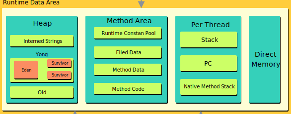

# 运行时数据区

运行时数据区用于保存 JVM 在运行过程中产生的数据，结构如图所示：

## Heap

Java 堆是可供各线程共享的运行时内存区域，是 Java 虚拟机所管理的内存区域中最大的一块。此区域非常重要，几乎所有的对象实例和数组实例都要在 Java 堆上分配，但随着 JIT 编译器及逃逸分析技术的发展，**也可能会被优化为栈上分配**。

Heap 中除了作为对象分配使用，还包含字符串字面量 **常量池（Internd Strings）** 。 除此之外 Heap 中还包含一个 **新生代（Yong Generation）**、一个 **老年代（Old Generation）**。

新生代分三个区，一个Eden区，两个Survivor区，**大部分对象在Eden区中生成**。Survivor 区总有一个是空的。

老年代中保存一些生命周期较长的对象，当一个对象经过多次的 GC 后还没有被回收，那么它将被移动到老年代。

## Methoad Area

方法区的数据由所有线程共享，因此为安全的使用方法区的数据，需要注意线程安全问题。

方法区主要保存类级别的数据，包括：
- ClassLoader Reference
- Runtime Constant Pool
  - 数字常量
  - 类属性引用
  - 方法引用
- Field Data：每个类属性的名称、类型等
- Methoad Data：每个方法的名称、返回值类型、参数列表等
- Methoad Code：每个方法的字节码、本地变量表等

方法区的实现在不同的 JVM 版本有不同，在 JVM 1.8 之前，方法区的实现为 **永久代（PermGen）**，但是由于永久代的大小限制， 经常会出现内存溢出。于是在 JVM 1.8 方法区的实现改为 **元空间（Metaspace）**，元空间是在 Native 的一块内存空间。

## Stack

对于每个 JVM 线程，当线程启动时，都会分配一个独立的运行时栈，用以保存方法调用。每个方法调用，都会在栈顶增加一个栈帧（Stack Frame）。

每个栈帧都保存三个引用：**本地变量表（Local Variable Array）**、 **操作数栈（Operand Stack）** 和 **当前方法所属类的运行时常量池（Runtime Constant Pool）**。由于本地变量表和操作数栈的大小都在编译时确定，所以栈帧的大小是固定的。

当被调用的方法返回或抛出异常，栈帧会被弹出。在抛出异常时 `printStackTrace()` 打印的每一行就是一个栈帧。同时得益于栈帧的特点，栈帧内的数据是线程安全的。

栈的大小可以动态扩展，但是如果一个线程需要的栈大小超过了允许的大小，就会抛出 `StackOverflowError`。

## PC Register

对于每个 JVM 线程，当线程启动时，都会有一个独立的  **PC（Program Counter） 计数器**，用来保存当前执行的代码地址（方法区中的内存地址）。如果当前方法是 Native 方法，PC 的值为 NULL。一旦执行完成，PC 计数器会被更新为下一个需要执行代码的地址。

## Native Method Stack

本地方法栈和 Java 虚拟机栈的作用相似，Java 虚拟机栈执行的是字节码，而本地方法栈执行的是 `native` 方法。本地方法栈使用传统的栈（C Stack）来支持 `native` 方法。

## Direct Memory

[Native Memory Tracking](https://docs.oracle.com/javase/8/docs/technotes/guides/troubleshoot/tooldescr007.html)

在 JDK 1.4 中新加入了 NIO 类，它可以使用 Native 函数库直接分配堆外内存，然后通过一个存储在 Java 堆里的 `DirectByteBuffer` 对象作为这块内存的引用进行操作。这样能在一些场景中显著提高性能，因为 **避免了在 Java 堆和 Native 堆中来回复制数据**。