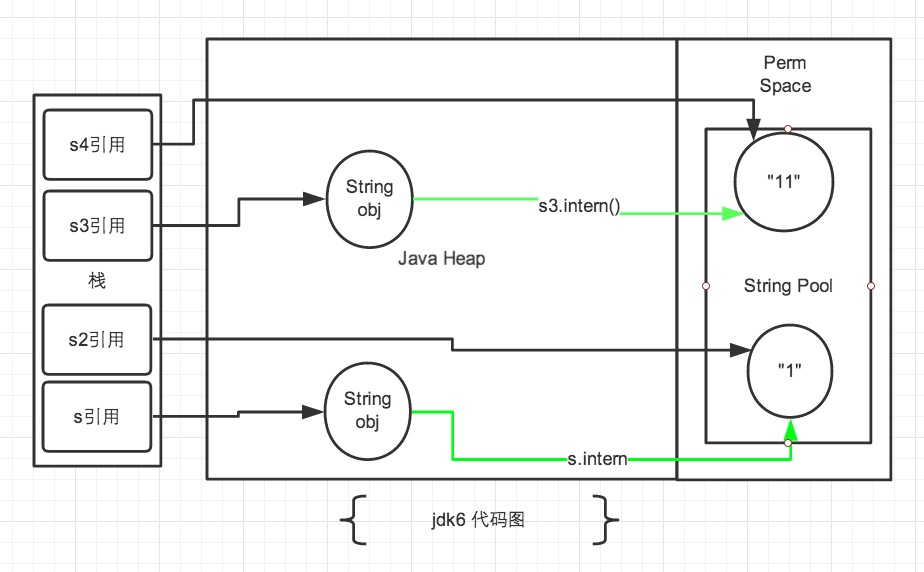
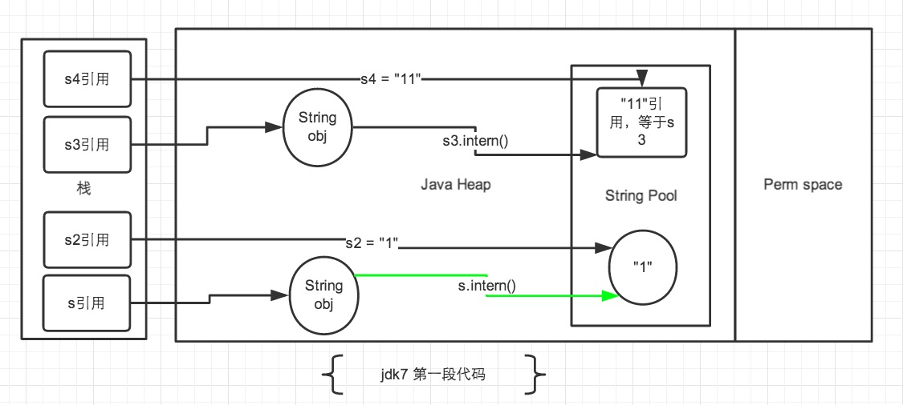
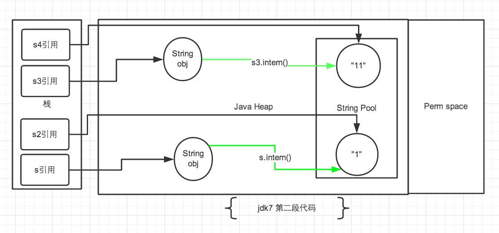

# String 常量池

在 `JAVA` 语言中有 8 中基本类型和一种比较特殊的类型 `String` 。这些类型为了使他们在运行过程中速度更快，更节省内存，都提供了一种常量池的概念。常量池就类似一个 JAVA 系统级别提供的缓存。

`String` 类型的常量池比较特殊。它的主要使用方法有两种：

 - 直接使用双引号声明出来的 `String` 对象会直接存储在常量池中
 - 如果不是用双引号声明的 `String` 对象，可以使用 `String` 提供的 `intern` 方法。 `intern` 方法会从字符串常量池中查询当前字符串是否存在，若不存在就会将当前字符串放入常量池中

## intern

```
    /**
     * Returns a canonical representation for the string object.
     * <p>
     * A pool of strings, initially empty, is maintained privately by the
     * class {@code String}.
     * <p>
     * When the intern method is invoked, if the pool already contains a
     * string equal to this {@code String} object as determined by
     * the {@link #equals(Object)} method, then the string from the pool is
     * returned. Otherwise, this {@code String} object is added to the
     * pool and a reference to this {@code String} object is returned.
     * <p>
     * It follows that for any two strings {@code s} and {@code t},
     * {@code s.intern() == t.intern()} is {@code true}
     * if and only if {@code s.equals(t)} is {@code true}.
     * <p>
     * All literal strings and string-valued constant expressions are
     * interned. String literals are defined in section 3.10.5 of the
     * <cite>The Java&trade; Language Specification</cite>.
     *
     * @return  a string that has the same contents as this string, but is
     *          guaranteed to be from a pool of unique strings.
     */
    public native String intern();
```

JAVA 使用 `jni` 调用 `c++` 实现的 `StringTable` 的 `intern` 方法,  `StringTable` 跟 Java 中的 `HashMap` 的实现是差不多的, 只是 **不能自动扩容**。默认大小是 `1009` 。

要注意的是， `String` 的 `String Pool` 是一个固定大小的 `Hashtable` ，默认值大小长度是 `1009` ，如果放进 `String Pool` 的 `String` 非常多，就会造成 Hash 冲突严重，从而导致链表会很长，而链表长了后直接会造成的影响就是当调用 `String.intern` 时性能会大幅下降。

在 JDK6 中 `StringTable` 是固定的，就是 `1009` 的长度，所以如果常量池中的字符串过多就会导致效率下降很快。在 `jdk7` 中， `StringTable` 的长度可以通过一个参数指定：

```
-XX:StringTableSize=99991
```

> 在 JDK6 以及以前的版本中，字符串的常量池是放在堆的 Perm 区。在 JDK7 的版本中，字符串常量池已经从 Perm 区移到正常的 Java Heap 区域

```
public static void main(String[] args) {
    String s = new String("1");
    s.intern();
    String s2 = "1";
    System.out.println(s == s2);

    String s3 = new String("1") + new String("1");
    s3.intern();
    String s4 = "11";
    System.out.println(s3 == s4);
}
```

上述代码的执行结果：
 - JDK6: `false false`
 - JDK7: `false true`

```
public static void main(String[] args) {
    String s = new String("1");
    String s2 = "1";
    s.intern();
    System.out.println(s == s2);

    String s3 = new String("1") + new String("1");
    String s4 = "11";
    s3.intern();
    System.out.println(s3 == s4);
}
```

上述代码的执行结果：
 - JDK6: `false false`
 - JDK7: `false false`

由于 JDK7 将字符串常量池移动到 Heap 中，导致上述版本差异，下面具体来分析下。

### JDK6



> 图中绿色线条代表 string 对象的内容指向，黑色线条代表地址指向

在 `jdk6` 中上述的所有打印都是 `false` ，因为 `jdk6` 中的常量池是放在 `Perm` 区中的， `Perm` 区和正常的 `JAVA Heap` 区域是完全分开的。上面说过如果是使用引号声明的字符串都是会直接在字符串常量池中生成，而 `new` 出来的 `String` 对象是放在 `JAVA Heap` 区域。所以拿一个 `JAVA Heap` 区域的对象地址和字符串常量池的对象地址进行比较肯定是不相同的，**即使调用 `String.intern` 方法也是没有任何关系的**。

### JDK7

因为字符串常量池移动到 JAVA Heap 区域后，再来解释为什么会有上述的打印结果。



 - 在第一段代码中，先看 `s3` 和 `s4` 字符串。`String s3 = new String("1") + new String("1");`，这句代码中现在生成了 2个 最终对象，是字符串常量池中的 `“1”` 和 `JAVA Heap` 中的 `s3` 引用指向的对象。中间还有 2个 匿名的 `new String("1")` 我们不去讨论它们。此时 `s3` 引用对象内容是 `”11”` ，但此时常量池中是没有 `“11”` 对象的。
 - 接下来 `s3.intern();` 这一句代码，是将 `s3` 中的 `“11”` 字符串放入 `String` 常量池中，因为此时常量池中不存在 `“11”` 字符串，因此常规做法是跟 `jdk6` 图中表示的那样，在常量池中生成一个 `“11”` 的对象，关键点是 `jdk7` 中常量池不在 `Perm` 区域了，这块做了调整。**常量池中不需要再存储一份对象，可以直接存储堆中的引用**。这份引用指向 `s3` 引用的对象。 也就是说引用地址是相同的。
 - 最后 `String s4 = "11";` 这句代码中 `”11”` 是显示声明的，因此会直接去常量池中创建，创建的时候发现已经有这个对象了，此时也就是指向 `s3` 引用对象的一个引用。所以 `s4` 引用就指向和 `s3` 一样了。因此最后的比较 `s3 == s4` 是 `true` 。
 - 再看 `s` 和 `s2` 对象。 `String s = new String("1");` 第一句代码，生成了2个对象。常量池中的 `“1”` 和 `JAVA Heap` 中的字符串对象。`s.intern();` 这一句是 `s` 对象去常量池中寻找后发现 `“1”` 已经在常量池里了。
 - 接下来 `String s2 = "1";` 这句代码是生成一个 `s2` 的引用指向常量池中的 `“1”` 对象。 结果就是 `s` 和 `s2` 的引用地址明显不同。


接下来是第二段代码：



 - 第一段代码和第二段代码的改变就是 `s3.intern();` 的顺序是放在 `String s4 = "11";` 后了。这样，首先执行 `String s4 = "11";` 声明 `s4` 的时候常量池中是不存在 `“11”` 对象的，执行完毕后， `“11“` 对象是 `s4` 声明产生的新对象。然后再执行 `s3.intern();` 时，常量池中 `“11”` 对象已经存在了，因此 `s3` 和 `s4` 的引用是不同的。
 - 第二段代码中的 `s` 和 `s2` 代码中，`s.intern();`，这一句往后放也不会有什么影响了，因为对象池中在执行第一句代码`String s = new String("1");` 的时候已经生成 `“1”` 对象了。下边的 `s2` 声明都是直接从常量池中取地址引用的。 `s` 和 `s2` 的引用地址是不会相等的。


### 小结

从上述的例子代码可以看出 `jdk7` 版本对 `intern` 操作和常量池都做了一定的修改。主要包括2点：

 - 将 `String` 常量池 从 `Perm` 区移动到了 `Java Heap` 区
 - `String#intern` 方法时，如果存在堆中的对象，会直接保存对象的引用，而不会重新创建对象。


### 使用范例

```
static final int MAX = 1000 * 10000;
static final String[] arr = new String[MAX];

public static void main(String[] args) throws Exception {
    Integer[] DB_DATA = new Integer[10];
    Random random = new Random(10 * 10000);
    for (int i = 0; i < DB_DATA.length; i++) {
        DB_DATA[i] = random.nextInt();
    }
	long t = System.currentTimeMillis();
    for (int i = 0; i < MAX; i++) {
        //arr[i] = new String(String.valueOf(DB_DATA[i % DB_DATA.length]));
         arr[i] = new String(String.valueOf(DB_DATA[i % DB_DATA.length])).intern();
    }

	System.out.println((System.currentTimeMillis() - t) + "ms");
    System.gc();
}
```

运行的参数是：`-Xmx2g -Xms2g -Xmn1500M` 上述代码是一个演示代码，其中有两条语句不一样，一条是使用 intern，一条是未使用 intern。

通过上述结果，我们发现不使用 `intern` 的代码生成了 `1000w` 个字符串，占用了大约 `640m` 空间。 使用了 `intern` 的代码生成了 `1345` 个字符串，占用总空间 `133k` 左右。其实通过观察程序中只是用到了 `10` 个字符串，所以准确计算后应该是正好相差 `100w` 倍。虽然例子有些极端，但确实能准确反应出 intern 使用后产生的巨大空间节省。

细心的同学会发现使用了 `intern` 方法后时间上有了一些增长。这是因为程序中每次都是用了 `new String` 后，然后又进行 `intern` 操作的耗时时间，这一点如果在内存空间充足的情况下确实是无法避免的，但我们平时使用时，内存空间肯定不是无限大的，不使用 `intern` 占用空间导致 `jvm` 垃圾回收的时间是要远远大于这点时间的。 毕竟这里使用了 `1000w` 次 `intern` 才多出来1秒钟多的时间。

### 不当使用

`fastjson` 中对所有的 `json` 的 `key` 使用了 `intern` 方法，缓存到了字符串常量池中，这样每次读取的时候就会非常快，大大减少时间和空间。而且 `json` 的 `key` 通常都是不变的。这个地方没有考虑到大量的 `json key` 如果是变化的，那就会给字符串常量池带来很大的负担。

这个问题 `fastjson` 在`1.1.24`版本中已经将这个漏洞修复了。程序加入了一个最大的缓存大小，超过这个大小后就不会再往字符串常量池中放了。

## 参考文档

[深入解析String#intern](https://tech.meituan.com/2014/03/06/in-depth-understanding-string-intern.html)
