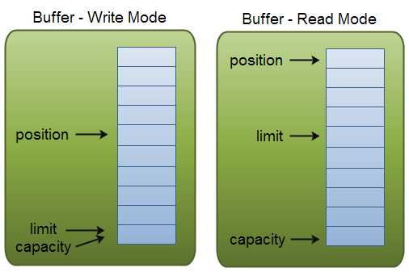

## NIO vs BIO

`NIO`为所有的原始类型提供(Buffer)缓存支持，字符集编码解码解决方案。 提供多路(non-bloking) 非阻塞式的高伸缩性网络I/O 。

| IO | NIO |
| :--- | :--- |
| 面向流 | 面向缓冲 |
| 阻塞IO | 非阻塞IO |
| 无 | 选择器 |

## Channel

Java NIO的通道类似流，但又有些不同：

1. 既可以从通道中读取数据，又可以写数据到通道。但流的读写通常是单向的。
1. 通道可以异步地读写。
1. 通道中的数据总是要先读到一个Buffer，或者总是要从一个Buffer中写入。

## Selector

Selector（选择器）是Java NIO中能够检测一到多个NIO通道，并能够知晓通道是否为诸如读写事件做好准备的组件。这样，一个单独的线程可以管理多个channel，从而管理多个网络连接。 Channel 可以向 Selector 注册监听四种不同类型的事件：

1. Connect
1. Accept
1. Read
1. Write

一旦向 Selector 注册了一或多个通道，就可以调用几个重载的 `select()` 方法。这些方法返回你所感兴趣的事件（如连接、接受、读或写）已经准备就绪的那些通道。换句话说，如果你对“读就绪”的通道感兴趣， `select()` 方法会返回读事件已经就绪的那些通道。

### select 方法空转

若 Selector 的轮询结果为空，也没有 wakeup 或新消息处理，则发生空轮询，CPU使用率 100%，Netty的解决办法：对 Selector 的 select 操作周期进行统计，每完成一次空的 select 操作进行一次计数。若在某个周期内连续发生N次空轮询，则触发了 epoll 死循环 bug 。**重建 Selector** 判断是否是其他线程发起的重建请求，若不是则将原 SocketChannel 从旧的 Selector 上去除注册，重新注册到新的 Selector 上，并将原来的 Selector 关闭。

## SelectionKey

当向 Selector 注册 Channel 时，`Channel.register()` 方法会返回一个 SelectionKey 对象，这个对象代表了注册到该 Selector 和 Channel 的关联关系，并提供了一组方法来操作。当 Channel 注册的事件来到时，这个对象会在 `Selector.selectedKeys()` 中返回，直到 Channel 或者 Selector 被关闭。

1. isAcceptable
2. isReadable
3. channel
4. selector

```java
Set<SelectionKey> selectedKeys = selector.selectedKeys();
Iterator<SelectionKey> keyIterator = selectedKeys.iterator();
while(keyIterator.hasNext()) {
    SelectionKey key = keyIterator.next();
    if(key.isAcceptable()) {
        // a connection was accepted by a ServerSocketChannel.
    } else if (key.isConnectable()) {
        // a connection was established with a remote server.
    } else if (key.isReadable()) {
        // a channel is ready for reading
    } else if (key.isWritable()) {
        // a channel is ready for writing
    }
    keyIterator.remove();
}
```

注意每次迭代末尾的 `keyIterator.remove()` 调用。Selector 不会自己从已选择键集中移除 SelectionKey 实例。必须在处理完通道时自己移除。下次该通道变成就绪时， Selector 会再次将其放入已选择键集中。

## Buffer

缓冲区本质上是一块可以写入数据，然后可以从中读取数据的内存。这块内存被包装成 NIO Buffer 对象，并提供了一组方法，用来方便的访问该块内存。为了理解Buffer的工作原理，需要熟悉它的三个属性： `capacity` 、 `position` 、 `limit`。

`position` 和 `limit` 的含义取决于 Buffer 处在读模式还是写模式。不管 Buffer 处在什么模式， `capacity` 的含义总是一样的。



**capacity**：作为一个内存块，Buffer有一个固定的大小值。你只能往里写 capacity 个byte、long，char等类型。一旦 Buffer 满了，需要将其清空（通过读数据或者清除数据）才能继续写数据往里写数据。

- `flip()`：方法将 Buffer **从写模式切换到读模式**。调用 `flip()` 方法会将 `position` 设回 0 ，并将 `limit` 设置成之前 `position` 的值。
- `clear()`： `position` 将被设回0， `limit` 被设置成 `capacity` 的值
- `compact()`：将所有未读的数据拷贝到 Buffer 起始处。然后将 `position` 设到最后一个未读元素正后面。 `limit` 属性依然像 `clear()` 方法一样，设置成 `capacity` 。
- `rewind()`：将 position 设回0，所以你可以重读 Buffer 中的所有数据，limit保持不变。

### 堆内内存（HeapByteBuffer）

HeapByteBuffer 是在 Java Heap 上分配的，但是Java NIO在读写到相应的 Channel 的时候，会先将 Java Heap 的 buffer 内容拷贝至直接内存 —— Direct Memory。这样的话，无疑 DirectByteBuffer 的 IO 性能肯定强于使用 HeapByteBuffer ，它省去了临时 buffer 的拷贝开销。


### 堆外内存（DirectByteBuffer）

DirectByteBuffer 底层的数据其实是维护在 JVM 堆外的用户空间中， DirectByteBuffer 里维护了一个引用 address 指向了数据，从而操作数据。虽然 GC 仍然管理着 DirectBuffer 的回收，但它是使用 `PhantomReference` 来达到的，在平常的 Young GC 或者 mark and compact 的时候却不会在内存里搬动。如果IO的数量比较大，比如在网络发送很大的文件，那么 GC 的压力下降就会很明显。**只有在 Full GC 以及调用 `System.gc` 的时候才会进行回收。**

DirectByteBuffer Java 堆内只会占用一个对象的指针引用的大小，堆外的的空间只有当 java 对象被回收时，才会被回收，这里会发现一个明显的不对称现象，就是堆外可能占用了很多，而堆内没占用多少，导致还没触发 GC ，那就很容易出现 Direct Memory 造成物理内存耗光。


## EchoNIOServer

```java
@Slf4j
public class NIOServer {
  private static final ByteBuffer buffer = ByteBuffer.allocate(32);

  public static void main(String[] args) throws Exception {
    ServerSocketChannel serverSocketChannel = ServerSocketChannel.open();
    serverSocketChannel.bind(new InetSocketAddress(8080));
    serverSocketChannel.configureBlocking(false);

    Selector selector = Selector.open();
    serverSocketChannel.register(selector, SelectionKey.OP_ACCEPT);

    while (true) {
      if (selector.select() == 0) {
        log.warn("selector.select() == 0");
        TimeUnit.MILLISECONDS.sleep(100);
        continue;
      }

      Iterator<SelectionKey> iterator = selector.selectedKeys().iterator();
      while (iterator.hasNext()) {
        SelectionKey selectedKey = iterator.next();
        if (selectedKey.isAcceptable()) {
          handleAccept(selectedKey);
        } else if (selectedKey.isReadable()) {
          handleRead(selectedKey);
        } else {
          log.warn("{}", selectedKey);
        }
        iterator.remove();
      }
    }
  }

  private static void handleRead(SelectionKey selectedKey) throws Exception {
    SocketChannel channel = (SocketChannel) selectedKey.channel();

    int readSize = channel.read(buffer);
    if (readSize == -1) {
      channel.close();
      return;
    }

    buffer.flip();
    byte[] readed = Arrays.copyOf(buffer.array(), readSize);
    log.info("from:{} read data:{}", channel, new String(readed));
    buffer.clear();

    buffer.put("echo:".getBytes());
    buffer.put(readed);
    buffer.flip();
    channel.write(buffer);
    buffer.compact();
  }

  private static void handleAccept(SelectionKey selectionKey) throws Exception {
    ServerSocketChannel serverSocketChannel = (ServerSocketChannel) selectionKey.channel();
    SocketChannel socketChannel = serverSocketChannel.accept();
    socketChannel.configureBlocking(false);
    socketChannel.register(selectionKey.selector(), SelectionKey.OP_READ);

    log.info("handleAccept from:{}", socketChannel);
  }
```