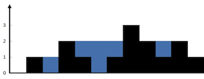

---
title: 接雨水
date: 2019-08-21T11:00:41+08:00
draft: false
categories: leetcode
---


**头条重点**

## 题目

给定 n 个非负整数表示每个宽度为 1 的柱子的高度图，计算按此排列的柱子，下雨之后能接多少雨水。



上面是由数组 [0,1,0,2,1,0,1,3,2,1,2,1] 表示的高度图，在这种情况下，可以接 6 个单位的雨水（蓝色部分表示雨水）。 感谢 Marcos 贡献此图。

```
示例:

输入: [0,1,0,2,1,0,1,3,2,1,2,1]
输出: 6
```

## 解题思路

  1. 首先找到最高点，然后从首尾向中间遍历，找到局部高点，然后就可以计算总量

```
public int trap(int[] height) {
    if (height.length <= 2) {
        return 0;
    }

    int max = 0, maxIndex = 0;
    for (int i = 0; i < height.length; i++) {
        if (height[i] > max) {
            max = height[i];
            maxIndex = i;
        }
    }

    int total = 0;
    int topIndex = 0;//局部最高点
    for (int i = 0; i < maxIndex; i++) {
        if (height[topIndex] < height[i]) {
            topIndex = i;
        } else {
            total += height[topIndex] - height[i];
        }
    }

    topIndex = height.length - 1;
    for (int i = height.length - 1; i > maxIndex; i--) {
        if (height[topIndex] < height[i]) {
            topIndex = i;
        } else {
            total += height[topIndex] - height[i];
        }
    }


    return total;
}
```
