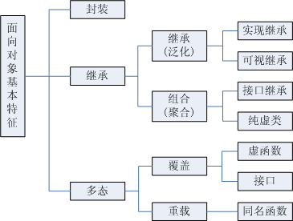

# 面向对象基础

面向对象三要素：封装、继承、多态

- `封装`：封装的意义，在于明确标识出允许外部使用的所有成员函数和数据项，或者叫接口。
- `继承`：
    - 继承基类的方法，并做出自己的扩展；
    - 声明某个子类兼容于某基类（或者说，接口上完全兼容于基类），外部调用者可无需关注其差别（内部机制会自动把请求派发`dispatch`到合适的逻辑）。
- `多态`：基于对象所属类的不同，外部对同一个方法的调用，实际执行的逻辑不同。**很显然，多态实际上是依附于继承的第二种含义的**。

## 多态

方法签名：`方法名 + 参数列表(参数类型、个数、顺序)`

### 重写

子类重写父类方法，**只有实例方法可以被重写**，重写后的方法必须仍为实例方法。**成员变量和静态方法都不能被重写，只能被隐藏**。

重写实例方法：超类Parent中有实例方法A，子类child定义了与A **相同签名和子集返回类型** 的实例方法B，子类对象ChildObj只能调用自己的实例方法B。

  >方法的重写（override）两同两小一大原则：

  >1. 方法名相同，参数类型相同

  >2. 子类返回类型小于等于父类方法返回类型

  >3. 子类抛出异常小于等于父类方法抛出异常

  >4. 子类访问权限大于等于父类方法访问权限

注意：

  - 不能重写static静态方法。(形式上可以写，但本质上不是重写，属于下面要讲的隐藏)

  - 重写方法可以改变其它的方法修饰符，如`final`,`synchronized`,`native`。不管被重写方法中有无final修饰的参数，重写方法都可以增加、保留、去掉这个参数的 final 修饰符(**参数修饰符不属于方法签名**)。

### 重载

在同一个类中，有多个方法名相同，参数列表不同（参数个数不同，参数类型不同），与方法的返回值无关，与权限修饰符无关。**编译器通过对方法签名的识别即可静态编译出不同的方法。这也是java中重载与重写的区别之一**。

  > 重载只是一种语言特性，与多态无关，与面向对象也无关。**多态是为了实现接口重用**。

Java中方法是可以和类名同名的，和构造方法唯一的区别就是，**构造方法没有返回值**。

### 隐藏

隐藏与覆盖在形式上极其类似(语法规则)，但有着本质的区别：只有成员变量(不管是不是静态)和静态方法可以被隐藏。

#### 成员变量

超类 Parent 中有成员变量 A ，子类 Child 定义了与 A 同名的成员变量 B ，子类对象 ChildObj 调用的是自己的成员变量 B。如果把子类对象 ChildObj 转换为超类对象 ParentObj ，ParentObj 调用的是超类的成员变量 A ！

  1. 隐藏成员变量时，只要同名即可，可以更改变量类型(无论基本类型还是隐藏类型)

  2. 不能隐藏超类中的 private 成员变量，换句话说，只能隐藏可以访问的成员变量。

  3. 隐藏超类成员变量 A 时，可以降低或提高子类成员变量B的访问权限，只要A不是 private。

  4. 隐藏成员变量与是否静态无关！静态变量可以隐藏实例变量，实例变量也可以隐藏静态变量。

  5. 可以隐藏超类中的final成员变量。

#### 静态方法

超类 Parent 有静态方法 A ，子类 Child 定义了与 A *相同签名和子集返回类型* 的静态方法 B ，子类对象 ChildObj 调用的是自己的静态方法 B 。如果把子类对象 ChildObj 转换为超类对象 ParentObj ，ParentObj 调用的是超类的静态方法 A ！

> 隐藏后的方法必须仍为静态方法
