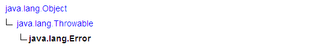

# Java异常

Java中有Error和Exception，它们都是继承自Throwable类。

## 二者的不同之处

Exception：

  - 可以是可被控制(checked) 或不可控制的(unchecked)。

  - 表示一个由程序员导致的错误。

  - 应该在应用程序级被处理。

Error：

  - 总是不可控制的(unchecked)。

  - 经常用来用于表示系统错误或低层资源的错误。

  - 如何可能的话，应该在系统级被捕捉。

## 异常的分类

  - **Checked exception**: 这类异常都是Exception的子类。异常的向上抛出机制进行处理，假如子类可能产生A异常，那么在父类中也必须throws A异常。可能导致的问题：代码效率低，耦合度过高。

  - **Unchecked exception**: **这类异常都是RuntimeException的子类，虽然RuntimeException同样也是Exception的子类，但是它们是非凡的，它们不能通过client code来试图解决**，所以称为Unchecked exception 。
