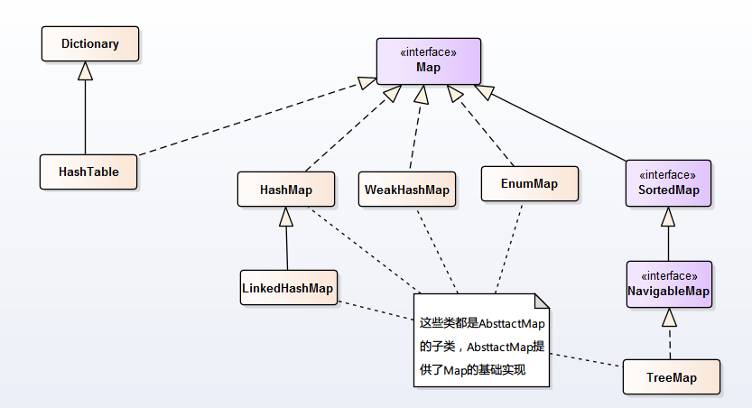

# 集合框架

Java集合框架提供了数据持有对象的方式，提供了对数据集合的操作。Java集合框架位于`java.util`包下，主要有三个大类：`Collection`、`Map`接口以及对集合进行操作的工具类。

## Collection

- List
  - `ArrayList`：线程不同步。默认初始容量为10，当数组大小不足时增长率为当前长度的`50%`。
  - `Vector`：**线程同步**。默认初始容量为10，当数组大小不足时增长率为当前长度的`100%`。它的同步是通过`Iterator`方法加`synchronized`实现的。
  - `Stack`：**线程同步**。继承自`Vector`，添加了几个方法来完成栈的功能。
  - `LinkedList`：线程不同步。**双端队列形式**。
- `Set`：Set是一种不包含重复元素的Collection，Set最多只有一个null元素。
  - `HashSet`：线程不同步，内部使用`HashMap`进行数据存储，提供的方法基本都是调用`HashMap`的方法，所以两者本质是一样的。**集合元素可以为**`NULL`。
  - `NavigableSet`：添加了搜索功能，可以对给定元素进行搜索：小于、小于等于、大于、大于等于，放回一个符合条件的最接近给定元素的 key。
  - `TreeSet`：线程不同步，内部使用`NavigableMap`操作。默认元素“自然顺序”排列，可以通过`Comparator`改变排序。
  - `EnumSet`：线程不同步。内部使用Enum数组实现，速度比`HashSet`快。**只能存储在构造函数传入的枚举类的枚举值**。

## Map

- `HashMap`：线程不同步。根据`key`的`hashcode`进行存储，内部使用静态内部类`Node`的数组进行存储，默认初始大小为16，每次扩大一倍。当发生Hash冲突时，采用拉链法（链表）。**可以接受为null的键值\(key\)和值\(value\)**。JDK 1.8中：当单个桶中元素个数大于等于8时，链表实现改为红黑树实现；当元素个数小于6时，变回链表实现。由此来防止hashCode攻击。
- `LinkedHashMap`：**保存了记录的插入顺序**，在用Iterator遍历LinkedHashMap时，先得到的记录肯定是先插入的. 也可以在构造时用带参数，按照应用次数排序。在遍历的时候会比HashMap慢，不过有种情况例外，当HashMap容量很大，实际数据较少时，遍历起来可能会比LinkedHashMap慢，因为LinkedHashMap的遍历速度只和实际数据有关，和容量无关，而HashMap的遍历速度和他的容量有关。
- `TreeMap`：线程不同步，基于 **红黑树*- （Red-Black tree）的NavigableMap 实现，**能够把它保存的记录根据键排序,默认是按键值的升序排序，也可以指定排序的比较器，当用Iterator 遍历TreeMap时，得到的记录是排过序的。**
- `HashTable`：线程安全，HashMap的迭代器\(Iterator\)是`fail-fast`迭代器。**HashTable不能存储NULL的key和value。**
- `ConcurrentHashmap`：支持并发操作的 Hash 表，`ConcurrentHashmap` 具有和 `HashTable` 同样的功能，并且具有相应的方法。即使所有操作都是线程安全的，但是并不需要进行加锁。

## 工具类

- `Collections`、`Arrays`：集合类的一个工具类\/帮助类，其中提供了一系列静态方法，用于对集合中元素进行排序、搜索以及线程安全等各种操作。
- `Comparable`、`Comparator`：一般是用于对象的比较来实现排序，两者略有区别。
  > - 类设计者没有考虑到比较问题而没有实现Comparable接口。这是我们就可以通过使用Comparator，这种情况下，我们是不需要改变对象的。
  > - 一个集合中，我们可能需要有多重的排序标准，这时候如果使用Comparable就有些捉襟见肘了，可以自己继承Comparator提供多种标准的比较器进行排序。
