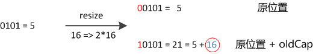

# [HashMap](https://yikun.github.io/2015/04/01/Java-HashMap%E5%B7%A5%E4%BD%9C%E5%8E%9F%E7%90%86%E5%8F%8A%E5%AE%9E%E7%8E%B0/)

在get和put的过程中，计算下标时，先对hashCode进行hash操作，然后再通过hash值进一步计算下标，如下图所示：


在对`hashCode()`计算hash时具体实现是这样的：

```
static final int hash(Object key) {
    int h;
    return (key == null) ? 0 : (h = key.hashCode()) ^ (h >>> 16);
}
```
> 可以看到这个函数大概的作用就是：高16bit不变，低16bit和高16bit做了一个异或。

在设计hash函数时，因为目前的table长度n为2的幂，而计算下标的时候，是这样实现的(使用&位操作，而非%求余)。设计者认为这方法很容易发生碰撞。为什么这么说呢？不妨思考一下，在`n - 1`为`15(0x1111)`时，其实散列真正生效的只是低`4bit`的有效位，当然容易碰撞了。

因此，设计者想了一个顾全大局的方法(综合考虑了速度、作用、质量)，就是把高`16bit`和低`16bit`异或了一下。设计者还解释到因为现在大多数的`hashCode`的分布已经很不错了，就算是发生了碰撞也用`O(logn)`的tree去做了。仅仅异或一下，既减少了系统的开销，也不会造成的因为高位没有参与下标的计算(table长度比较小时)，从而引起的碰撞。

如果还是产生了频繁的碰撞，会发生什么问题呢？作者注释说，他们使用树来处理频繁的碰撞(we use trees to handle large sets of collisions in bins)，在JEP-180中，描述了这个问题：

>Improve the performance of java.util.HashMap under high hash-collision conditions by using balanced trees rather than linked lists to store map entries. Implement the same improvement in the LinkedHashMap class.

之前已经提过，在获取HashMap的元素时，基本分两步：

  - 首先根据hashCode()做hash，然后确定bucket的index；
  - 如果bucket的节点的key不是我们需要的，则通过keys.equals()在链中找。

在Java 8之前的实现中是用链表解决冲突的，在产生碰撞的情况下，进行get时，两步的时间复杂度是O(1)+O(n)。因此，当碰撞很厉害的时候n很大，O(n)的速度显然是影响速度的。因此在Java 8中，如果一个bucket中碰撞冲突的元素超过某个限制(默认是8)，则使用红黑树来替换链表，这样复杂度就变成了`O(1)+O(logn)`了，这样在n很大的时候，能够比较理想的解决这个问题，在[Java 8：HashMap的性能提升](http://www.importnew.com/14417.html)一文中有性能测试的结果。

## Resize

当`put`时，如果发现目前的bucket占用程度已经超过了`Load Factor`所希望的比例，那么就会发生`resize`。在`resize`的过程，简单的说就是把`bucket`扩充为2倍，之后重新计算`index`，把节点再放到新的`bucket`中。`resize`的注释是这样描述的：

> Initializes or doubles table size. If null, allocates in accord with initial capacity target held in field threshold. Otherwise, because we are using power-of-two expansion, the elements from each bin must either stay at same index, or move with a power of two offset in the new table.

大致意思就是说，当超过限制的时候会`resize`，然而又因为我们使用的是2次幂的扩展(指长度扩为原来2倍)，所以，元素的位置要么是在原位置，要么是在原位置再移动2次幂的位置。例如我们从16扩展为32时，具体的变化如下所示：


因此元素在重新计算hash之后，因为n变为2倍，那么n-1的mask范围在高位多1bit(红色)，因此新的index就会发生这样的变化：


因此，我们在扩充HashMap的时候，不需要重新计算hash，只需要看看原来的hash值新增的那个bit是1还是0就好了，是0的话索引没变，是1的话索引变成“`原索引+oldCap`”。可以看看下图为16扩充为32的resize示意图：


这个设计确实非常的巧妙，既省去了重新计算hash值的时间，而且同时，由于新增的1bit是0还是1可以认为是随机的，因此resize的过程，均匀的把之前的冲突的节点分散到新的bucket了。

## 并发问题

[疫苗：JAVA HASHMAP的死循环](https://coolshell.cn/articles/9606.html)

在 `HashMap` Resize的过程中由于本身并不是线程安全，有可能出现死锁的问题。
