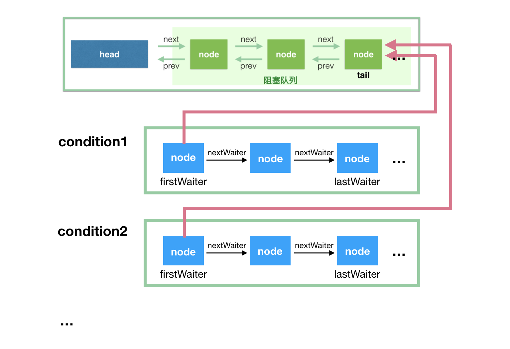

# AQS

AQS 提供一个框架，用于实现依赖于先进先出（FIFO）`等待队列` 的阻塞锁和相关同步器（信号量，事件等）。对于大多数依赖单个原子 int 值表示状态的同步器，该类可以作为十分有用的基类。子类必须定义所有的`protected`方法（包括`tryAcquire`、`tryRelease`），来改变这个状态，并且定义哪些状态代表来对象被使用和被释放。鉴于这些，该类中其他的方法用来实现队列和阻塞的机制。子类可以维护其他状态字段，但是只有使用 `getState` 、`setState`以及 `compareAndSetState` 来原子的操作状态值。

子类需要定义非 `public` 的内部工具类用于实现其内部类的同步属性。`AbstractQueuedSynchronizer` 类不实现任何同步接口，相反，它定义了诸如`acquireInterruptibly`之类的方法，可以被具体的锁和相关的同步器适当地调用，以实现它们的公共方法。

该类支持默认的独占模式和共享模式。当一个线程处在独占模式下，其他试图 `acquire` 的线程都无法成功。共享模式可以同时被多个线程 `acquire`成功。在具体的应用场景中该类无法理解这些区别，当共享模式 `acquire` 成功之后，下一个线程（如果有一个存在）必须判定是否能够`acquire`。线程等待在不同的模式里但是会共享同一个FIFO队列。通常来说，子类只需要支持其中一种模式，但是如果都支持，可以参照`ReadWriteLock`。子类不需要定义不支持模式的方法。

该类定义`AbstractQueuedSynchronizer.ConditionObject`内部类，可以被子类使用的 `Condition` 实现，来支持独占模式 `isHeldExclusively` 判定当前线程的同步是否是独占模式，可用通过`release`方法与 `getState` 方法来完全释放当前对象，在将保存的状态值调用`acquire`，最终将此对象恢复到其先前获取的状态。`AbstractQueuedSynchronizer`没有方法来创建 `Condition`，所以如果无法满足这个约束，则不要使用它。`AbstractQueuedSynchronizer.ConditionObject` 的行为与具体的同步器实现有关。

该类为内部队列提供检查，检测和监视方法，以及 在`condition objects`上的类似方法。 这些方法可以根据需要使用 `AbstractQueuedSynchronizer` 用于它们的同步机制。该类的序列化仅存储 `atomic int` 的状态值，因此反序列化对象的线程队列为空。

## 使用

为了使用该类去创建一个同步器，需要重新定义以下方法，并使用 `getState`, `setState`, `compareAndSetState` 方法来改变同步状态。
  - tryAcquire
  - tryRelease
  - tryAcquireShared
  - tryReleaseShared
  - isHeldExclusively

上述所有方法默认实现都会抛出 `UnsupportedOperationException`。这个方法的具体实现必须保证内部的线程安全，并且应该快速并且不会阻塞。所有其他方法均为 `final`，因为他们不能独立变化。

You may also find the inherited methods from AbstractOwnableSynchronizer useful to keep track of the thread owning an exclusive synchronizer. You are encouraged to use them -- this enables monitoring and diagnostic tools to assist users in determining which threads hold locks.

也许你发现一些继承自 `AbstractOwnableSynchronizer` 的方法非常有助于线程保持拥有其独占同步器。同时我们也鼓励使用他们，有助于监控和诊断工具判定哪些线程持有来锁。

## [ReentrantLock](http://ifeve.com/java-special-troops-aqs/)

>公平锁相比与非公平锁在 `tryAcquire`中会多判定一个 `hasQueuedPredecessors`，如果为 `false`（队列头为当前线程--已获取锁 or 队列为空）并且成功修改状态值，则可以认为获取锁成功，这样才是重入，不然加到队尾就会有麻烦。

ReentrantLock 中通过两个子类 `FairSync` 和 `NoFairSync` 继承 AQS 来实现锁。在`Lock`方法中，直接调用 AQS 的 `acquire`，`acquire`会调用 `NoFairSync` 中的`tryAcquire`来尝试让当前线程直接获取锁。如果失败则会创建链表节点，将当前线程加入队列，并`park`。当`release`方法被调用后，会寻找队列下一个节点进行 `unpark`，这样他就有机会在`acquireQueued`中获取锁。

> 公平和非公平就体现在 `tryAcquire` 方法中，`FairSync`会判定当前线程是否已获取锁 or 队列为空，在这样的情况下才会尝试获取锁。而`NoFairSync`会直接来获取锁。

## [Condition](https://javadoop.com/post/AbstractQueuedSynchronizer-2/)

`Condition` 因子将 `Object monitor` 方法（`wait, notify and notifyAll`）拆分为不同的对象，通过将它们与 `Lock` 相结合来实现每个对象具有多个等待集的效果。任何 `Lock` 可以替代 `synchronized` 关键字的地方，都可以用`Condition` 来替换`Object monitor` 方法。

`Conditions`（也称为 条件队列 或者 条件变量）提供了一种方法 -- 让线程暂停执行，直到其他线程基于某种条件唤醒。在多个线程中访问一些共享的状态信息，是需要进行保护的，所以 `Lock` 与 `Condition` 有某种形式的关联。`Condition`提供的关键属性是它以原子方式释放关联的锁并挂起当前线程，就像`Object.wait`一样。

`Condition` 本质上是绑定到 `Lock`。可以通过 `Lock.newCondition()` 来获取一个 `Condition` 实例。

`Condition` 的实现可以提供相比于 `Object monitor`方法不一样的行为和语义，比如：被通知调起的顺序、在通知时不需要持有锁。如果实现类提供了不一样的语义，必须在文档中进行说明。

`Condition` 实例只是普通的对象，可以用在同步语句中，并且有他们自己的 `Object monitor`的`wait`和 `notification` 方法。获取 `Condition` 对象的 `Object monitor` 或者使用其 `monitor` 方法，与`Lock` 中使用 `Condition` 的 `wait` 或者 `signal` 方法没有任何关系。为了避免混淆，不建议使用 `Condition` 的 `Object monitor` 方法，除非在它自己的实现里。

### 实现类需要注意

  - 虚假唤醒（`spurious wakeup`）：开发者最好将条件 `wait` 方法放在循环中
  - `Condition` 有3中 `wait` 形式（`interruptible, non-interruptible, and timed`），在不同平台的底层实现可能不同。因此，不需要对三种 `wait` 定义一致的语义，也不需要支持中断形式的线程暂停。

### AbstractQueuedSynchronizer.ConditionObject

```
/** First node of condition queue. */
private transient Node firstWaiter;
/** Last node of condition queue. */
private transient Node lastWaiter;
```

在 `ConditionObject` 的内部维护了一个队列：`条件队列`，与 `AbstractQueuedSynchronizer` 里的 `等待队列` 不同。



基本上，把这张图看懂，你也就知道 condition 的处理流程了。所以，我先简单解释下这图，然后再具体地解释代码实现。

  1. 条件队列和等待队列的节点，都是 Node 的实例，因为条件队列的节点是需要转移到等待队列中去的；
  2. 我们知道一个 `ReentrantLock` 实例可以通过多次调用 `newCondition()` 来产生多个 `Condition` 实例，这里对应 `condition1` 和 `condition2`。注意，`ConditionObject` 只有两个属性 `firstWaiter` 和 `lastWaiter；`
  3. 每个 `condition` 有一个关联的条件队列，如线程 1 调用 `condition1.await()` 方法即可将当前`线程 1` 包装成 `Node` 后加入到`条件队列`中，然后阻塞在这里，不继续往下执行，条件队列是一个单向链表；
  4. 调用`condition1.signal()` 触发一次唤醒，此时唤醒的是队头，会将`condition1` 对应的条件队列的 `firstWaiter`（队头） 移到`等待队列`的队尾，等待获取锁，获取锁后 `await` 方法才能返回，继续往下执行。

上面的 `2->3->4` 描述了一个最简单的流程，没有考虑中断、signalAll、还有带有超时参数的 await 方法等，不过把这里弄懂是这节的主要目的。
