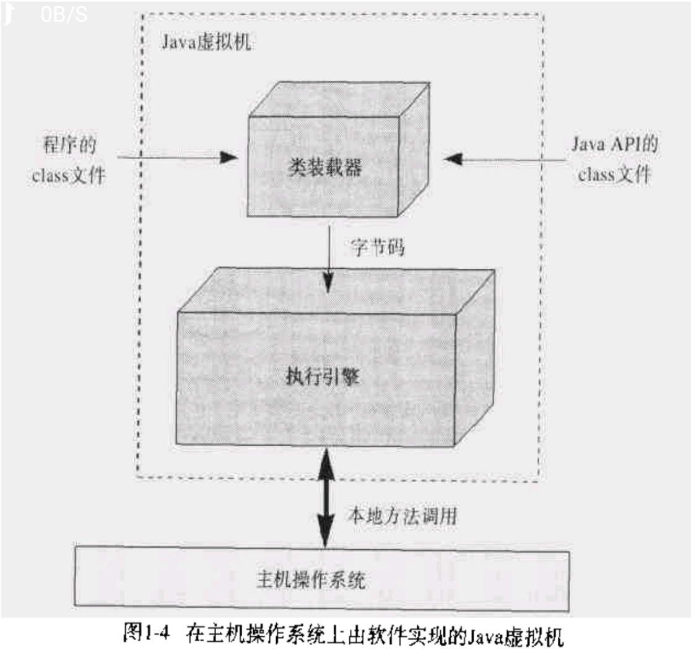

# 类加载器

## 简介  

Java类加载器是Java运行时环境（Java Runtime Environment）的一部分，负责动态加载Java类到Java虚拟机的内存空间中。**类通常是按需加载，即第一次使用该类时才加载。** 由于有了类加载器，Java运行时系统不需要知道文件与文件系统。每个Java类必须由某个类加载器装入到内存。

类装载器子系统涉及Java虚拟机的其他几个组成部分，以及几个来自`java.lang`库的类。比如，用户自定义的类装载器只是普通的Java对象，它的类必须派生自`java.lang.ClassLoader`。`ClassLoader`中定义的方法为程序提供了访问类装载器机制的接口。此外，对于每个被装载的类型，Java虚拟机都会为他创建一个`java.lang.Class`类的实例来代表该类型。和所有其他对象一样，用户自定义的类装载器以及`Class`类的实例都放在内存中的堆区，而装载的类型信息都位于方法区。

类装载器子系统除了要定位和导入二进制class文件外，还必须负责验证被导入类的正确性，为变量分配初始化内存，以及帮助解析符号引用。这些动作必须严格按一下顺序完成：

  1. 装载--查找并装载类型的二进制数据。
  2. 链接--执行验证、准备以及解析(可选)
    - 验证：确保被导入类型的正确性
    - 准备：为类变量分配内存，并将其初始化为默认值。
    - 解析：把类型中的符号引用转换为直接引用。
  3. 初始化--把类变量初始化为正确的初始值。
  4. 使用
  5. 卸载：类加载器加载的每个类和类加载器本身都被没有引用

## 分类

在Java虚拟机中存在多个类装载器，Java应用程序可以使用两种类装载器：
  - `启动(bootstrap)类装载器`：此装载器是Java虚拟机实现的一部分。由原生代码（如C语言）编写，不继承自`java.lang.ClassLoader`。负责加载核心Java库，存储在`<JAVA_HOME>/jre/lib`目录中。*（如果Java虚拟机在已有操作系统中实现为C程序，那么启动类加载器就是此C程序的一部分）* 启动类装载器通常使用某种默认的方式从本地磁盘中加载类，包括Java API。

  - `用户自定义类装载器`：*（包含但不止，扩展类加载器以及系统类加载器）* ，继承自Java中的`java.lang.ClassLoader`类，Java应用程序能在运行时安装用户自定义类装载器，这种累装载器使用自定义的方式来装载类。用户定义的类装载器能用Java编写，能够被编译为Class文件，能被虚拟机装载，还能像其他对象一样实例化。它们实际上只是运行中的Java程序可执行代码的一部分。一般JVM都会提供一些基本实现。应用程序的开发人员也可以根据需要编写自己的类加载器。**JVM中最常使用的是系统类加载器（system），它用来启动Java应用程序的加载。** 通过`java.lang.ClassLoader.getSystemClassLoader()` 可以获取到该类加载器对象。**该类由sun.misc.Launcher$AppClassLoader实现。**

## 全盘负责双亲委托机制

`全盘负责`是指当一个ClassLoader装载一个类的时，除非显式地使用另一个ClassLoader，该类所依赖及引用的类也由这个ClassLoader载入；“双亲委托机制”是指先委托父装载器寻找目标类，只有在找不到的情况下才从自己的类路径中查找并装载目标类。**这一点是从安全角度考虑的，试想如果有人编写了一个恶意的基础类（如java.lang.String）并装载到JVM中将会引起多么可怕的后果。但是由于有了“全盘负责委托机制”，java.lang.String永远是由根装载器来装载的，这样就避免了上述事件的发生。**

类加载器需要完成的最终功能是定义一个Java类，即把Java字节代码转换成JVM中的`java.lang.Class`类的对象。但是类加载的过程并不是这么简单。Java类加载器有两个比较重要的特征：

  - 层次组织结构指的是每个类加载器都有一个父类加载器，通过`getParent()`方法可以获取到。类加载器通过这种父亲-后代的方式组织在一起，形成树状层次结构。

  - 代理模式则指的是一个类加载器既可以自己完成Java类的定义工作，也可以代理给其它的类加载器来完成。由于代理模式的存在，启动一个类的加载过程的类加载器和最终定义这个类的类加载器可能并不是一个。**前者称为初始类加载器，而后者称为定义类加载器。**

两者的关联在于：在每个类被装载的时候，Java虚拟机都会监视这个类，看它到底是被启动类装载器还是被用户自定义类装载器装载。**当被装载的类引用了另外一个类的时候，虚拟机就会使用装载第一个类的类装载器装载被引用的类。**

>注意：JVM加载类A，并使用A的ClassLoader去加载B，但B的类加载器并不一定和A的类加载器一致，这是因为有双亲委托机制的存在。

一般的类加载器在尝试自己去加载某个Java类之前，会 **首先代理给其父类加载器**。当父类加载器找不到的时候，才会尝试自己加载。这个逻辑是封装在`java.lang.ClassLoader`类的`loadClass()`方法中的。一般来说，父类优先的策略就足够好了。在某些情况下，**可能需要采取相反的策略，即先尝试自己加载，找不到的时候再代理给父类加载器。这种做法在Java的Web容器中比较常见，也是Servlet规范推荐的做法。** 比如，Apache Tomcat为每个Web应用都提供一个独立的类加载器，使用的就是自己优先加载的策略。IBM WebSphere Application Server则允许Web应用选择类加载器使用的策略。

>假设 类加载器B2被要求装载类MyClass，在parent delegation模型下，类加载器B2首先请求类加载器B代为装载，类加载器B再请求系统类装载器去装载MyClass，系统类装载器也会继续请求它的Parent扩展类加载器去装载MyClass，以此类推直到引导类装载器。若引导类装载器能成功装载，则将MyClass所对应的Class对象的reference逐层返回到类加载器B2，若引导类装载器不能成功装载，下层的扩展类装载器将尝试装载，并以此类推直到类装载器B2如果也不能成功装载，则装载失败。

>需要指出的是，Class Loader是对象，它的父子关系和类的父子关系没有任何关系。一对父子loader可能实例化自同一个 Class，也可能不是，甚至父loader实例化自子类，子loader实例化自父类。

## defineClass vs findClass vs loadClass

  - `loadclass`：判断是否已加载，使用双亲委派模型，请求父加载器，都为空，使用 `findclass`
  - `findclass`：根据名称或位置加载 `.class` 字节码,然后使用 `defineClass`
  - `defineclass`：解析定义 `.class` 字节流，返回 `class` 对象

## 运行时包

类加载器的一个重要用途是 **在JVM中为相同名称的Java类创建隔离空间**。在JVM中，**判断两个类是否相同，不仅是根据该类的二进制名称，还需要根据两个类的定义类加载器。** 只有两者完全一样，才认为两个类的是相同的。

在允许两个类型之间对包内可见的成员进行访问前，虚拟机不但要确定这个两个类型属于同一个包，**还必须确认它们属于同一个运行时包－它们必须有同一个类装载器装载的。** 这样，`java.lang.Virus`和来自核心的`java.lang`的类不属于同一个运行时包，`java.lang.Virus`就不能访问`JAVA API`的`java.lang`包中的包内可见的成员。

## Class.getClassLoader vs Thread.getContextClassLoader

  - 每个 `Class` 会使用自己的 `ClassLoader` 去加载其他的 `Class` 。如果 `ClassA.class` 引用了 `ClassB.class` ，那么 `ClassB` 需要能被 `ClassA` 的 `ClassLoader` 或者其 `父ClassLoader` 找到。

  - `Thread.getContextClassLoader` 是当前线程使用的 `ClassLoader`。对象可以通过 `ClassLoaderC` 加载，并且传递到 `Classload` 是 `ClassLoaderD` 的线程里。在某些情况下，对象需要使用 `Thread.currentThread().getContextClassLoader()` 来加载 `ClassLoaderC` 不能获取的资源

## [Tomcat & ClassLoader](https://blog.csdn.net/liweisnake/article/details/8470285)

事实上，tomcat之所以造了一堆自己的classloader，大致是出于下面三类目的：

   - 对于各个 `webapp` 中的 `class` 和 `lib` ，需要相互隔离，不能出现一个应用中加载的类库会影响另一个应用的情况；而对于许多应用，需要有共享的lib以便不浪费资源，举个例子，如果 `webapp1` 和 `webapp2` 都用到了 log4j ，可以将 log4j 提到 `tomcat/lib` 中，表示所有应用共享此类库，试想如果 log4j 很大，并且 20 个应用都分别加载，那实在是没有必要的。
   - 与 `jvm` 一样的安全性问题。使用单独的 `classloader` 去装载 `tomcat` 自身的类库，以免其他恶意或无意的破坏；
   - 热部署，相信大家一定为 `tomcat` 修改文件不用重启就自动重新装载类库而惊叹吧。
